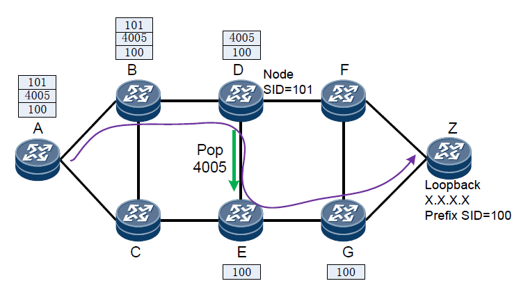
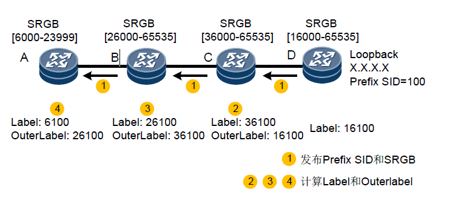

## segment Routing简介

**segment routing** 是基于源路由技术理念设计的一种在网络上转发数据包的协议。它将代表转发路径的序列号编码在数据包头部使用IGP或BGP协议进行传递，沿途设备收到数据包后解码头部的信息，如果头部标识和自己的标识相同则弹出这个标识进行下一步处理，如果不相同则按照ECMP转发数据包。

**源路由**：用户可以指定起始节点某一数据包到达目的地所经过的路径，中间节点只需按照定义好的规则进行转发即可，不必关心目的地在哪，如何到达目的地。源路由技术的这种特点，可以应用在在SDN,TE等领域。

## segment routing的驱动力：

1. 网络业务种类越来越复杂，不同种类的业务对网络的要求不同，比如语音，视频等业务需要低延迟，下载业务需要高带宽。传统的网络解决方法配置复杂，适用性差。
2. segment routing可以配合现在提出的业务驱动网络的思想，使得端到端路径控制更加简单和易于实现。
3. Ip网络中mpls的应，如mpls vpn，mpls-TE等的控制平面需要单独的协议LDP或者RSVP，控制报文占用带宽，控制平面复杂。SR技术可以简化mpls的控制平面，直接使用IGP传递SID无需单独的隧道协议。
4. IPV6已是大势所趋，segment routing在IPV6中的应用更为简单。
5. 提供高效TI-LFA（Topology-Independent Loop-free Alternate） FRR保护，实现路径故障的快速恢复。
6. Segment Routing同时支持传统网络和SDN网络，兼容现有设备，保障现有网络平滑演进到SDN网络。

## segment routing的几个概念：

- SR域（Segment Routing Domain）：SR节点的集合。
- SID：即Segment ID，用来标识唯一的段。在转发层面，可以映射为MPLS标签。
- SRGB（Segment Routing Global Block）：用户指定的为Segment Routing预留的本地标签集合。

## Segment 分类：

- PrefixSegment（前缀段）：
Prefix Segment用于标识网络中的某个目的地址前缀（Prefix）。Prefix Segment通过IGP协议扩散到其他网元，全局可见，全局有效。
Prefix Segment通过Prefix Segment ID（SID）标识。Prefix SID是源端发布的SRGB范围内的偏移值，接收端会根据自己的SRGB计算实际标签值用于生成MPLS转发表项。
- AdjacencySegment（邻接段）：
Adjacency Segment用于标识网络中的某个邻接。Adjacency Segment通过IGP协议扩散到其他网元，全局可见，本地有效。
Adjacency Segment通过Adjacency Segment ID（SID）标识。Adjacency SID为SRGB范围外的本地SID。
- NodeSegment（节点段）：
Node Segment是特殊的Prefix Segment，用于标识特定的节点（Node）。在节点的Loopback接口下配置IP地址作为前缀，这个节点的Prefix SID实际就是NodeSID。

### PrefixSegment

prefixSegment的转发路径是通过IGP的SPF算法计算出来的，如图所示：Z节点的prefix SID通过IGP扩散出去后每个节点都可以学习到，每个节点也可以通过spf计算出到达Z的cost值。当数据包从A传递到Z时，在网络中既可以存在等价路径也可以存在主备链路。所以基于PrefixSegment的转发路径不是固定的，头结点已无法控制报文的转发路径。

### AdjacenySengment

Adjacency SID是由邻居分配给上游节点的，类似于MPLS lable。
通过给网络中每个邻接分配一个Adjacency Segment，然后在头节点定义一个包含多个Adjacency Segment的Segment List，就可以严格指定任意一条显式路径（Strict Explicit）。这种方式可以更好的配合实现SDN。

### NodeSgment

基于Adjacency Segment + Node Segment 的转发路径, NodeSID是一种特殊的PrefixSID,所以这种转发方式和上一种其实差不多。
这种方式是将Adjacency Segment和Node Segment结合，通过AdjacencySegment，可以强制整条路径包含某一个邻接。而对于Node Segment，节点可以使用SPF算法计算最短路径，也可以负载分担。
如图：D-E使用了Adjacency Segment控制数据包的走向，其它节点则基于NodeSegment计算最短路径。

## SR转发机制

SR在IPv4中的应用是基于mpls网络的，SR可以直接应用在MPLS架构，转发机制没有变化。代表段的SID被编码为MPLS标签。段序列被编码为标签栈。要处理的段位于栈顶。一个段处理完成后，相关标签从标签栈中弹出。

和mpls相同在转发数据包之前需要先建立转发路径LSP，在segment routing中叫做SR LSP。由一个Prefix或Node Segment指导数据包转发。
SR-BE（Segment Routing Best Effort）是指IGP使用最短路径算法计算得到的最优SR LSP。

### SR LSP的创建

- 网络拓扑上报（这个步骤当有控制器的时候才需要）
- 标签分配
- 路径计算

对于SR LSP，主要基于前缀标签创建。目的节点通过IGP协议发布Prefix SID，转发器解析Prefix SID，并根据自己的SRGB计算标签值。此后各节点使用IGP协议收集的拓扑信息，根据最短路径算法计算标签转发路径，并将计算的下一跳及出标签（OuterLabel）信息下发转发表，指导数据报文转发。

### LSP具体创建过程：

1. 在D上配置SRGB，在D的Loopback口配置Prefix SID，生成转发表项并下发。之后D将SRGB和Prefix SID封装到LSP报文（如包含SR-CapabilitiesSub-TLV的IS-IS Router Capability TLV-242），并将LSP报文通过IGP向全网扩散。网络中其他设备接收到LSP报文后，解析D发布的Prefix SID，根据自己的SRGB计算标签值，同时根据下一跳节点发布的SRGB计算出标签值（OuterLabel）。使用IGP拓扑计算标签转发路径，然后生成转发表项。
2. C设备解析D发布的Prefix SID，根据自己的SRGB=[36000–65535]计算标签值，计算公式是：Label=SRGB的起始值+Prefix SID值，所以Label=36000+100=36100。使用IS-IS拓扑计算出标签（OuterLabel），计算公式是：OuterLabel=下一跳设备发布的SRGB的起始值+Prefix SID值，在本例中，下一跳设备为D，D发布的SRGB范围是[16000–65535]，所以
OuterLabel=16000+100=16100。
3. B和A的计算过程与前面相同。

### 数据转发

当LSP建立完成，每个节点都有对应的标签信息后，开始转发数据包。数据包的转发过程和mpls的相同，数据按照头部（2.5层）的标签信息和标签动作进行转发。

标签动作分为：push，switch，pop 三种。

## 总结：

segment Routing的lsp建立，数据转发过程基本和mpls的相同。不同点在于控制平面直接使用IGP协议，而mpls需要单独的控制协议。标签生成方式和mpls略有不同。

segmentRouting和mpls一样也有PHP和TTL处理机制（这里不再细说，有兴趣的可以去看下，其实和mpls的原理也基本相同）

segmentRouting相对于mpls来说其优点在于可以结合控制器来做更精细化的流量管理，加快业务部署，平滑演进SDN（目前SDN网络中主要还在用VXLAN）。

