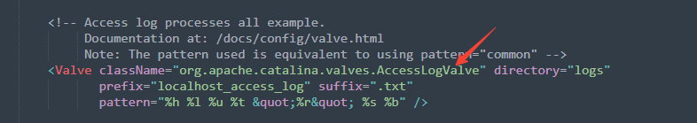
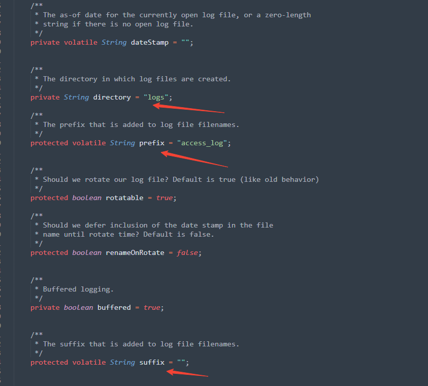
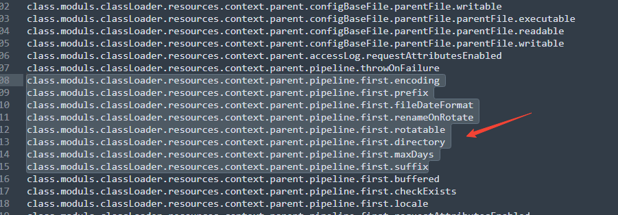
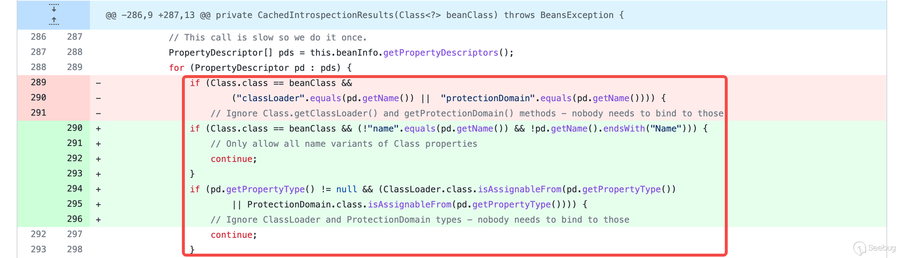
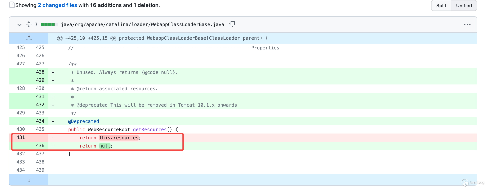

## 前言


前一篇文章介绍了cve-2010-1622漏洞的原理，本篇文章在其基础上介绍下CVE-2022-22965漏洞原理。


## CVE-2022-22965 漏洞影响版本


Spring Framework 5.3.X < 5.3.18 、2.X < 5.2.20


使用tomcat部署spring项目,且tomcat < 9.0.62


使用了POJO参数绑定


## CVE-2022-22965 漏洞分析


tomcat中可以在server.xml中配置日志得路径和其它参数得。





可以看到其类为：`org.apache.catalina.valves.AccessLogValve`


在Spring中的万物都是SpringBean，那么通过xml文件加载的配置属性，实际上也是可以被配置修改的, 此漏洞POC正是利用了这一点来修改了`org.apache.catalina.valves.AccessLogValve`中得属性来达到getshell的目的。


```text
# 设置文件后缀为 .jsp
class.module.classLoader.resources.context.parent.pipeline.first.suffix=.jsp

# 设置文件前缀为 shell
class.module.classLoader.resources.context.parent.pipeline.first.prefix=shell

# 设置日志文件的路径为 webapp/path，只有该文件下的 jsp 文件会被解析，本文以 ROOT 为例
class.module.classLoader.resources.context.parent.pipeline.first.directory=webapp/ROOT

```


可以看到其poc也是通过参数绑定修改了对应的变量值，而且是SpringMVC 多层嵌套参数绑定


从poc可以推断其绑定过程为：


```java
User.getClass()
    java.lang.Class.getModule()
        java.lang.Module.getClassLoader()
            org.apache.catalina.loader.ParallelWebappClassLoader.getResources()
                org.apache.catalina.webresources.StandardRoot.getContext()
                    org.apache.catalina.core.StandardContext.getParent()
                        org.apache.catalina.core.StandardHost.getPipeline()
                            org.apache.catalina.core.StandardPipeline.getFirst()
                                org.apache.catalina.valves.AccessLogValve.setPattern()

```


这里就不展开调式了，调式过程可以看这篇文章：[Spring 远程命令执行漏洞（CVE-2022-22965）原理分析和思考](https://paper.seebug.org/1877)


直接看下AccessLogValve这个类中的属性。





相关参数的解释：


`suffix`参数

- 参数名：`class.module.classLoader.resources.context.parent.pipeline.first.suffix`
- 参数值：`.jsp`

按照`pattern`参数相同的调试方法，`suffix`参数最终将`AccessLogValve.suffix`设置为`.jsp`_，即 accesslog 的文件名后缀。_


`directory`参数

- 参数名：`class.module.classLoader.resources.context.parent.pipeline.first.directory`
- 参数值：`webapps/ROOT`

按照`pattern`参数相同的调试方法，`directory`参数最终将`AccessLogValve.directory`设置为`webapps/ROOT`_，即 accesslog 的文件输出目录。_


这里提下`webapps/ROOT`目录，该目录为 Tomcat Web 应用根目录。部署到目录下的 Web 应用，可以直接通过`http://localhost:8080/`根目录访问。


`prefix`参数

- 参数名：`class.module.classLoader.resources.context.parent.pipeline.first.prefix`
- 参数值：`tomcatwar`

按照`pattern`参数相同的调试方法，`prefix`参数最终将`AccessLogValve.prefix`设置为`tomcatwar`_，即 accesslog 的文件名前缀。_


`fileDateFormat`参数

- 参数名：`class.module.classLoader.resources.context.parent.pipeline.first.fileDateFormat`
- 参数值：空

按照`pattern`参数相同的调试方法，`fileDateFormat`参数最终将`AccessLogValve.fileDateFormat`_设置为空，即 accesslog 的文件名不包含日期。_


通过修改这些属性即可改变tomcat日志的存放位置及名称和后缀，如果修改为xxx.jsp即可达到getshell的目的。


这里有几个问题：


**1. 为什么需要jdk1.9以上的版本才能利用呢？**


看过前面一篇文章的同学知道spring在对cve-2010-1622的漏洞修复时将将classloader添加进了黑名单，但是自从JDK 9+开始，JDK引入了模块（Module）的概念，就可以通过module来调用JDK模块下的方法，而module并不在黑名单中，所以能够绕过黑名单，如：class.module.classLoader.xxxx的方式。


**2. 为什么需要tomcat部署方式才能利用呢？**


使用 SpringBoot 可执行 jar 包的方式运行，classLoader嵌套参数被解析为org.springframework.boot.loader.LaunchedURLClassLoader，查看其源码，没有getResources()方法。也就无法进一步利用了。


另外Panda师傅写了个可以遍历属性的脚本：


```java
    @RequestMapping("/testclass")
    public void classTest(){
        HashSet<Object> set = new HashSet<Object>();
        String poc = "class.moduls.classLoader";
        User action = new User();
        processClass(action.getClass().getClassLoader(),set,poc);
    }

        public void processClass(Object instance, java.util.HashSet set, String poc){
        try {
            Class<?> c = instance.getClass();
            set.add(instance);
            Method[] allMethods = c.getMethods();
            for (Method m : allMethods) {
                if (!m.getName().startsWith("set")) {
                    continue;
                }
                if (!m.toGenericString().startsWith("public")) {
                    continue;
                }
                Class<?>[] pType  = m.getParameterTypes();
                if(pType.length!=1) continue;

                if(pType[0].getName().equals("java.lang.String")||
                        pType[0].getName().equals("boolean")||
                        pType[0].getName().equals("int")){
                    String fieldName = m.getName().substring(3,4).toLowerCase()+m.getName().substring(4);
                    System.out.println(poc+"."+fieldName);
                    //System.out.println(m.getName());
                }
            }
            for (Method m : allMethods) {
                if (!m.getName().startsWith("get")) {
                    continue;
                }
                if (!m.toGenericString().startsWith("public")) {
                    continue;
                }
                Class<?>[] pType  = m.getParameterTypes();
                if(pType.length!=0) continue;
                if(m.getReturnType() == Void.TYPE) continue;
                m.setAccessible(true);
                Object o = m.invoke(instance);
                if(o!=null)
                {
                    if(set.contains(o)) continue;

                    processClass(o, set, poc+"."+m.getName().substring(3,4).toLowerCase()+m.getName().substring(4));
                }
            }
        } catch (IllegalAccessException | InvocationTargetException x) {
            x.printStackTrace();
        }
    }
```


运行后确实可以发现有关属性：





## **CVE-2022-22965 漏洞修复**


spring 修复方法：


通过对比 Spring 5.3.17 和 5.3.18 的版本，可以看到对`CachedIntrospectionResults`构造函数中 Java Bean 的`PropertyDescriptor`的过滤条件被修改了：当 Java Bean 的类型为`java.lang.Class`时，仅允许获取`name`以及`Name`后缀的属性描述符。在章节`3.2.2 关键点二：JDK版本`中，利用`java.lang.Class.getModule()`的链路就走不通了。





tomcat修复方法：


Tomcat 9.0.62补丁中可以看到对getResource()方法的返回值做了修改，直接返回null。WebappClassLoaderBase即ParallelWebappClassLoader的父类，Web应用部署方式中，利用org.apache.catalina.loader.ParallelWebappClassLoader.getResources()的链路就走不通了。





## **后记**


在分析此漏洞的过程中，参考了不少资料，以作者目前的能力来说，看起有关于spring和tomcat的框架部分来说还有点吃力，一些内容也是直接引用的其它师傅的分析结果。CVE-2022-22965漏洞的利用方式还参考了Struts2 S2-020漏洞的利用方法，不得不说还是很精妙的。


## **参考文章**

- [Spring 远程命令执行漏洞（CVE-2022-22965）原理分析和思考](https://paper.seebug.org/1877/)
- [从零开始，分析Spring Framework RCE](https://www.cnpanda.net/sec/1196.html)
