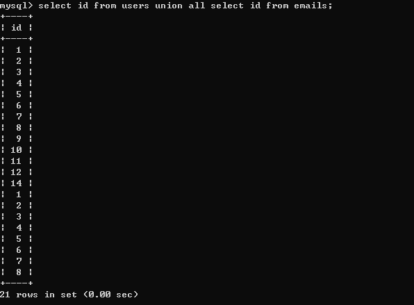

## union和union all


union和union all都是联合查询，用于连接两个以上的 SELECT 语句的结果组合到一个结果集合中，区别在于union会去除重复的结果，union all不会。


> 要注意的是前后两个select语句中的列数必须一致


例：


现在数据库中有两个表，分别是：users和emails. 先看下这两个表中的内容：


使用union联合查询俩个表中的id：


可看到将两个表中的id全部查了出来，并且去除了重复结果。


使用union all进行查询则不会去除重复结果，如下：





当然也可以查询两个表中不同的字段数，如下所示：


## _groupconcat和concat_


concat函数用于将多个字符串连接到一起形成一个字符串，效果如下：


group_concat函数会将要查询的结果以一个组合的形式返回，group__concat需要和groupby函数配合使用，否则会将返回结果以一行显示。_


例：


除此之外还可以使用Separator关键字加分隔符：


## length()


该函数用于获取字符串的长度。


例：


## mid()


SQL MID() 函数用于得到一个字符串的一部分。这个函数被MySQL支持，但不被MS SQL Server和Oracle支持。在SQL Server， Oracle 数据库中，我们可以使用 SQL SUBSTRING函数或者 SQL SUBSTR函数作为替代。


MID() 函数语法为：


```sql
SELECT MID(ColumnName, Start [, Length]) FROM TableName

```


例：


## left()


LEFT()函数是一个字符串函数，它返回具有指定长度的字符串的左边部分。


用法：


```sql
LEFT(str,length);

```


LEFT()函数接受两个参数：

- str是要提取子字符串的字符串。
- length是一个正整数，指定将从左边返回的字符数。

LEFT()函数返回str字符串中最左边的长度字符。如果str或length参数为NULL，则返回NULL值。


如果length为0或为负，则LEFT函数返回一个空字符串。如果length大于str字符串的长度，则LEFT函数返回整个str字符串。


请注意，SUBSTRING(或SUBSTR)函数也提供与LEFT函数相同的功能。


例：


## substr()


substr和mid函数的作用和用法基本相同，只不过substr支持的数据库更多，mid只支持mysql数据库。


用法：


```sql
substr(string string,num start,num length);

```


例：


## ascii()


ascii函数用来返回字符串str的最左面字符的ASCII代码值。如果str是空字符串，返回0。如果str是NULL，返回NULL。这个函数可以和substr函数配合来使用猜测一个字符。


例：


## sleep()


sleep函数可以让sql执行的时候暂停一段时间，函数的返回结果为0.


例：


## if(expr1,expr2,expr3)


语法如下：


IF(expr1,expr2,expr3)，如果expr1的值为true，则返回expr2的值，如果expr1的值为false，则返回expr3的值。


例：


## count()


_count函数是用来统计表中或数组中记录的一个函数，下面我来介绍在MySQL中count函数用法与性能比较吧。count() 它返回检索行的数目， 不论其是否包含 NULL值。_


## _loadfile()_


_loadfile()可以用来读取文件，此函数的执行必须使用dba权限或者root权限。_


需要注意的是：


_mysql 新版本下secure-file-priv字段 ： secure-file-priv参数是用来限制LOAD DATA, SELECT ... OUTFILE, and LOADFILE()传到哪个指定目录的。_

- ure_file_priv的值为null ，表示限制mysqld 不允许导入,导出
- 当secure_file_priv的值为/tmp/ ，表示限制mysqld 的导入,导出只能发生在/tmp/目录下
- 当secure_file_priv的值没有具体值时，表示不对mysqld 的导入,导出做限制

如何查看secure-file-priv参数的值：


```sql
show global variables like '%secure%';

```


## into outfile()


into outfile()函数可以将字符串写入文件，此函数的执行也需要很大的权限，并且目标目录可写。

