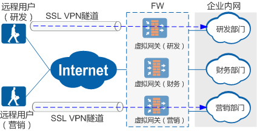
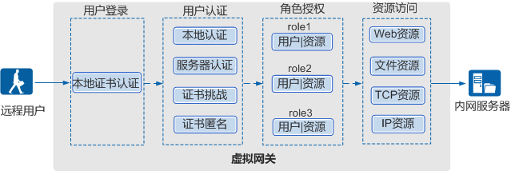

### 简介：

之前介绍的IPSEC VPN,L2TP VPN,MPLS VPN等属于二层或者三成VPN。而SSL VPN则属于应用层面的vpn,SSL VPN是以SSL协议为安全基础的VPN远程接入技术，移动办公人员（在SSL VPN中被称为远程用户）使用SSL VPN可以安全、方便的接入企业内网，访问企业内网资源，提高工作效率。

**在SSL VPN出现之前，IPSec、L2TP等先期出现的VPN技术虽然可以支持远程接入这个应用场景，但这些VPN技术存在如下缺陷。**

- 远程用户终端上需要安装指定的客户端软件，导致网络部署、维护比较麻烦。
- IPSec/L2TP VPN的配置繁琐。
- 网络管理人员无法对远程用户访问企业内网资源的权限做精细化控制。

**SSL VPN凭借自身的技术特点使其在远程接入应用场景中与早期VPN相比更具优势，其特点如下：**

- SSL VPN采用B/S架构设计，远程用户终端上无需安装额外的客户端软件，直接使用Web浏览器就可以安全、快捷的访问企业内网资源。
- 可以根据远程用户访问内网资源类型的不同，对其访问权限进行高细粒度控制。
- 提供了本地认证、服务器认证、证书匿名和证书挑战多种身份认证方式，提高了身份认证的灵活性。
- 主机检查策略可以检查远程用户终端的操作系统、端口、进程以及杀毒软件等是否符合安全要求，并且还具备防跳转、防截屏的能力，消除了潜藏在远程用户终端上的安全隐患。
- 缓存清理策略用于清理远程用户访问内网过程中在终端上留下的访问痕迹，加固了用户的信息安全。

### SSL VPN业务分类：

根据远程用户访问内网资源类型的不同，SSL VPN提供了Web代理、文件共享、端口转发、网络扩展这四种内网访问方式，即SSL VPN业务。

| 业务    | 定义                                                                                                                               |
| ----- | -------------------------------------------------------------------------------------------------------------------------------- |
| Web代理 | 远程用户访问内网Web资源时使用Web代理业务。                                                                                                         |
| 文件共享  | 远程用户访问内网文件服务器（如支持SMB协议的Windows系统、支持NFS协议的Linux系统）时使用文件共享业务。远程用户直接通过Web浏览器就能在内网文件系统上创建和浏览目录，进行下载、上传、改名、删除等文件操作，就像对本机文件系统进行操作一样方便。 |
| 端口转发  | 远程用户访问内网TCP资源时使用端口转发业务。适用于TCP的应用服务包括Telnet、远程桌面、FTP、Email等。端口转发提供了一种端口级的安全访问内网资源的方式。                                             |
| 网络扩展  | 远程用户访问内网IP资源时使用网络扩展业务。Web资源、文件资源以及TCP资源都属于IP资源，通常在不区分用户访问的资源类型时为对应用户开通此业务。                                                       |

### 虚拟网关：

FW向远程用户提供SSL VPN接入服务的功能模块称为虚拟网关，虚拟网关有独立的IP地址。网络管理员可以在虚拟网关下配置用户、资源以及用户访问资源的权限等。

通常大中型企业会有多个业务部门，每个业务部门都有自己的内部资源和授权策略，这些业务层面的需求将致使FW的SSL VPN配置管理变的复杂。通过在FW上创建多个虚拟网关，每个业务部门独立使用自己的虚拟网关对外提供SSL VPN接入服务，使得业务管理更加清晰和简单。

如图所示，在FW上创建研发、财务和营销三个虚拟网关，不同部门的外出办公人员通过访问各自业务部门的虚拟网关，就可以获取该业务部门下的资源。

### 总体流程：

SSL vpn根据业务种类的不同，原理也不尽相同，这里就不详细介绍各个业务的原理了，有兴趣的可以自行百度。 SSL vpn的配置非常简单，在WEB页面上点点鼠标即可，所以也不介绍了。

远程用户通过SSL VPN访问企业内网资源的总体流程如图所示。

FW向远程用户提供SSL VPN接入服务的功能模块称为虚拟网关，虚拟网关是远程用户访问企业内网资源的统一入口。远程用户在Web浏览器中输入虚拟网关的IP地址，并在虚拟网关登录界面输入用户名和密码，虚拟网关将会对用户进行身份认证。身份认证通过后，虚拟网关会向远程用户提供可访问的内网资源列表，远程用户点击资源列表链接即可访问对应资源。远程用户在资源访问列表中只能看到网络管理员为其开通的业务资源，例如为远程用户A开通了Web代理业务，则远程用户A在资源列表中就只能看到有权访问的Web资源，而看不到企业内网中的文件资源、TCP资源等其他资源。

一台FW设备可以创建多个虚拟网关，每个虚拟网关之间相互独立，互不影响。可以在虚拟网关下配置各自的用户、资源和策略，进行单独管理。虚拟网关本身无独立的管理员，所有虚拟网关的创建、配置、修改和删除等管理操作统一由FW的系统管理员完成。

**用户登录**
远程用户通过Web浏览器（客户端）登录虚拟网关，请求建立SSL连接。虚拟网关向远程用户发送自己的本地证书，远程用户对虚拟网关的本地证书进行身份认证。认证通过后，远程用户与虚拟网关成功建立SSL连接。

**用户认证**
虚拟网关对远程用户进行用户认证，验证用户身份。用户认证可以选择以下四种方式之一：本地认证、服务器认证、证书匿名认证、证书挑战认证。

**角色授权**
用户认证完成后，虚拟网关查询该用户的资源访问权限。用户的权限分配通过角色实现，先将具有相同权限的用户/组加入某个角色，然后角色关联可访问的业务资源，角色是联系用户和资源的纽带。

**资源访问**
虚拟网关根据远程用户的角色信息，向用户推送可访问的资源链接，远程用户点击对应的资源链接进行资源访问。

