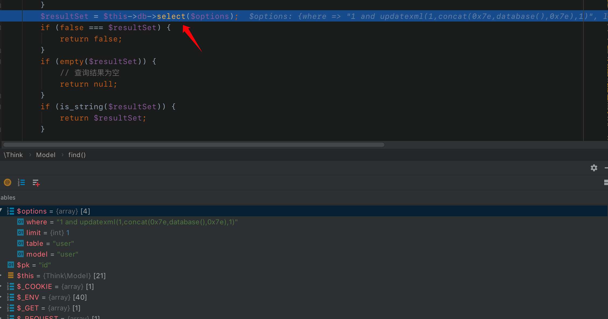

## 前言


2018年8月23号11:25分 星期四，tp团队对于已经停止更新的thinkphp3系列进行了一处安全更新，经过分析，此次更新修正了由于`select()`,`find()`,`delete()`方法可能会传入数组类型数据产生的多个sql注入隐患。


thinkphp3的github地址为：[https://github.com/top-think/thinkphp](https://github.com/top-think/thinkphp)


下载完毕后需要使用`git checkout`命令回退到上一次的提交:


```bash
git checkout 109bf30
```


查看本次更新的[提交记录](https://github.com/top-think/thinkphp/commit/9e1db19c1e455450cfebb8b573bb51ab7a1cef04#diff-c7e3ac519b1260c65bca310cad99050c)：


可看到此次更新主要是在`ThinkPHP/Library/Think/Model.class.php`文件中，其中对于`delete`，`find`，`select`三个函数进行了修改。思考可能是因为`$option`参数可控，然后经过_`parseOptions`_函数处理过后产生了注入。


## 环境搭建


将下载的tp3框架放入web服务器的根目录下，然后在`/Application/Home/Controller/IndexController.class.php`中写一段测试代码：


新建`test`函数用来测试tp3的`find`方法，在本地的mysql数据库中新建tptest数据库，然后新建user表，并添加测试数据：


访问`http://127.0.0.1:8888/index.php?m=Home&c=Index&a=test&id=1`查看结果：


看到以上结果证明环境搭建成功。


## 注入分析


根据网上给的poc看下结果，poc为：


```html
http://127.0.0.1:8888/index.php?m=Home&c=Index&a=test&id[where]=1 and updatexml(1,concat(0x7e,database(),0x7e),1)
```


成功执行sql语句：


使用xdeug看下调用过程：


在此处打断点：


进入`M`方法：


进入`find`方法：


看下面这个判断：


```php
        if (isnumeric($options) || is_string($options)) {
            $where[$this->getPk()] = $options;
            $options               = array();
            $options['where']      = $where;
        }
```


由于现在的`$option`是个数组，所以并不会进入这个判断，继续往下：


`getPk`函数是查找mysql主键的函数，继续往下会有一个判断：


```php
_if (isarray(_options) && (count(_options) > 0) && isarray($pk)) {
            // 根据复合主键查询
            $count = 0;
            foreach (arraykeys(_options) as _key) {
                if (isint($key)) {
                    $count++;
                }

            }
            if (count(_pk) == count) {
                $i = 0;
                foreach (pk as field) {
                    where[field] = options[i];
                    unset(options[i++]);
                }
                options['where'] = where;
            } else {
                return false;
            }
```


`必须同时满足`$option`是一个数组并且`$option`数组中的元素大于0并且查询出的主键`$pk`是一个数组才会进入判断，显然这里不满足`$`pk是一个数组的条件，所以不会进入循环。继续往下：`


来到_`parseOptions`_函数，进入此函数：


使用_`arraymerge`_`函数将`$option`与option合并，合并结果还是`$option`,因为``$this->option是一个空数组。继续往下：`


```php
if (isset($options['where']) && is_array($options['where']) && !empty($fields) && !isset($options['join'])) {
            // 对数组查询条件进行字段类型检查
            foreach ($options['where'] as $key => $val) {
                $key = trim($key);
                if (inarray($key, $fields, true)) {
                    if (isscalar($val)) {
                        $this->_parseType($options['where'], $key);
                    }
                }
            }
        }
```


分析这个判断，发现`$options['where']`并不是一个数组，所以不会进入判断，继续往下：


可以看到又一个表达式过滤函数_`optionsfilter`_,进入这个函数：


发现是个空函数，所以不会进行任何过滤，继续往下：





开始调用tp的select方法在数据库中查找数据，进入到select方法中可看到查询的sql语句还是我们拼接过后的，所以就导致了sql注入的产生：


## 产生注入的原因


为什么tp没有对我们传入的数据进行过滤呢？带着这个疑问我们走一遍正常的流程，将poc换为：


```html
http://127.0.0.1:8888/index.php?m=Home&c=Index&a=test&id=1 and updatexml(1,concat(0x7e,database(),0x7e),1)
```


和之前一样的流程就不截图了，走到这里的时候不一样了：


由于此时的`$options['where']`是一个数组了，所以会进入判断：


然后进过_`parseType`_方法处理：


进过`inrval`函数处理后在输入的sql语句就是正常的了，这样就不会产生注入


所以导致注入产生的原因是构造的poc绕过了tp对`$option['where']`是否是一个数组的判断，从而不会进入循环，也不会经_`parseType`_函数处理从而导致了注入。


官方的修复方法是：

在_`parseOptions`_`函数处理时不传入`$option`，这样经过`_parseOptions`处理过后，`$`option始终为空,也就是我们传入的poc执行后的sql语句就变成了：`


```sql
select  from users limit 1
```


无论你查询什么都只会返回第一条数据，这种处理方式还是挺暴力的。


## 最后


本次注入的产生不只有find方法，select，delete等方法产生注入的原理也是和上文一样的，具体过程就不再分析。

