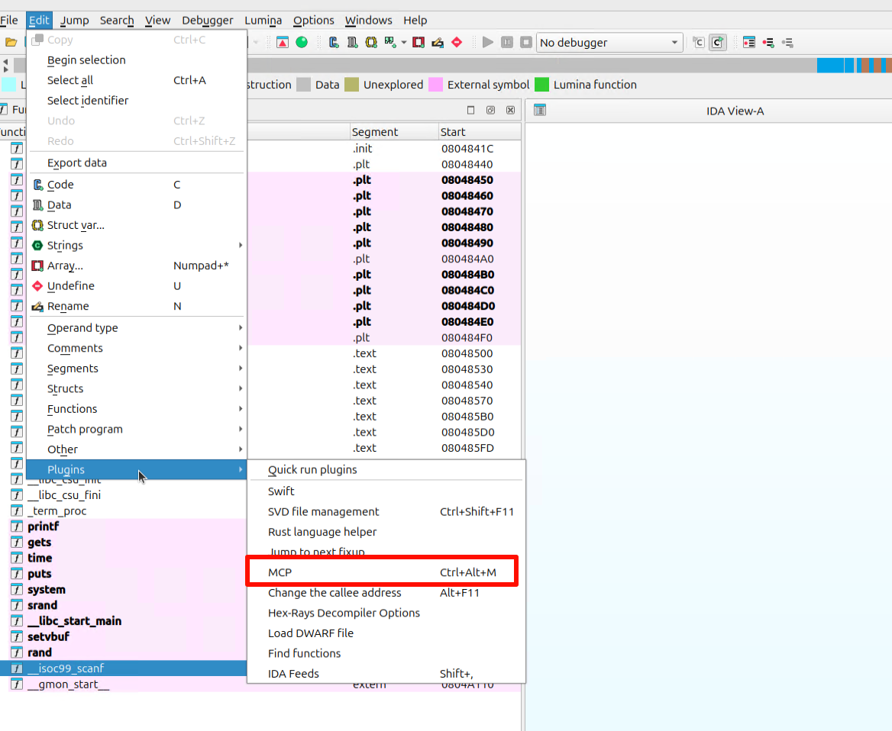
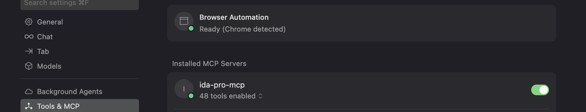
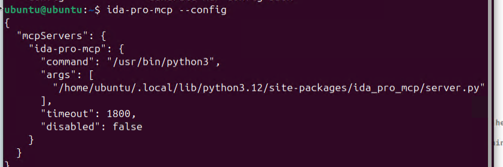

## IDA下载与安装


下载地址：


[https://bbs.kanxue.com/thread-283752.htm](https://bbs.kanxue.com/thread-283752.htm)


下载完毕后直接执行idapro_90_x64linux.run安装即可，这里略过。


如果启动报错：


```json
Could not acquire license: No valid license file could be found Warning: Ignoring XDG_SESSION_TYPE=wayland on Gnome. Use QT_QPA_PLATFORM=wayland to run on Wayland anyway. qt.qpa.plugin: Could not load the Qt platform plugin "xcb" in "" even though it was found. This application failed to start because no Qt platform plugin could be initialized. Reinstalling the application may fix this problem. Available platform plugins are: eglfs, linuxfb, minimal, minimalegl, offscreen, vnc, wayland-egl, wayland, wayland-xcomposite-glx, xcb. Aborted (core dumped)
```


解决办法：


```json
sudo apt-get install libxcb-xinerama0 libxcb-xinerama0-dev libxcb1 libxcb1-dev \
                     libx11-xcb1 libx11-xcb-dev libglu1-mesa libsm6 libxrender1 \
                     libxi6 libxext6 libxfixes3 libxrandr2 libxinerama1

```


## IDA mcp安装


地址：[https://github.com/mrexodia/ida-pro-mcp](https://github.com/mrexodia/ida-pro-mcp)


> 这里要求IDA使用的python版本≥3.11，在IDA安装目录下执行`idapyswitch` 切换版本。


安装：


```json
pip install https://github.com/mrexodia/ida-pro-mcp/archive/refs/heads/main.zip
```


自动配置MCP server并安装IDA插件：


```json
ida-pro-mcp --install
```


打开IDA后在如下位置开启MCP服务即可：





打开cursor就可以看到mcp服务已经配置好了：





如果没有，则执行`ida-pro-mcp —config` 自动生成mcp配置文件，然后配置到cursor中。





## 参考：


[https://zhuanlan.zhihu.com/p/650638983](https://zhuanlan.zhihu.com/p/650638983)

