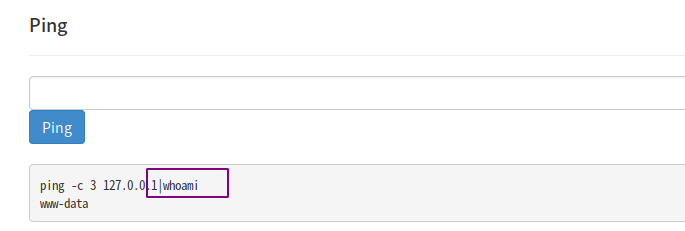
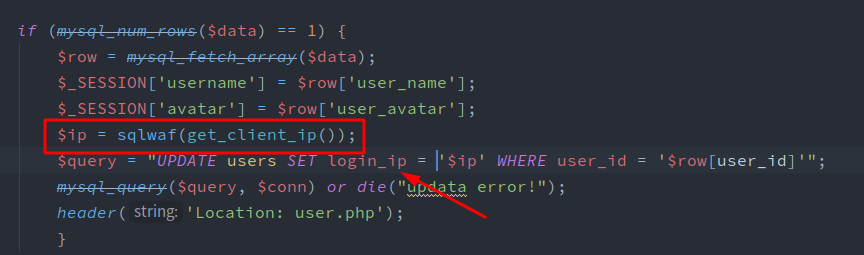

## vauditDemo代码审计


本片博客记录vauditDemo的代码审计过程，初学代码审计，记录下来方便回看。vauditDemo地址：[https://github.com/virink/VAuditDemo](https://github.com/virink/VAuditDemo), 这个是大牛virink写的一款练习代码审计的靶场，作者本人也有配套的视频教程，配合食用，味道更佳。


## 通读源码


对于这种代码不是很多的CMS,通读源码未尝不是一个好方法，在读源码的过程中能够更好的了解整个CMS的架构以及业务逻辑，为接下来的代码审计铺平道路。靶场作者在课上也提到了这种方法。


### 靶场整体框架


```shell
_├── about.inc                                     ---说明信息
├── admin                                           ---管理员目录
│   ├── captcha.php
│   ├── delAdmin.php
│   ├── delUser.php
│   ├── index.php
│   ├── logCheck.php
│   ├── login.php
│   ├── manageAdmin.php
│   ├── manageCom.php
│   ├── manage.php
│   ├── manageUser.php
│   ├── phperrors.log
│   └── ping.php
├── css                                                   --- css文件
│   ├── bootstrap.css
│   ├── bootstrap.min.css
│   ├── bootswatch.less
│   ├── bootswatch.min.css
│   └── variables.less
├── footer.php                              ---页脚
├── header.php                           ----页头
├── images                                    ---图片目录
│   └── default.jpg
├── index.php                              ---入口文件
├── install                                      ---安装文件
│   ├── install.php
│   └── install.sql
├── js                                               ---js文件
│   ├── bootstrap.min.js
│   ├── bootswatch.js
│   ├── bsa.js
│   └── check.js
├── messageDetail.php           ---留言详情页面
├── message.php                       ---留言页面
├── messageSub.php               ---留言页面
├── search.php                           ----搜索页面
├── sys                                            ---配置目录
│   ├── config.php
│   ├── install.lock
│   └── lib.php
├── uploads                              -----图片上传目录
└── user                                     -----普通用户目录
    ├── avatar.php
    ├── edit.php
    ├── logCheck.php
    ├── login.php
    ├── logout.php
    ├── regCheck.php
    ├── reg.php
    ├── updateAvatar.php
    ├── updateName.php
    ├── updatePass.php
    └── user.php_

```


1.入口文件index.php


首先包含了config.php和header.php，然后就是包含了关于页面，入口文件很简单，没啥好说的，但要注意的是这里存在`include`函数，可能有任意文件包含的风险。


2.配置文件config.php


检查当前目录下是否存在install.lock文件，不存在的话就跳转到install.php页面，然后包含了`lib.php`文件，数据库的配置信息也在此文件中。


3.lib.php


此文件下主要是一些过滤函数用来过滤用户输入，这些过滤函数可能存在bypass的可能。


> 注意这里的sec函数对全局GET,POST,COOKIE等输入做了过滤。


4.header.php


根据session判断是普通用户还是管理员，将其的名字显示到页面上，然后就是登录和注册链接。


5.reg.php


主要是一些表单信息，信息提交到regCheck.php去做校验。


6.regCheck.php


使用clean_`input函数过滤了用户注册的用户名和密码，防止注册含有特殊字符的用户名，这里可以考虑bypass clean`_`input函数。`


7.user.php


根据username从数据库中查询对应的userid。


8.message.php


从数据库中获取留言信息展示到页面上，这里的用户名和留言内容都使用了`htmlspecialchars`转义，基本排除了留言板存在xss的可能。


9.messagesub.php


将用户留言信息插入到数据库中，使用cleaninput函数过滤了留言信息，但是这里可能存在bypass注入。


10.search.php


根据用户输入搜索留言，这里使用了`sec`函数对用户输入进行了过滤。


以上就是重要代码的通读，接下来详解每个漏洞的形成过程。


## 安装问题


此靶场在使用前需要先安装，其实安装就是创建数据库并写入一些sql语句的过程，此安装文件在判断数据库已经安装完成后并未直接退出，导致下面的代码依旧可以执行，存在敏感信息泄露。


**install.php**


**复现：**


使用burpsuite抓包，访问install.php,查看响应结果。


render后的结果：


可看到已经泄露了一些敏感信息。


## 命令注入


在admin目录下有一个ping.php文件，这个页面的功能是在后台执行ping命令。


执行正常的命令：


查看**ping.php**文件：


代码并未对`target`做任何过滤，这样就可以进行命令拼接从而达到命令执行的效果。





## SQL注入


全局搜索查看可能存在注入的语句：


转到**messageDetail.php**：


使用sqlwaf函数对id进行了过滤，查看sqlwaf函数：


转到**lib.php**：


这个函数对常见的sql注入语句进行了替换。


这里将`||`替换为空字符串，那不就可以使用`sele||ct`这种方式去绕过对`select`的过滤。


## 存储型XSS


有个管理员可以查看普通用户的用户名和ip地址的页面，我们看下用户名和ip地址分别是怎么获取的。


转到**manageUser.php**:


是从数据库中查询出来的，但是用户名经过了`htmlspecialchars`的转义，继续查找ip地址是怎么传入数据库的。


转到**logCheck.php**:





login_`ip是使用get`__clientip_`函数获取的，并且经过了``sqlwaf函数的过滤。`


继续查看_`getclientip`_函数：


转到**lib.php**:


此函数从http头信息中提取_`HTTPCLIENTIP`_或者_`HTTPXFORWARDEDFOR`_等可以标记客户端地址的字段。


那么就可以伪造这些信息，进而达到xss的效果。


修改http头中的Client-IP值：


普通用户登录后这个值就会保存到数据库中，当管理员去后台查看时，这个值就会展示到页面上，进而引起XSS.


## 登录爆破


管理员的登录页面存在验证码，当需要爆破密码进行登录时就需要识别验证码或者绕过验证码。


转到**admin/login.php**:


验证码是由`captcha.php`生成的，继续转到**admin/logCheck.php**:


可以看到提交的验证码是与session中的验证码作比较的，而session中的验证码是由captcha.php生成的。


若果不让其访问captcha.php，那_`$SESSION['captcha']`_=null , 这样不就绕过了验证码的限制吗？


登录并使用burp抓包：


_将请求包中的Cookie删除，这样重放的时候新seesion中的$SESSION['captcha']就会为空，所以也需要把captcha参数删除。_


将验证码和Cookie去掉，重放跳转到manage页面，说明绕过验证码成功，接下来就是正常的去爆破了。


## 任意文件读取


转到**avatar.php**：


存在_`filegetcontents`_函数，这个函数控制不好的话就会造成任意文件读取的发生。


跟踪_`$SESSION['avatar']`_来到user/logCheck.php。


_`$SESSION['avatar']`_是从数据库中获取的，继续跟踪_`useravatar`_看其是怎么插入到数据库中的。


来到**updateAvatar.php**中发现了其插入语句：


变量`$avatar`是由上传路径+时间戳+文件名三部分组成的，其中文件名是可控的。


构造payload :


```php
', user_avatar = '../sys/config.php' WHERE user_name = 'test'#.png  ,

```


将avatar更改为`../sys/config.php`即可读取这个文件的内容。


burp抓取头像上传的数据包然后改包：


上传后发现数据库中的数据变成了这样的：


原因是文件名中不能包含路径信息，将文件名转换为16进制，重新上传。


这样就成功了：


接下来登录然后读取头像文件就可以看到config.php文件的内容。


同样这个任意文件读取也可以访问任意外部链接的内容，从而达到SSRF的效果。


## 文件包含


转到**index.php,**使用了`include`函数包含about.inc文件。


这里限制了后缀只能是`.inc`格式的，可以尝试使用伪协议绕过，关于伪协议的使用请参考：[https://lorexxar.cn/2016/09/14/php-wei/](https://lorexxar.cn/2016/09/14/php-wei/)


我这里使用`phar`伪协议。


在上传文件处上传一个一句话木马，注意需要将木马文件后缀该为`.inc`，并将其压缩，压缩文件后缀该为`.png`格式。


上传test.png，观察其上传时间，并将这个时间转换为时间戳：


上传文件的名字是按照如下规则重命名的：


所以我们上传的文件为：_`/uploads/u1575446707test.png`_


使用phar读取压缩包里面的test.inc文件：


payload为：_`phar://uploads/u1575446707test.png/test`_


成功上传一句话并执行命令成功。


## 越权


后台有个更改用户名的地方，我们来看看这里是否存在越权的问题：


跟踪**edit.php**来到**updateName.php**:


在**updateName.php**_中发现了一个奇怪的问题，更新用户名时竟然不从session中获取userid,而是可以接收用户post的id。这样就导致了可以修改任意用户用户名的越权问题。_


来修改下用户sss的用户名：


可看到已将其用户名修改。


## **二次截断注入**


二次注入简而言之就是在存在单引号的情况下，利用双条件查询，利用前一个条件去闭合单引号，后一个条件就可以成为我们的payload。这里的关键是闭合单引号。


来到**messageSub.php**:


这个页面处理用户的留言信息，会将用户的留言信息提交到数据库中，使用了`clean_input`函数，但是并未使用`sqlwaf`函数过滤用户输入。


`cleaninput`这个函数很奇怪，先是使用了`stripslashes`删除反斜杠，然后又使用`mysql_real_escape_string()`给特殊字符加上反斜杠。O__O "…


如果我们能够注册一个用户名里面包含`\`,那就可以闭合valves中的第一个单引号，后面就可以插入payload的了。


payload为：`,(select user()),now());#`


来到**regCheck.php**:


使用`clean_input`函数过滤了用户名。


我们注册一个`abcd\`用户：


界面显示的是`abcd\\`,查看数据库是`abcd\`,说明用户名已注册成功。


然后退出重新登陆：


页面显示error,不必理会，现在已经登陆成功了。


在留言页面填写payload：


留言成功后，留言板即可显示payload执行的结果：


至此全部漏洞的代码审计已经说明完毕，代码审计本是一个复杂的过程，文中有没说清楚的可结合视频学习。

