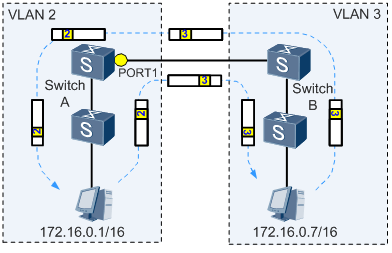

VLAN Mapping主要部署在公网上的边缘节点设备，实现私网与公网的VLAN分离，节省公网的VLAN资源。

VLAN Mapping通过修改报文携带的VLAN Tag来实现不同VLAN的相互映射。

在某些场景中，两个VLAN相同的二层用户网络通过骨干网络互联，为了实现用户之间的二层互通，以及二层协议（例如MSTP等）的统一部署，需要实现两个用户网络的无缝连接，此时就需要骨干网可以传输来自用户网络的带有VLAN Tag的二层报文。

而在通常情况下，骨干网的VLAN规划和用户网络的VLAN规划是不一致的，所以在骨干网中无法直接传输用户网络的带有VLAN Tag的二层报文。

解决这个问题的方法有两个，其中一个是通过QinQ或者VPLS等二层隧道技术，将用户带有VLAN Tag的二层报文封装在骨干网报文中进行传输，可以实现用户带有VLAN Tag的二层报文的透传。

但是这种方法一方面需要增加额外的报文开销（增加一层封装），另外一方面，二层隧道技术可能会对某些二层协议报文的透传支持不是非常完善。

另外一种方法就是通过VLAN Mapping技术，一侧用户网络的带有VLAN Tag的二层报文进入骨干网后，骨干网边缘设备将用户网络的VLAN（C-VLAN）修改为骨干网中可以识别和承载的VLAN（S-VLAN），传输到另一侧之后，边缘设备再将S-VLAN修改为C-VLAN。这样就可以很好的实现两个用户网络二层无缝连接。

在另一种场景中，如果由于规划的差异，导致两个直接相连的二层网络中部署的VLAN ID不一致。但是用户又希望可以把两个网络作为单个二层网络进行统一管理，例如用户二层互通和二层协议的统一部署。此时也可以在连接两个网络的交换机上部署VLAN Mapping功能，实现两个网络之间不同VLAN ID的映射，达到二层互通和统一管理的目的。

**基本原理**

交换机收到数据报文后，根据是否带有Tag做以下两种处理：

1、数据报文带Tag，根据配置的VLAN Mapping方式，决定替换单层、双层或双层中的外层Tag；然后进入MAC地址学习阶段，根据源MAC地址+映射后的VLAN ID刷新MAC地址表项；根据目的MAC+映射后VLAN ID查找MAC地址表项，如果没有找到，则在VLAN ID对应的VLAN内广播，否则从表项对应的接口转发。

2、数据报文不带Tag，根据配置的VLAN划分方式决定是否添加VLAN Tag，对于不能加入VLAN的数据报文上送CPU或丢弃，否则添加Tag；然后进入MAC地址学习阶段，按照二层转发流程进行转发。

如下图1所示，当在接口Port1上配置了VLAN2和VLAN3映射后，接口在向外发送VLAN2的帧时，将帧中的VLAN Tag替换成VLAN3的VLAN Tag；在接收VLAN3的帧时，将帧中的VLAN Tag替换成VLAN2的VLAN Tag，然后按照二层转发流程进行数据转发，这样VLAN2和VLAN3就能实现互相通信。

此外，要想借助VLAN Mapping实现两个VLAN内设备互相通信，这两个VLAN内设备的IP地址还必须处于同一网段。如果两个VLAN内设备的IP地址不在同一网段，那么设备间的互通需要依赖三层路由实现，这样就失去了VLAN Mapping的意义。

**映射方式**

设备支持基于VLAN、802.1优先级和MQC（流策略）方式实现VLAN Mapping，其中基于VLAN的VLAN Mapping包括以下映射方式：

- 1 to 1的映射方式

当部署VLAN Mapping功能设备上的主接口收到带有单层VLAN Tag的报文时，将报文中携带的单层VLAN Tag映射为公网的VLAN Tag。包括1:1和N:1两种方式，其中1:1的方式是将指定的一个用户侧VLAN Tag标签映射到一个网络侧VLAN Tag标签，N:1的方式是将指定范围的多个用户侧VLAN Tag标签映射到一个网络侧VLAN Tag标签。

- 2 to 1的映射方式

当部署VLAN Mapping功能设备上的主接口收到带有双层VLAN Tag的报文时，将报文中携带的外层Tag映射为公网的Tag，内层Tag作为数据透传。

- 2 to 2的映射方式

当部署VLAN Mapping功能设备上的主接口收到带有双层VLAN Tag的报文时，将报文中携带的双层VLAN Tag映射为公网的双层VLAN Tag。

基于MQC实现VLAN Mapping指的是通过MQC可以对分类后的报文实现VLAN Mapping。

用户可以根据多种匹配规则对报文进行流分类，然后将流分类与VLAN Mapping的动作相关联，对匹配规则的报文重标记报文的VLAN ID值。基于MQC的VLAN Mapping能够针对业务类型提供差别服务。

