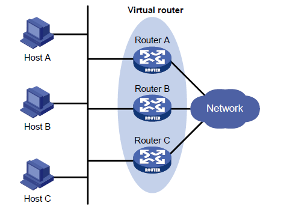

vrrp将域中的一组路由器划分到一起称为一个备份组。既然是备份组，那么这个组中最少需要两台路由器，一台作为master另一台作为slaver。理论上最多可以有无限台路由器，但只能有一台master，其余的全部为slaver。

这个备份组中的路由器组成一个虚拟路由器。

vrrp备份组特点：

虚拟路由器具有 IP 地址，称为虚拟IP 地址。局域网内的主机仅需要知道这个虚拟路由器的IP地址，并将其设置为缺省路由的下一跳地址。

网络内的主机通过这个虚拟路由器与外部网络进行通信。
备份组内的路由器根据优先级，选举出Master 路由器，承担网关功能。其他路由器作为Backup路由器，当Master 路由器发生故障时，取代Master 继续履行网关职责，从而保证网络内的主机不间断地与外部网络进行通信。

vrrp组网示意图：

vrrp备份组特性：

1.vrrp备份组中的每台路由器都有一个优先级，vrrp备份组就是根据这个优先级来确定谁是master谁是slaver的。优先级取值范围为0-255，数值越大，优先级越高。（注意：255是最高优先级，当一个备份组中有多台路由器时，拥有IP地址的路由器优先级就为255）
2.vrrp备份组中的路由器工作模式分为抢占模式和非抢占模式两种模式。

- 非抢占方式：如果备份组中的路由器工作在非抢占方式下，则只要Master 路由器没有出现故障，Backup 路由器即使随后被配置了更高的优先级也不会成为Master 路由器。
- 抢占方式：如果备份组中的路由器工作在抢占方式下，它一旦发现自己的优先级比当前的Master 路由器的优先级高，就会对外发送VRRP 通告报文。导致备份组内路由器重新选举Master 路由器，并最终取代原有的Master 路由器。相应地，原来的Master 路由器将会变成Backup 路由器。

3.vrrp有两种认证模式：simple 简单字符认证 和MD5 认证 ，采取认证的主要原因是：防止非法用户构造报文攻击备份组，伪造master路由器。

