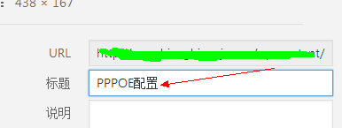

WordPress目录下找到wp-admin/includes/file.php这个文件。在wp-admin/includes/file.php文件中查找


```php
$new_file = $uploads['path'] . "/$filename";

```


替换成下面的:


```php
$new_file = $_uploads['path'] . "/".date("YmdHis").floor(microtime()1000).".".$ext;_

```


这样就可以实现wordpress上传图片自动重命名了。


然后在编辑图片中改成你想要的中文名字就好，经测试这一方法比较好用，其他方法暂不可用。




