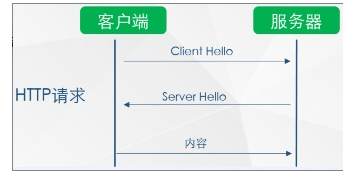

## 为什么要把HTTP换成HTTPS


先大概说一下我们浏览到网页的过程：


1 首先你要有一台大家都可以访问到的服务器（当然是用你的电脑也可以），并不是说可以访问此服务器的所有资源。裸服务器是不可以是用的，需要安装应用对外提供服务，而应用在服务器上的体现就是端口号。http为80端口，https为443端口号，ftp为21号端口号等。


2.以http为例，在服务器上安装可以提供网页服务的应用，常见的有Apache，nginx，tomcat，IIS（一般用在winserver上）。这些应用会把网页端的代码转换为我们能看到的页面。其实是将PHP和JAVA等动态语言传递参数到HTML中，再配合CSS和JS的修饰，然后再由浏览器识别。最终就是我们看到的效果。


3.下面不谈有关代码的事，之谈服务器端和客户端的交互过程。





如图就是HTTP中最简单的交互。http协议工作在TCP层之上，属于应用层协议。交互过程相当于TCP三次握手再加上HTTP协议规定的一些东西。http的诞生使得我们的互联网世界变得极为丰富，但是它有一个很大的缺点，那就是不安全，所有信息都是明文传输。攻击人员通过抓包就可以看的清清楚楚，当然也包括你想对某人说的悄悄话和你的银行卡密码。


正是由于这种问题，https诞生了。https和http一样也工作在TCP层之上，不过在他们之间还隔着一层东西叫做SSL/TSL。


这层东西的作用可就大了，可以实现加密，完整性校验，数字签名等功能。


**https简单访问过程**


总之HTTPS会将服务器和客户端之间的内容进行加密。使数据更加安全。


详细解释过程可看：


http://baijiahao.baidu.com/sid=1570143475599137&wfr=spider&for=pc


## 准备将HTTP变成HTTPS的工具


实现加密和解密需要三个文件：私钥，公钥和证书链。这三个文件需要我们去向SSL证书提供商申请。


推荐三款免费的：

- Let’s Encrypt  是国外一个公共的免费SSL项目，由 Linux 基金会托管，它的来头不小，由Mozilla、思科、Akamai、IdenTrust和EFF等组织发起免费三个月，三个月后重新申请即可。
- startSSL  个人免费一年
- 沃通   免费两年，证书其实是startSSL发布的

我是在腾讯云申请的，申请很方面速度也很快，申请地址：


https://console.cloud.tencent.com/ssl/detail/JwB8tHnV


申请完成后你会得到一个压缩文件，下载下来打开就是想要的文件：


其中第一个是证书链，第二个是公钥，第三个是私钥。


## 服务器端配置SSL


以apache为例：

1. 安装SSL模块：

```shell
_sudo yum install -y modssl_

```

1. 复制三个文件分别到如下目录:私钥：/etc/pki/tls/private/公钥和证书链： /etc/pki/tls/certs/
2. 修改配置文件：

修改/etc/httpd/conf.d/ssl.conf文件的下面内容：


```shell
_SSLProtocol all -SSLv2 -SSLv3
SSLCertificateFile     /etc/pki/tls/certs/2www.hrwhisper.me.crt
SSLCertificateKeyFi/etc/pki/tls/private/3www.hrwhisper.me.key
SSLCertificateChainFile   /etc/pki/tls/certs/1__root_bundle.crt

```

1. 重启httpd服务：

```shell
service httpd restart

```


到这里已经实现了网站的https,将网址http改为https已经可以访问。并且浏览器前面的锁是绿色的，代表网站是可信任的。


## wordpress端需要修改和注意的


我们只是实现了网站的https，但是wordpress后台中的一些关键项也要设为https。例如：


设置完成后可能出现网站打不开的情况，还需要更新数据库。


**更新方法:**


在数据库中执行如下sql语句：


```shell
UPDATE wp_posts SET post__content = REPLACE(postcontent, 'http://www.handbye.cn','https://handbye.cn');_

```


将里面对应的网址换成你自己的。


如果评论或者文章自定义字段中也使用过网站的地址，那么还要执行以下语句：


```shell
UPDATE wp_comments SET comment__content = REPLACE(commentcontent, 'http://www.handbye.cnt','https://handbye.cn');
UPDATE wp__comments SET comment_author_url = REPLACE(comment__authorurl, 'http://www.handbye.cn','https://handbye.cn');
UPDATE wp__postmeta SET meta__value = REPLACE(metavalue, 'http://handbye.cnt','https://handbye.cn');
UPDATE wp__termmeta SET meta__value = REPLACE(metavalue, 'http://www.handbye.cn','https://handbye.cn');_

```


将里面对应的网址换成你自己的。


这时就已经大工告成！！


## 进一步优化


将之前已经收录的http链接301重定向到https,新站点请忽略：
（修改.htaccess文件）


```shell
_<IfModule modrewrite.c>
RewriteEngine On
RewriteCond %{HTTPS} off
RewriteRule ^(.)$ https://%{HTTP__HOST}%{REQUEST__URI} [R=301,L]
</IfModule>
<IfModule modrewrite.c>
RewriteEngine On
RewriteCond %{HTTPS} off
RewriteRule ^(.)$ https://%{HTTP__HOST}%{REQUEST_URI} [R=301,L]
</IfModule>

```


或者使用插件来实现：


推荐插件：**HTTPS Redirection**


## 参考文章


https://www.boke8.net/wordpress-https.html


https://www.hrwhisper.me/secure-your-wordpress-with-a-free-ssl-certificate/

