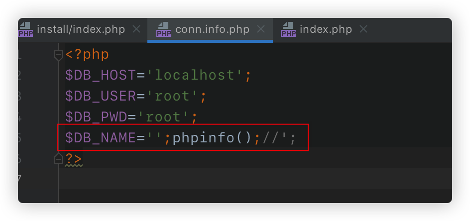
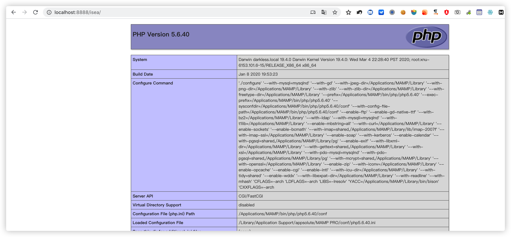

在审计一个名为熊海CMS的时候，发现了一处比较有趣的文件写入导致的getshell，所以记录一下分享出来。虽然利用条件有些鸡肋，但在遇到CMS安装页未删除并且可以重复安装的情况下倒是一个getshell的思路。


关键代码如下：


```php
include '../inc/db.class.php';
$db = new DBManage ( $dbhost, $dbuser, $dbpwd, $dbname, 'utf8' );
$db->restore ('seacms.sql');
$content = "<?php
\$DB_HOST='".$dbhost."';
\$DB_USER='".$dbuser."';
\$DB_PWD='".$dbpwd."';
\$DB_NAME='".$dbname."';
?>
";
$of = fopen('../inc/conn.info.php','w');
if($of){
 fwrite($of,$content);
}
echo "MySQL数据库连接配置成功!<br /><br />";

```


在安装时，会将数据库名，用户，密码等写入`db.class.php`文件，那就可以构造数据库名来getshell了。


我们可将数据库的名称改为：`';phpinfo();//`  （经测试，mysql的数据名是可以有任意字符的）这样在安装时写入到`db.calss.php`的文件就变成了如下的样子：





这样直接访问安装后的CMS首页就可以执行写入的php代码了，因为不管哪个页面都引用了`db.class.php`这个配置文件。





如果是黑盒测试的话就需要不断尝试数据库名的payload，因为不同CMS写入配置文件时的格式不同。

