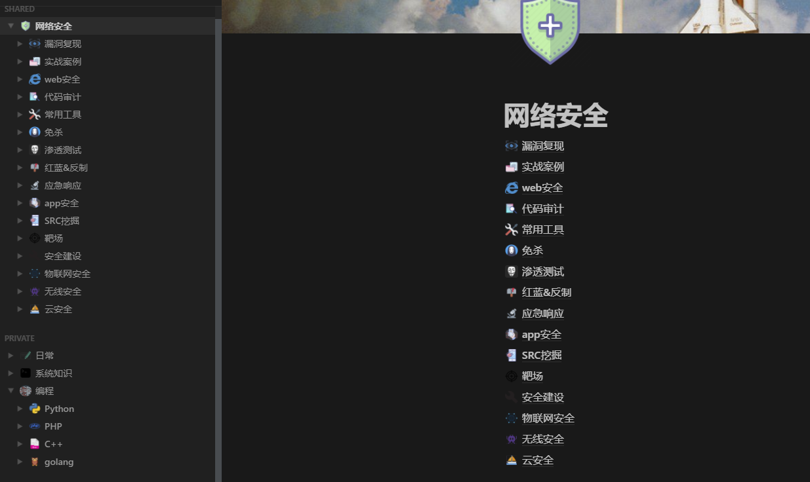
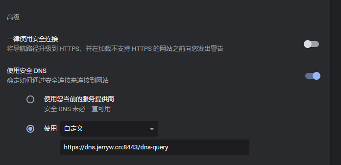
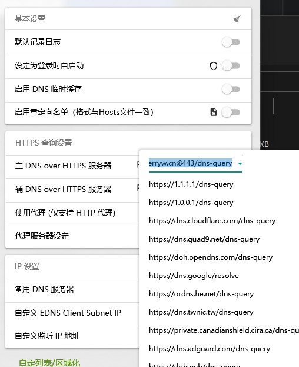
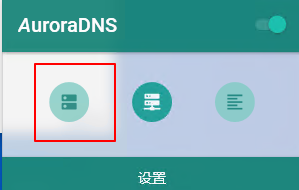

## 为什么notion需要加速

作者算是一个notion的重度用户了，每天都要在notion上收集和记录东西，如下面的页面就是我在notion上记录的有关于网络安全的东西。

奈何notion在国内没有服务器，导致网络访问较慢，有时候更是直接打不开页面。在网上搜寻解决办法时，大概找到了这么两种：

1. 用梯子加速
2. 修改host或者修改dns为DOH

本文篇章主要介绍第二种方法，因为第一种方法对大多数人来说不适用。

这里首先要感谢Jerry提供了一个免费的节点用进行notion的流量中转，具体情况可以看[这里](https://jerryw.cn/notion-faster)。

> 我更推荐你使用DOH,因为修改host的方式当加速服务器的ip更改后就失效了。

windows用户如何修改host?请看这里[https://jingyan.baidu.com/article/9113f81b49ed2f2b3214c7fa.html](https://jingyan.baidu.com/article/9113f81b49ed2f2b3214c7fa.html)

## 配置DOH

如何使用DOH呢？

如何你只是要浏览器访问notion，那么设置很简单，以chrome为例：

打开设置中的安全和隐私设置

在这里设置使用安全的DNS即可。

如何你要使用notion客户端，那么上面的方法就不适用了，以windows用户为例，如果要设置DOH,win10本身是不支持的，我推荐一款简单方便的软件叫做AuroraDNS。

下载地址：[https://github.com/mili-tan/AuroraDNS.GUI](https://github.com/mili-tan/AuroraDNS.GUI)

使用方法：[https://www.4gml.com/thread-78.htm](https://www.4gml.com/thread-78.htm)

只需要在这里设置主DNS为`https://dns.jerryw.cn:8443/dns-query`即可：

最后启动就可以了

然后可以去测试下你的notion速度是不是比之前快多了！

