> 以下文章中提到的所有漏洞都已经报相关厂商并已修复


## 事件起因


在一个满是~黑客~（安全从业者）的群里，竟然混入了一个不明飞行物，他还发了个极具诱惑的广告：


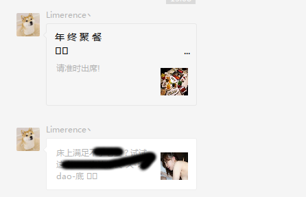


我仔细一看（马赛克后面的文字请自行瞎想），感觉事情不对，点开其中的广告仔细欣赏了一番，于是有了下面的故事。


## 微信不背这个锅


一般来说在微信中打开未经备案的域名或者微信监测到的恶意域名都会提示风险并阻断访问：


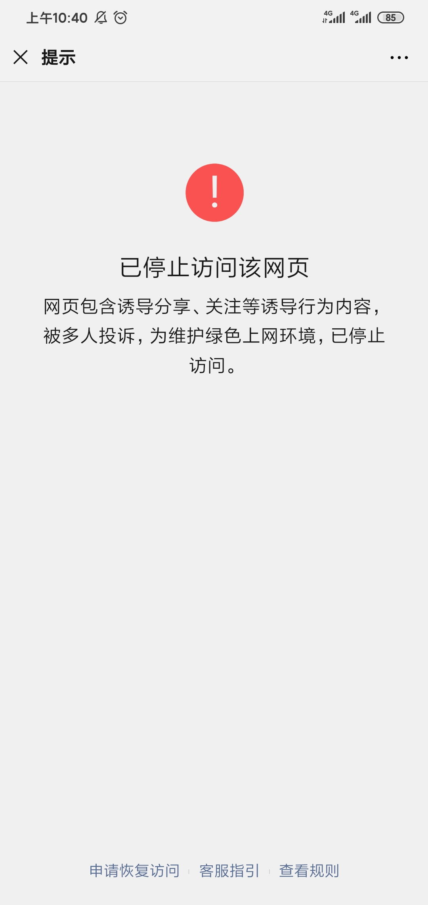


但是骗子在群里发送的链接却没有提示，直接跳转到了下面这个页面：


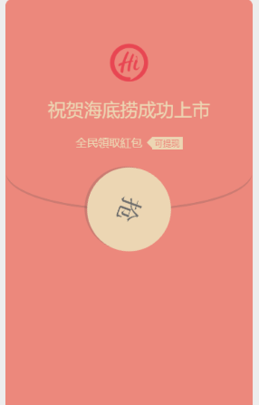


海底捞满脸问号，我做错了什么？


瞧这优美的设计，骗子的美术功底还不错。点击抢，就会跳转到另外一个页面，提示你已经抢到了多少红包，分享朋友圈和群即可领取。这个页面我没截到，大概就是我上面描述的东西。


大概的代码如下：


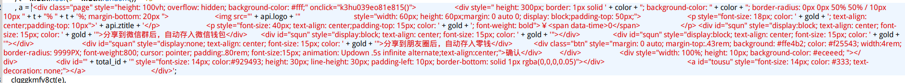


然后就需要你去联系客服人员，然后有人就上当了。


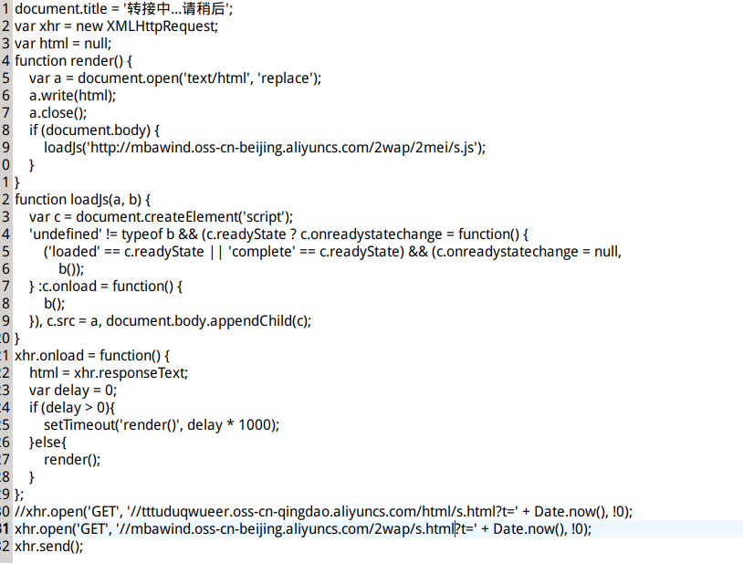


## 分析过程


打开骗子发的链接后发现有一个跳转过程：


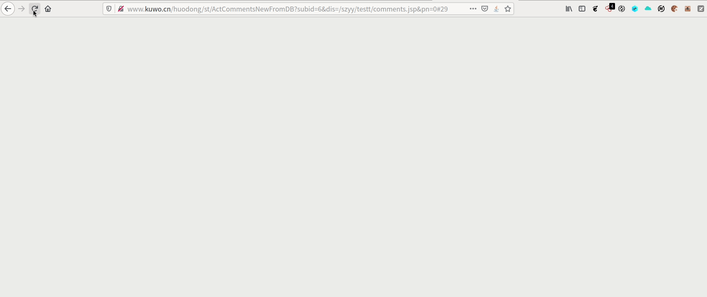


跳转的那个页面如下：


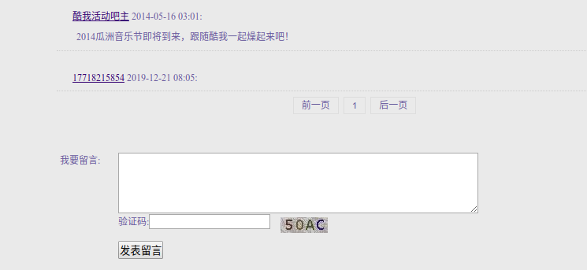


酷我音乐留言板，我怀疑这个页面存在xss，被人插入了恶意的js代码导致了页面跳转到骗子给定的页面，也就是上面看到的抽奖页。


我仔细看了下页面的请求信息：


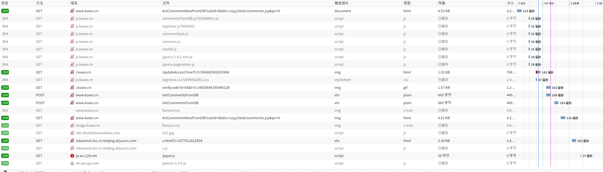


找出了二个可疑的加载js代码的url地址：


```shell
http://cdn.zhudazhanzuidiao.com/222.jpg

http://mbawind.oss-cn-beijing.aliyuncs.com/2wap/2mei/s.js

```


其中222.jpg文件也是一个js文件


s.js文件是最主要的js文件，就是用来展示那个抽奖页面的。s.js中还加载了几个js文件。


有兴趣的同学可以深入分析下这几个文件


| 文件                                                                                                                                                      | MD5                              |
| ------------------------------------------------------------------------------------------------------------------------------------------------------- | -------------------------------- |
| [222.jpg](https://xbsfcursotamandareg12br-my.sharepoint.com/:i:/g/personal/darklessmailhrkanet/EeccVFHMDiZEhh7rA4NJCJIBPoEwXChDKQsUTuDVUsrrXw?e=LpUa4L) | 610d141a3b1e827dbd29fa2a1fff6565 |
| [s.js](https://xbsfcursotamandareg12br-my.sharepoint.com/:u:/g/personal/darklessmailhrkanet/EZUsI7ORw11KsfTu35ACLXcB8h1aFMNNe12kub7b99X3Q?e=O0ixvS)     | 99dd595529146aef041fe2906bbb776d |
| [t.js](https://xbsfcursotamandareg12br-my.sharepoint.com/:u:/g/personal/darklessmailhrkanet/ERVWC4OVMrVIjZtM0yQf1QBlVpthiOFVzw7Gqnj8ZdtcA?e=vHOC74)     | 1ad50dcd3b631ad0cf2a252bbda6ba2b |


## 酷我音乐主站XSS


尝试寻找酷我音乐存在xss的留言板地址。


最终发现的地址如下：


[http://www.kuwo.cn/huodong/st/ActCommentsNewFromDB?subid=6&dis=/szyy/testt/comments.jsp&pn=0#29](http://www.kuwo.cn/huodong/st/ActCommentsNewFromDB?subid=6&dis=%2Fszyy%2Ftestt%2Fcomments.jsp&pn=0#29)


`subid`的值可以遍历，不同的值代表一个留言页面。


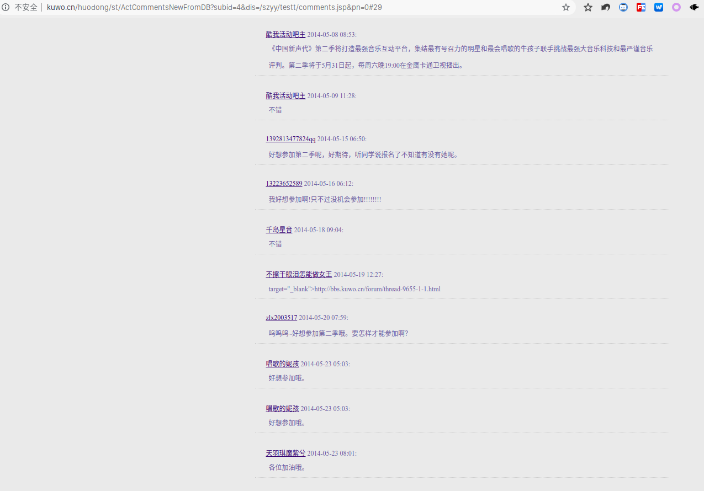


很多页面都已被垃圾留言充斥。


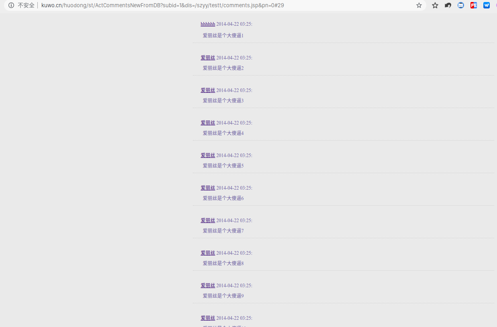


subid=6的页面已被黑产利用来进行诈骗钓鱼等非法活动


每个页面下面都有个留言框可以留言：


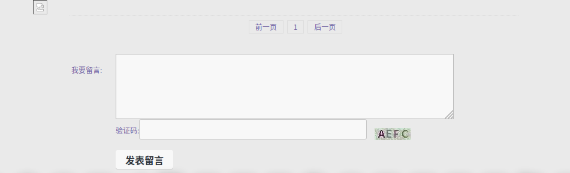


这里没有登录按钮，可以在[酷我音乐](www.kuwo.cn)登陆后把cookie带过来，即可留言。


尝试写入一个xss payload，弹窗成功，说明这个页面确实存在xss。


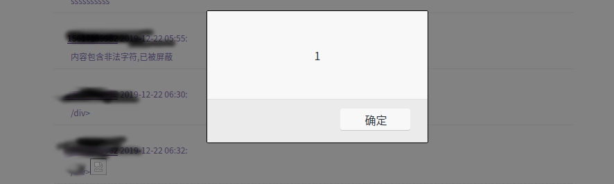


提交厂商进行修复：


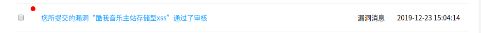


## 后续


给微信举报后，已将原来那个链接封禁了，今天打开一看又可以访问了。仔细一看原来是借助乐视的url跳转漏洞复活了。黑产大哥，我服了you，可否把你的零day送我几个呢。


这个洞还没修，图片就不放了。

