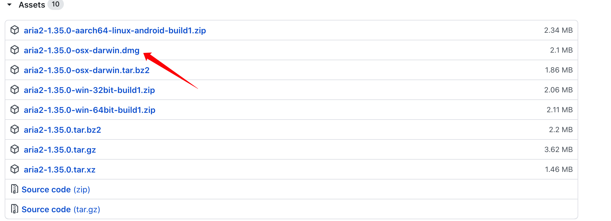
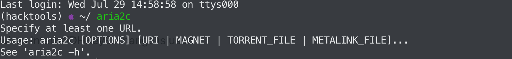
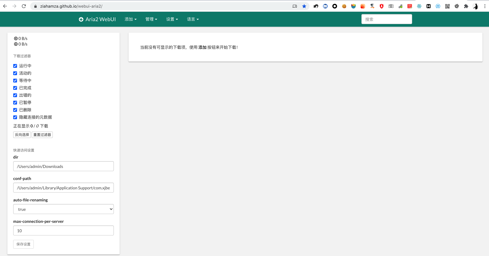
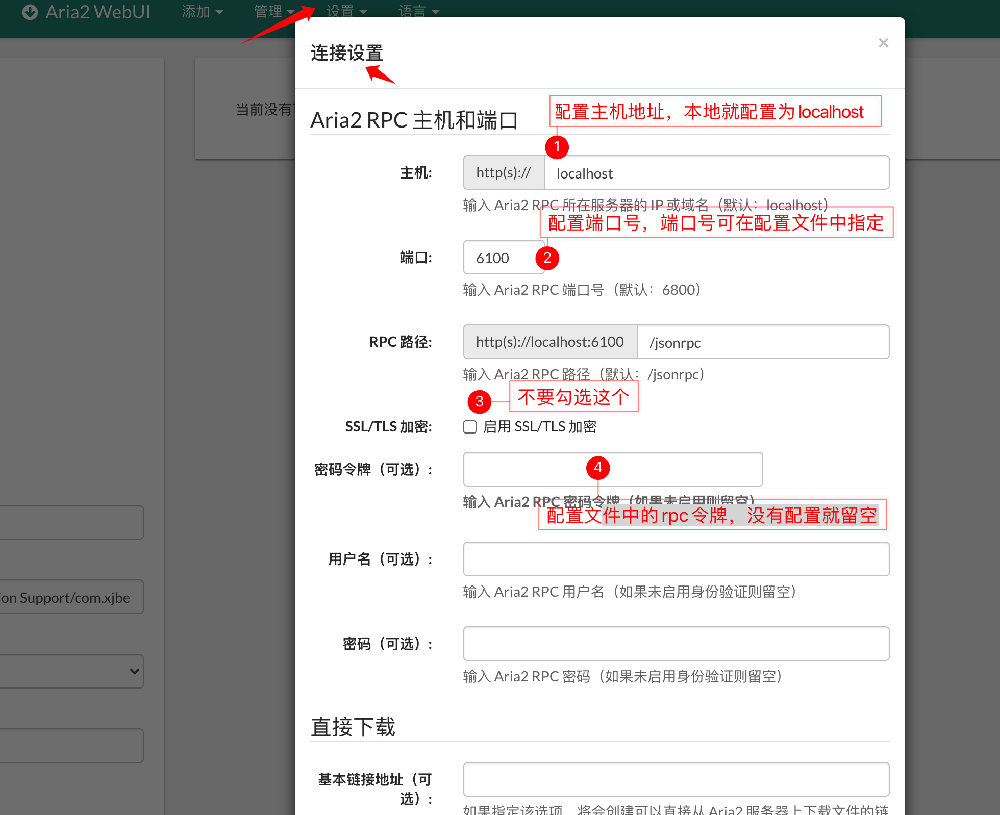
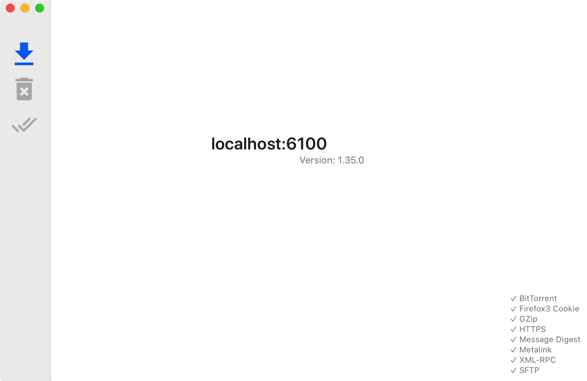
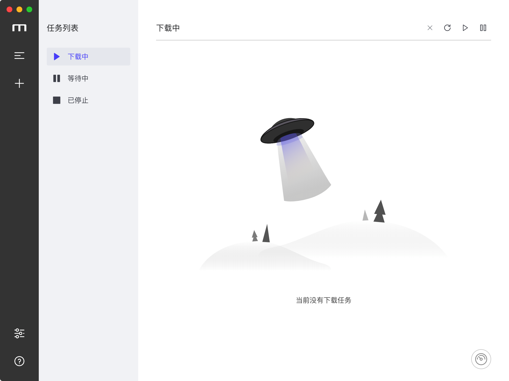
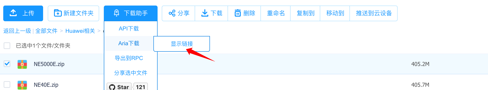

> 首发于freebuf：[https://www.freebuf.com/sectool/244962.html](https://www.freebuf.com/sectool/244962.html)


## aria2简介


aria2是一个轻量级多协议和多源命令行下载实用程序。它支持HTTP/HTTPS、FTP、SFTP、BitTorrent和Metalink。aria2可以通过内置的JSON-RPC和XML-RPC接口进行操作。aria2支持多线程下载，在同等网络条件下，下载速度可以提升数倍。aria2是跨平台的，操作简单，并支持断点续传，本文重点介绍aria2在mac os下的使用。


## 安装aria2


mac上安装aria2十分简单，你只需要在终端下输入命令`brew install aria2`即可安装。你也可以在[这里](https://github.com/aria2/aria2/releases/tag/release-1.35.0)下载对应的安装包进行安装：





aria2安装完毕后在终端输入aria2c即可进行使用:





## aria2的配置文件


aria2可通过配置文件进行灵活定义各项功能，aria2安装完毕后可在当前用户目录下新建一个`.aria2`文件夹，并在这个文件夹内新建一个`aria2.conf`文件，此文件即为aria2的配置文件，当aria2启动时会自动读取此文件中的配置。


> 注意还需要在此文件夹下新建一个`aria2.session`的文件用于保存会话。


`aria2.conf`配置文件详解：


```shell
## '#'开头为注释内容, 选项都有相应的注释说明, 根据需要修改 ##
## 被注释的选项填写的是默认值, 建议在需要修改时再取消注释  ##

## 文件保存相关 ##

# 文件的保存路径(可使用绝对路径或相对路径), 默认: 当前启动位置
dir=/home/ivo/Videos

# 启用磁盘缓存, 0为禁用缓存, 需1.16以上版本, 默认:16M
#disk-cache=32M
#disk-cache=32M
# 文件预分配方式, 能有效降低磁盘碎片, 默认:prealloc
# 预分配所需时间: none < falloc ? trunc < prealloc
# falloc和trunc则需要文件系统和内核支持
# NTFS建议使用falloc, EXT3/4建议trunc, MAC 下需要注释此项
file-allocation=prealloc
# 断点续传
continue=true

## 下载连接相关 ##

# 最大同时下载任务数, 运行时可修改, 默认:5
max-concurrent-downloads=10
# 同一服务器连接数, 添加时可指定, 默认:1
max-connection-per-server=10
# 最小文件分片大小, 添加时可指定, 取值范围1M -1024M, 默认:20M
# 假定size=10M, 文件为20MiB 则使用两个来源下载; 文件为15MiB 则使用一个来源下载
min-split-size=10M
# 单个任务最大线程数, 添加时可指定, 默认:5
split=5
# 整体下载速度限制, 运行时可修改, 默认:0
#max-overall-download-limit=0
# 单个任务下载速度限制, 默认:0
#max-download-limit=0
# 整体上传速度限制, 运行时可修改, 默认:0
#max-overall-upload-limit=0
# 单个任务上传速度限制, 默认:0
#max-upload-limit=0
# 禁用IPv6, 默认:false
disable-ipv6=true

## 进度保存相关 ##

# 从会话文件中读取下载任务
input-file=/home/ivo/.aria2/aria2.session
# 在Aria2退出时保存`错误/未完成`_的下载任务到会话文件
save-session=/home/ivo/.aria2/aria2.session
# 定时保存会话, 0为退出时才保存, 需1.16.1以上版本, 默认:0
save-session-interval=60

## RPC相关设置 ##

enable-rpc=true
pause=false
rpc-allow-origin-all=true
rpc-listen-all=true
rpc-save-upload-metadata=true
rpc-secure=false

# 启用RPC, 默认:false
#enable-rpc=true
# 允许所有来源, 默认:false
#rpc-allow-origin-all=true
# 允许非外部访问, 默认:false
#rpc-listen-all=true
# 事件轮询方式, 取值:[epoll, kqueue, port, poll, select], 不同系统默认值不同
#event-poll=select
# RPC监听端口, 端口被占用时可以修改, 默认:6800
rpc-listen-port=6800
# 设置的RPC授权令牌, v1.18.4新增功能, 取代 --rpc-user 和 --rpc-passwd 选项
#rpc-secure=<taken>
# 设置的RPC访问用户名, 此选项新版已废弃, 建议改用 --rpc-secret 选项
#rpc-user=<USER>
# 设置的RPC访问密码, 此选项新版已废弃, 建议改用 --rpc-secret 选项
#rpc-passwd=<PASSWD>

## BT/PT下载相关 ##

# 当下载的是一个种子(以.torrent结尾)时, 自动开始BT任务, 默认:true
#follow-torrent=true
# BT监听端口, 当端口被屏蔽时使用, 默认:6881-6999
listen-port=51413
# 单个种子最大连接数, 默认:55
#bt-max-peers=55
# 打开DHT功能, PT需要禁用, 默认:true
enable-dht=true
# 打开IPv6 DHT功能, PT需要禁用
#enable-dht6=false
# DHT网络监听端口, 默认:6881-6999
#dht-listen-port=6881-6999
# 本地节点查找, PT需要禁用, 默认:false
bt-enable-lpd=true
# 种子交换, PT需要禁用, 默认:true
enable-peer-exchange=false
# 每个种子限速, 对少种的PT很有用, 默认:50K
#bt-request-peer-speed-limit=50K
# 客户端伪装, PT需要
#peer-id-prefix=-TR2770-
user-agent=Transmission/2.92
#user-agent=netdisk;4.4.0.6;PC;PC-Windows;6.2.9200;WindowsBaiduYunGuanJia
# 当种子的分享率达到这个数时, 自动停止做种, 0为一直做种, 默认:1.0

seed-ratio=1.0
#作种时间大于30分钟，则停止作种
seed-time=30
# 强制保存会话, 话即使任务已经完成, 默认:false
# 较新的版本开启后会在任务完成后依然保留.aria2文件
#force-save=false
# BT校验相关, 默认:true
#bt-hash-check-seed=true
# 继续之前的BT任务时, 无需再次校验, 默认:false
bt-seed-unverified=true
# 保存磁力链接元数据为种子文件(.torrent文件), 默认:false
bt-save-metadata=true
#下载完成后删除.ara2的同名文件
on-download-complete=/home/ivo/aria2/deletearia2
#on-download-complete=/home/pi/aria2/rasp.sh_

```


如果你不想自己去配置aria2，那么[这里](https://gist.github.com/maboloshi/a4b1f27567319d4a42352aadd036a578)有一份现成的配置文件，拿来即可使用。


## aria2常用命令详解


```shell
Options:
 -v, --version                打印版本信息

 -h, --help[=TAG|KEYWORD]     显示帮助信息

 -l, --log=LOG                指定日志保存文件

 -d, --dir=DIR                指定文件下载位置

 -o, --out=FILE               指定文件下载后的保存时的文件名

 -s, --split=N                指定下载时的连接数，默认为5

 --file-allocation=METHOD     指定文件分配方式
                              Possible Values: none, prealloc, trunc, falloc
                              Default: prealloc

 -V, --check-integrity[=true|false]    通过验证散列或整个文件的哈希来检查文件的完整性。此选项仅在BitTorrent，
                                       带有校验和的Metalink下载或带有--checksum选 项的HTTP（S）/ FTP下载中有效。

 -c, --continue[=true|false]  是否开启断点续传

 -i, --input-file=FILE        从文件中读取url进行下载，每行一个url

 -j, --max-concurrent-downloads=N    为每个队列项设置并行下载的最大数量，默认值为5

 -Z, --force-sequential[=true|false]  在命令行中依次获取URI并在单独的会话中下载每个URI

 -x, --max-connection-per-server=NUM  每次下载与一台服务器的最大连接数，默认为1

 -k, --min-split-size=SIZE    指定文件可分隔大小，默认值为20M

 --ftp-user=USER              指定ftp用户名

 --ftp-passwd=PASSWD          指定ftp密码

 --http-user=USER             指定http认证用户名

 --http-passwd=PASSWD         指定http认证密码

 --load-cookies=FILE          指定存放cookies的文件名


```


详细使用手册请查看：[https://aria2.github.io/manual/en/html/aria2c.html#](https://aria2.github.io/manual/en/html/aria2c.html#)


## 下载示例


### 下载单个文件


下面的命令将会从指定的 URL 中下载一个文件，并且保存在当前目录，在下载文件的过程中，我们可以看到文件的（日期、时间、下载速度和下载进度）。


```shell
# aria2c https://download.owncloud.org/community/owncloud-9.0.0.tar.bz2
[#986c80 19MiB/21MiB(90%) CN:1 DL:3.0MiB]
03/22 09:49:13 [NOTICE] Download complete: /opt/owncloud-9.0.0.tar.bz2

Download Results:
gid   |stat|avg speed  |path/URI
======+====+===========+=======================================================
986c80|OK  |   3.0MiB/s|/opt/owncloud-9.0.0.tar.bz2

Status Legend:
(OK):download completed.

```


### 使用不同的名字保存文件


在初始化下载的时候，我们可以使用 -o（小写）选项在保存文件的时候使用不同的名字。这儿我们将要使用 owncloud.zip 文件名来保存文件。


```shell
# aria2c -o owncloud.zip https://download.owncloud.org/community/owncloud-9.0.0.tar.bz2
[#d31304 16MiB/21MiB(74%) CN:1 DL:6.2MiB]
03/22 09:51:02 [NOTICE] Download complete: /opt/owncloud.zip

Download Results:
gid   |stat|avg speed  |path/URI
======+====+===========+=======================================================
d31304|OK  |   7.3MiB/s|/opt/owncloud.zip

Status Legend:
(OK):download completed.

```


### 下载速度限制


默认情况下，aria2 会利用全部带宽来下载文件，在文件下载完成之前，我们在服务器就什么也做不了（这将会影响其他服务访问带宽）。所以在下载大文件时最好使用 –max-download-limit 选项来避免进一步的问题。


```shell
# aria2c --max-download-limit=500k https://download.owncloud.org/community/owncloud-9.0.0.tar.bz2
[#7f9fbf 21MiB/21MiB(99%) CN:1 DL:466KiB]
03/22 09:54:51 [NOTICE] Download complete: /opt/owncloud-9.0.0.tar.bz2

Download Results:
gid   |stat|avg speed  |path/URI
======+====+===========+=======================================================
7f9fbf|OK  |   462KiB/s|/opt/owncloud-9.0.0.tar.bz2

Status Legend:
(OK):download completed.

```


### 下载多个文件


下面的命令将会从指定位置下载超过一个的文件并保存到当前目录，在下载文件的过程中，我们可以看到文件的（日期、时间、下载速度和下载进度）。


```shell
# aria2c -Z https://download.owncloud.org/community/owncloud-9.0.0.tar.bz2 ftp://ftp.gnu.org/gnu/wget/wget-1.17.tar.gz
[DL:1.7MiB][#53533c 272KiB/21MiB(1%)][#b52bb1 768KiB/3.6MiB(20%)]
03/22 10:25:54 [NOTICE] Download complete: /opt/wget-1.17.tar.gz
[#53533c 18MiB/21MiB(86%) CN:1 DL:3.2MiB]
03/22 10:25:59 [NOTICE] Download complete: /opt/owncloud-9.0.0.tar.bz2

Download Results:
gid   |stat|avg speed  |path/URI
======+====+===========+=======================================================
b52bb1|OK  |   2.8MiB/s|/opt/wget-1.17.tar.gz
53533c|OK  |   3.4MiB/s|/opt/owncloud-9.0.0.tar.bz2

Status Legend:
(OK):download completed.

```


### 续传未完成的下载


当你遇到一些网络连接问题或者系统问题的时候，并将要下载一个大文件（例如： ISO 镜像文件），我建议你使用 -c 选项，它可以帮助我们从该状态续传未完成的下载，并且像往常一样完成。不然的话，当你再次下载，它将会初始化新的下载，并保存成一个不同的文件名（自动的在文件名后面添加 .1 ）。注意：如果出现了任何中断，aria2 使用 .aria2 后缀保存（未完成的）文件。


```shell
# aria2c -c https://download.owncloud.org/community/owncloud-9.0.0.tar.bz2
[#db0b08 8.2MiB/21MiB(38%) CN:1 DL:3.1MiB ETA:4s]^C
03/22 10:09:26 [NOTICE] Shutdown sequence commencing... Press Ctrl-C again for emergency shutdown.

03/22 10:09:26 [NOTICE] Download GID#db0b08bf55d5908d not complete: /opt/owncloud-9.0.0.tar.bz2

Download Results:
gid   |stat|avg speed  |path/URI
======+====+===========+=======================================================
db0b08|INPR|   3.3MiB/s|/opt/owncloud-9.0.0.tar.bz2

Status Legend:
(INPR):download in-progress.

```


如果重新启动传输，aria2 将会恢复下载。


```shell
# aria2c -c https://download.owncloud.org/community/owncloud-9.0.0.tar.bz2
[#873d08 21MiB/21MiB(98%) CN:1 DL:2.7MiB]
03/22 10:09:57 [NOTICE] Download complete: /opt/owncloud-9.0.0.tar.bz2

Download Results:
gid   |stat|avg speed  |path/URI
======+====+===========+=======================================================
873d08|OK  |   1.9MiB/s|/opt/owncloud-9.0.0.tar.bz2

Status Legend:
(OK):download completed.

```


### 从文件获取输入


就像 wget 可以从一个文件获取输入的 URL 列表来下载一样。我们需要创建一个文件，将每一个 URL 存储在单独的行中。ara2 命令行可以添加 -i 选项来执行此操作。


```shell
# aria2c -i test-aria2.txt
[DL:3.9MiB][#b97984 192KiB/21MiB(0%)][#673c8e 2.5MiB/3.6MiB(69%)]
03/22 10:14:22 [NOTICE] Download complete: /opt/wget-1.17.tar.gz
[#b97984 19MiB/21MiB(90%) CN:1 DL:2.5MiB]
03/22 10:14:30 [NOTICE] Download complete: /opt/owncloud-9.0.0.tar.bz2

Download Results:
gid   |stat|avg speed  |path/URI
======+====+===========+=======================================================
673c8e|OK  |   4.3MiB/s|/opt/wget-1.17.tar.gz
b97984|OK  |   2.5MiB/s|/opt/owncloud-9.0.0.tar.bz2

Status Legend:
(OK):download completed.

```


### 每个主机使用两个连接来下载


默认情况，每次下载连接到一台服务器的最大数目，对于一条主机只能建立一条。我们可以通过 aria2 命令行添加 -x2（2 表示两个连接）来创建到每台主机的多个连接，以加快下载速度。


```shell
# aria2c -x2 https://download.owncloud.org/community/owncloud-9.0.0.tar.bz2
[#ddd4cd 18MiB/21MiB(83%) CN:1 DL:5.0MiB]
03/22 10:16:27 [NOTICE] Download complete: /opt/owncloud-9.0.0.tar.bz2

Download Results:
gid   |stat|avg speed  |path/URI
======+====+===========+=======================================================
ddd4cd|OK  |   5.5MiB/s|/opt/owncloud-9.0.0.tar.bz2

Status Legend:
(OK):download completed.

```


### 下载 BitTorrent 种子文件


我们可以使用 aria2 命令行直接下载一个 BitTorrent 种子文件：


```shell
# aria2c https://torcache.net/torrent/C86F4E743253E0EBF3090CCFFCC9B56FA38451A3.torrent?title=[kat.cr]irudhi.suttru.2015.official.teaser.full.hd.1080p.pathi.team.sr
[#388321 0B/0B CN:1 DL:0B]                                                                                                                    
03/22 20:06:14 [NOTICE] Download complete: /opt/[kat.cr]irudhi.suttru.2015.official.teaser.full.hd.1080p.pathi.team.sr.torrent

03/22 20:06:14 [ERROR] Exception caught
Exception: [BtPostDownloadHandler.cc:98] errorCode=25 Could not parse BitTorrent metainfo

Download Results:
gid   |stat|avg speed  |path/URI
======+====+===========+=======================================================
388321|OK  |    11MiB/s|/opt/[kat.cr]irudhi.suttru.2015.official.teaser.full.hd.1080p.pathi.team.sr.torrent

Status Legend:
(OK):download completed.

```


### 下载 BitTorrent 磁力链接


使用 aria2 我们也可以通过 BitTorrent 磁力链接直接下载一个种子文件：


```shell
# aria2c 'magnet:?xt=urn:btih:248D0A1CD08284299DE78D5C1ED359BB46717D8C'

```


### 下载 BitTorrent Metalink 种子


我们也可以通过 aria2 命令行直接下载一个 Metalink 文件。


```shell
# aria2c https://curl.haxx.se/metalink.cgi?curl=tar.bz2

```


### 从密码保护的网站下载一个文件


或者，我们也可以从一个密码保护网站下载一个文件。下面的命令行将会从一个密码保护网站中下载文件。


```shell
# aria2c --http-user=xxx --http-password=xxx https://download.owncloud.org/community/owncloud-9.0.0.tar.bz2

# aria2c --ftp-user=xxx --ftp-password=xxx ftp://ftp.gnu.org/gnu/wget/wget-1.17.tar.gz

```


## aria2 浏览器版


有些同学不习惯使用命令行，别着急，aria2同样有gui版本。


> 注意使用gui版的前提是已经安装完毕aria2,并且开启了rpc，这些都可以在配置文件中进行指定。


1.在线版：[https://ziahamza.github.io/webui-aria2/](https://ziahamza.github.io/webui-aria2/)





初次使用时需要进行连接配置：





配置完毕后即可通过rpc和本地aria2通信，然后就可以添加下载任务进行下载了。


2.chrome插件：[Aria2 for Chrome](https://chrome.google.com/webstore/detail/aria2-for-chrome/mpkodccbngfoacfalldjimigbofkhgjn/related?hl=zh-CN)


同样使用rpc连接到本地aria2后即可使用。


类似的软件还有很多就不一一推荐了。


## aria2 桌面版


除了使用命令行和浏览器，还可以使用aria2的桌面版，本文推荐作者正在使用的两个。


1.Aria2D


项目地址：[https://github.com/xjbeta/Aria2D](https://github.com/xjbeta/Aria2D)





2.Motrix


项目地址：[https://motrix.app/](https://motrix.app/)





推荐使用这款软件，内置了aria2，无需进行配置即可使用。


## 为百度云盘加速


最后推荐一个插件，本插件可将百度云盘文件下载地址转换为aria2的下载地址，然后就可以告别百度云盘的龟速下载了：


插件地址：[百度网盘直链下载助手](https://github.com/syhyz1990/baiduyun)





实测下载速度可以达到500kb/s，虽然不是很快，但也比之前强了不少。


## 参考：


[https://www.zcfy.cc/article/aria2-command-line-downloader-command-examples](https://www.zcfy.cc/article/aria2-command-line-downloader-command-examples)
[https://aria2.github.io/manual/en/html/aria2c.html#](https://aria2.github.io/manual/en/html/aria2c.html#)
[https://gist.github.com/maboloshi/a4b1f27567319d4a42352aadd036a578](https://gist.github.com/maboloshi/a4b1f27567319d4a42352aadd036a578)
[https://sshwy.gitee.io/2019/04/13/53687/](https://sshwy.gitee.io/2019/04/13/53687/)
[http://ivo-wang.github.io/2019/04/18/%E5%85%B3%E4%BA%8Earia2%E6%9C%80%E5%AE%8C%E6%95%B4%E7%9A%84%E4%B8%80%E7%AF%87/](http://ivo-wang.github.io/2019/04/18/%E5%85%B3%E4%BA%8Earia2%E6%9C%80%E5%AE%8C%E6%95%B4%E7%9A%84%E4%B8%80%E7%AF%87/)
[https://github.com/P3TERX/aria2.conf](https://github.com/P3TERX/aria2.conf)

