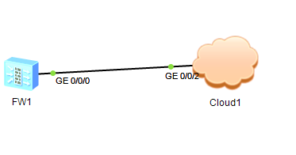
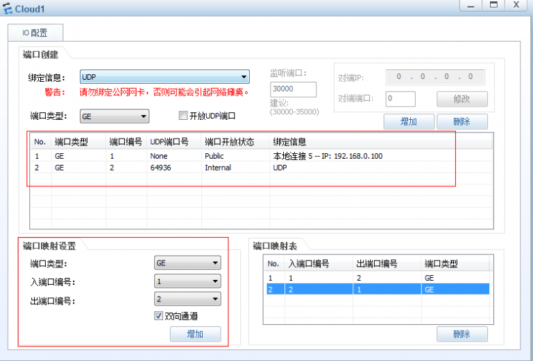
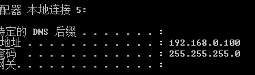
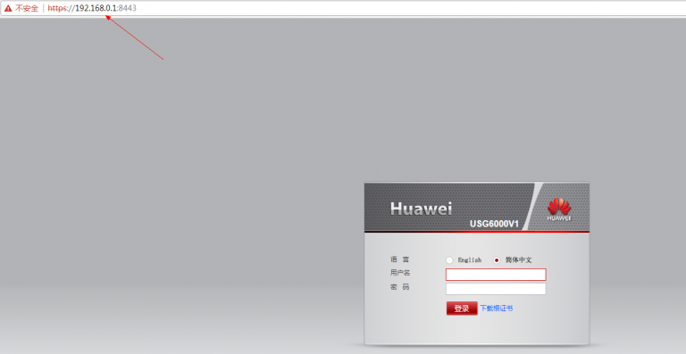

华为的USG系列防火墙默认是开启了web登陆的，我们可以使用浏览器登陆到防火墙中对其进行一些配置。如果没有真实设备，但又想体现下使用web管理防火墙怎么办呢？
别担心，华为的ENSP模拟上的USG6000V防火墙也是就可以用浏览器来登录管理的，下面就介绍下怎么来登录。

1. 打开ensp，并打开一台防火墙，然后打开一个cloud

拓扑连接如下：





cloud的配置如下：





> 关于如何使用cloud桥接本地网卡的说明参考：http://www.cnblogs.com/handbye/p/7709427.html

1. 保证电脑可以ping通防火墙的G0/0/0接口，华为USG防火墙的默认管理接口为G0/0/0，默认管理地址为：192.168.0.1

管理接口的默认配置如下：


```shell
interface GigabitEthernet0/0/0
 undo shutdown
 ip binding vpn-instance default
 ip address 192.168.0.1 255.255.255.0
 service-manage http permit
 service-manage https permit
 service-manage ping permit
 service-manage ssh permit
 service-manage snmp permit
 service-manage telnet permit
 service-manage netconf permit

```


我的电脑本地连接5地址为：192.168.0.100





我是可以ping通192.168.0.1的。

1. 打开浏览器，输入：https://192.168.0.1:8443/ 即可打开防火墙登陆界面。



