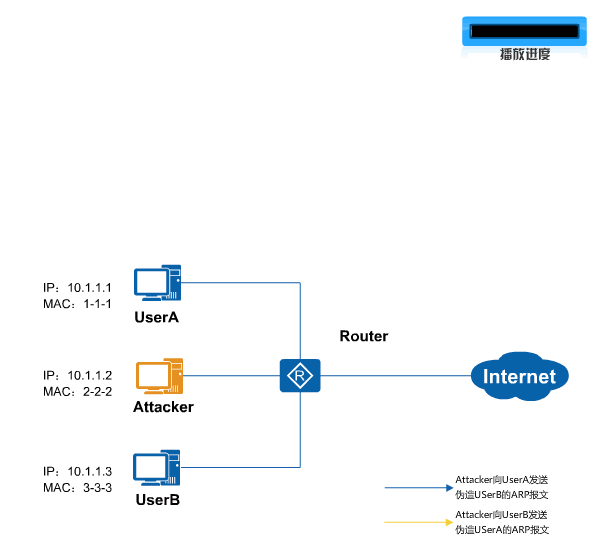

网络中针对ARP的攻击层出不穷，中间人攻击是常见的ARP欺骗攻击方式之一。

中间人攻击（Man-in-the-middle attack）是指攻击者与通讯的两端分别创建独立的联系，并交换其所收到的数据，使通讯的两端认为与对方直接对话，但事实上整个会话都被攻击者完全控制。在中间人攻击中，攻击者可以拦截通讯双方的通话并插入新的内容。

如图所示，是中间人攻击的一个场景。攻击者主动向UserA发送伪造UserB的ARP报文，导致UserA的ARP表中记录了错误的UserB地址映射关系，攻击者可以轻易获取到UserA原本要发往UserB的数据；同样，攻击者也可以轻易获取到UserB原本要发往UserA的数据。这样，UserA与UserB间的信息安全无法得到保障。

中间人攻击:

为了防御中间人攻击，可以在Router上部署 **动态ARP检测DAI（Dynamic ARP Inspection** 功能。

动态ARP检测是利用绑定表来防御中间人攻击的。当设备收到ARP报文时，将此ARP报文对应的源IP、源MAC、VLAN以及接口信息和绑定表的信息进行比较，如果信息匹配，说明发送该ARP报文的用户是合法用户，允许此用户的ARP报文通过，否则就认为是攻击，丢弃该ARP报文。

> 说明：  
> 动态ARP检测功能仅适用于DHCP Snooping场景。设备使能DHCP Snooping功能后，  
> 当DHCP用户上线时，设备会自动生成DHCP Snooping绑定表；  
> 对于静态配置IP地址的用户，设备不会生成DHCP Snooping绑定表，所以需要手动添加静态绑定表。

当Router上部署动态ARP检测功能后，如果攻击者连接到Router并试图发送伪造的ARP报文，Router会根据绑定表检测到这种攻击行为，对该ARP报文进行丢弃处理。如果Router上同时使能了动态ARP检测丢弃报文告警功能，则当ARP报文因不匹配绑定表而被丢弃的数量超过了告警阈值时，Router会发出告警通知管理员。

