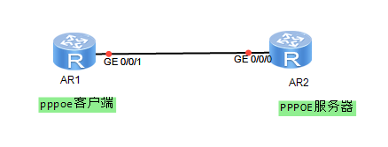

客户端


```shell
dialer-rule

dialer-rule 1 ip permit

#

ip route-static 0.0.0.0 0.0.0.0 Dialer1

interface Dialer1

link-protocol ppp

ppp chap user 

ppp chap password cipher 

ip address ppp-negotiate

dialer user hcie

dialer bundle 1

dialer-group 1

#

interface GigabitEthernet0/0/1

pppoe-client dial-bundle-number 1 on-demand

#

```


服务器端：


```shell
#

ip pool pppoepool

gateway-list 10.1.12.254

network 10.1.12.0 mask 255.255.255.0

#

aaa

local-user  password cipher 

local-user hcie service-type ppp

#

#

interface Virtual-Template1

ppp authentication-mode chap

remote address pool pppoepool

ip address 10.1.12.2 255.255.255.0

#

interface GigabitEthernet0/0/0

pppoe-server bind Virtual-Template 1

#

```

