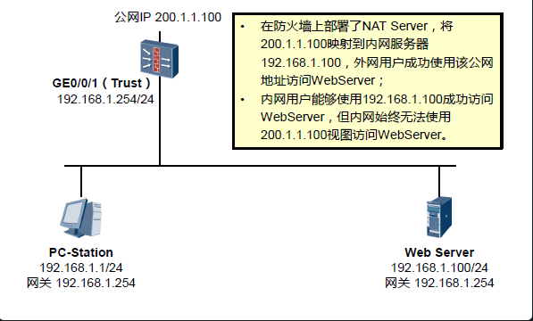

## 出现背景:

在防火墙上部署了NATserver后，外网用户可以访问内部服务器。一般内部服务器都会通过一个域名进行解析。但如果内网用户也想通过此域名访问服务器就会出现问题。

## 原因分析:

1. 防火墙上配置了NATserver，将公网ip    200.1.1.100映射为服务器的私网地址192.168.1.100。数据包会交给服务器。
2. pc访问服务器时的目的地址为200.1.1.100，此时防火墙会做转换，将目的地址转换为了192.168.1.100，源地址不变为192.168.1.1
3. 去时的数据包走向没有问题，分析回来的，回来时就会出现问题。
4. 由于服务器和PC处于同一网段（防火墙已放行PC所在区域和服务器所在区域的数据），回包时服务器发送ARP报文找到了PC的MAC地址，三层封装时源IP地址为：192.168.1.100，目的IP地址为192.168.1.1。源目MAC地址分别为服务器的MAC地址和PC的MAC地址。数据包直接走二层过去。
5. PC和服务进行通信需要建立TCP的三次握手,第一次握手时的目的IP地址为200.1.1.100，但此时却收到了192.168.1.100的回包。怎么办，凌乱了，握手不成功。TCP连接无法建立。

## 解决方案:

> 上述问题产生的根本原因是PC访问服务器的数据包来回路径不一致，要解决这个问题只要使服务器访问PC的数据包经过防火墙即可。

防火墙的内网接口地址为192.168.1.254，在防火墙上在做一个源NAT将PC访问服务器的源地址也做一个转换，将192.168.1.1转换为192.168.1.254。

**转换过后在分析：**

1. 过去的数据包走向和上述相同，不再分析。只不过在服务器看来，访问自己的地址变成了192.168.1.254。
2. 回来时，服务器会把数据包交给192.168.1.254，此时由于防火墙上做了NAT srver,会将服务器的地址转换为200.1.1.100，由于做了源NAT，防火墙将目的地址192.168.1.254转换为192.168.1.1。此时就与之前的TCP三次握手对应上了，PC一看与我握手的是200.1.1.100，成功握手。
3. 数据包来回路径一致，成功解救问题。

_参考:
http://blog.sina.com.cn/s/blog406127500102uwh3.html_

