## 背景


在某次HW时，我们在内网发现了一个防火墙web登录弱口令，在登录后查看配置时，发现此防火墙可通内网核心管理网段，拓扑大概如下：


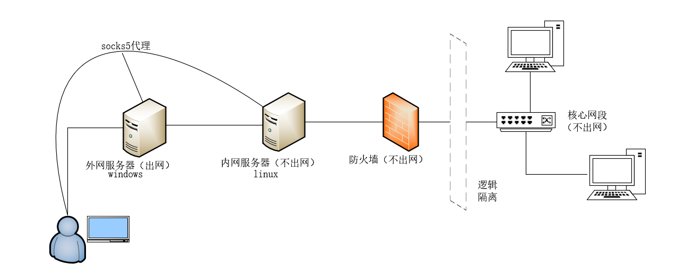


此时我们得设法让攻击机能够访问此核心网段。我们想了如下几个方法：

1. 在防火墙上添加到核心网段的路由
2. 做端口映射
3. 启用ssl vpn，将目标网段加到ssl vpn中。

先说下这几种方法的利弊，第一种方法最为简单，但是无法确定目标网段的网关设备在哪，有可能网关设备上没有到攻击机(跳板机)网段的回程路由。第二种方法做端口映射，如果不确定核心网段开放的端口也会很麻烦，且不利于fscan等工具做信息收集。第三种方法最为方便，一旦ssl vpn建立，就相当于攻击机已经处于核心网段之中了，这时候无论是信息收集还是漏洞利用都很方便，但是此防火墙处于内网，如何连接其ssl vpn是个问题。


## socks5代理方式连接失败


当在防火墙上打开ssl vpn后，查看其登录页面如下。


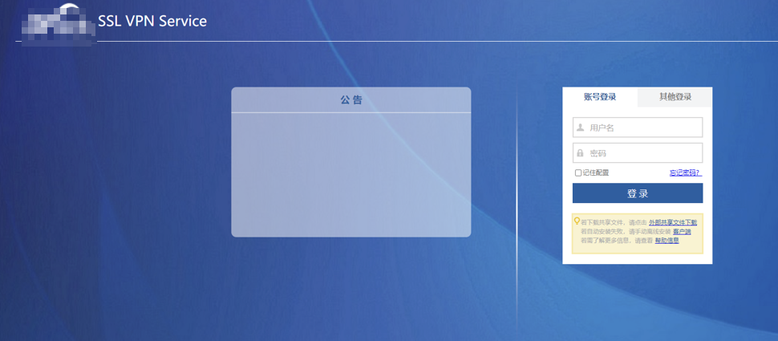


按照其提示我们下载了ssl vpn客户端，并将其加入profile规则中，让其走socks5去连接ssl vpn服务器端。


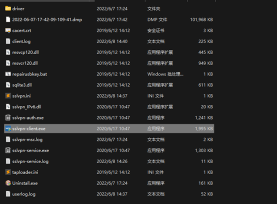


此种方法尝试后发现，sslvpn在认证通过后立马又会掉线，查看连接日志发现是udp协商未通过。


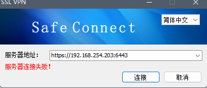


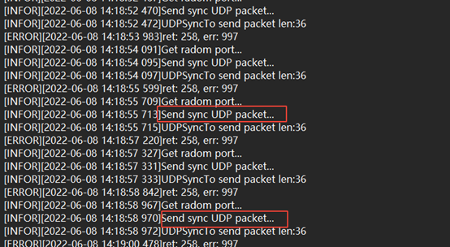


由于socks5代理不支持UDP，所以UDP传输失败导致了ssl vpn无法正常建立。但是不是所有厂家的ssl vpn都不支持socks5代理的方式去连接，例如华为的ssl vpn就可以在其客户端上配置代理去连接。


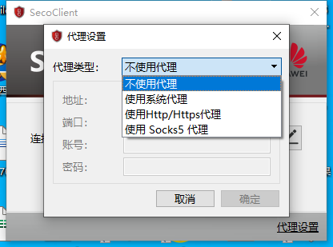


所以在实际环境中可以先去尝试使用socks5代理去连接，不成功的话再采取端口转发的方法。


## 端口转发解决问题


上面提到了由于socks5不支持UDP传输导致了ssl vpn建立失败，那我们分析下再其建立过程种UDP协商时使用的端口。


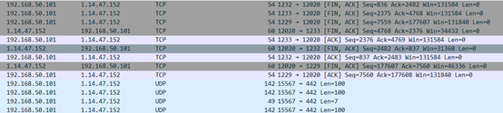


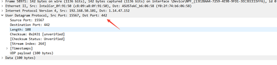


可以看到使用的是442端口，那么我们就想办法把UDP442端口转发出来。


这次使用的端口转发工具是FRP,其支持tcp，udp的端口转发。


这里就贴一下FRP的配置吧：


公网VPS的 frps.ini


```text
_[common]
bindaddr = 0.0.0.0
bindport = 10991_

```


内网可出网机器 frpc.ini


```text
_[common]
serveraddr = 1.14.47.152
serverport = 10991
[tcp]      
type = tcp 
localport = 8072        
remoteport = 8072
[udp]      
type = udp
localport = 8073         
remoteport = 8073        
[forward1]         
type = tcp
localip = 127.0.0.1    
localport = 8072        
remoteport = 12020
[forward2]         
type = udp
localip = 127.0.0.1    
localport = 8073        
remoteport = 442_

```


内网可出网机器 frps.ini


```text
_[common]
bindaddr = 0.0.0.0
bindport = 21_

```


内网不出网机器 frpc.ini


```text
_[common]
serveraddr = 172.31.32.33  //内网可出网机器的ip
serverport = 21

[tcp]
type = tcp             
remoteport = 8072     
localip = 192.168.254.203 //sslvpn的ip地址
localport = 8081  //sslvpn的http端口

[udp]
type = udp
remoteport = 8073
localip = 192.168.254.203 //sslvpn的ip地址
localport = 442 //sslvpn的udp端口_

```


这样基于可以把ssl vpn的http端口和udp端口全部转发出来了，再攻击机直接连接转发出来的端口即可。


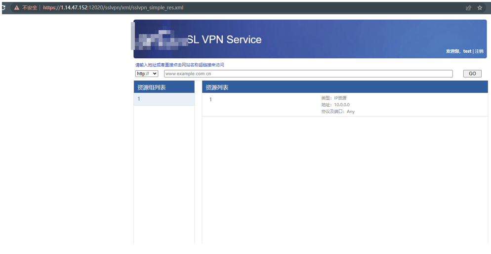


可以看到vpn已成功建立连接，并分配了网卡。


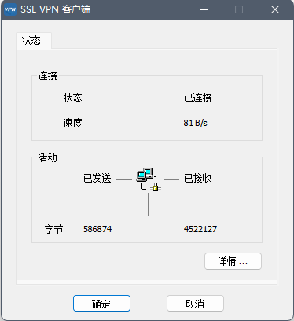


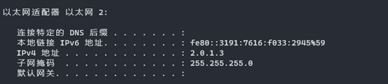


这样就可以随意访问核心网段的地址了，ping也是没问题的。


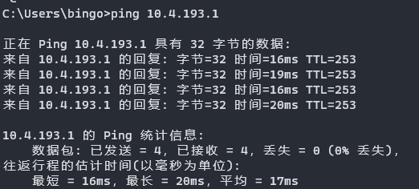


## 参考


[使用Frp实现无公网地址（家庭宽带）环境下的SSL VPN部署](https://bbs.sangfor.com.cn/forum.php?mod=viewthread&tid=57000)

