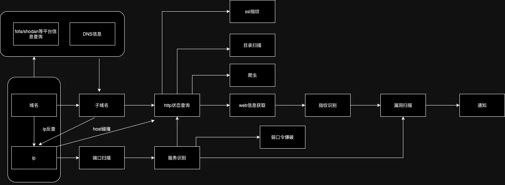

## 项目地址


[https://github.com/handbye/Tscan](https://github.com/handbye/Tscan)


# **项目简介**


> 本项目完全由cursor开发！！


Tscan 是一个基于 Go 语言开发的安全扫描器，支持 Web 界面和 API 调用，集成了端口扫描、服务识别、弱口令爆破、目录扫描、爬虫、指纹识别、漏洞扫描、子域名收集等多种安全检测能力。所有扫描结果自动归档到 SQLite 数据库，并可导出为 Excel 文件。


基本实现了下图中的流程：





## **功能特性**

- **端口扫描与服务识别**：集成 nmap，支持大规模端口与服务识别。
- **HTTP 信息提取**：集成 httpx，自动获取 Web Title、指纹、爬虫等信息。
- **目录扫描**：支持自定义字典、并发、超时、深度等参数。
- **爬虫与指纹识别**：集成 katana、fingers，自动识别网站技术栈。
- **弱口令爆破**：对数据库、SMB、VNC 等常见服务进行爆破。
- **漏洞扫描**：集成 nuclei，支持多种漏洞模板。
- **子域名收集与爆破**：集成 subfinder，支持自定义字典与 DNS 解析器。
- **任务管理与进度展示**：多线程、多任务并发，任务进度实时可见。
- **白名单机制**：支持 IP/域名白名单，配置为  时全部放行。
- **结果归档与导出**：所有扫描结果自动存入 SQLite，可导出为 Excel。
- **Web 前端**：提供现代化前端界面，便于操作与结果查看。

## **架构流程**

- 输入 IP、IP 段或域名，自动识别目标类型，按需执行端口扫描、服务识别、目录扫描、爆破、漏洞检测等。
- 支持 webhook/API 调用，适合自动化集成。

## **依赖工具（以包集成方式）**

- [**nmap**](https://github.com/Ullaakut/nmap)
- [**httpx**](https://github.com/projectdiscovery/httpx)
- [**katana**](https://github.com/projectdiscovery/katana)
- [**fingers**](https://github.com/chainreactors/fingers)
- [**nuclei**](https://github.com/projectdiscovery/nuclei)
- [**subfinder**](https://github.com/projectdiscovery/subfinder)
- [**uncover**](https://github.com/projectdiscovery/uncover)

## **快速开始**


### **1. 克隆项目**


```text

git clone <your-repo-url>cd Tscan
```


### **2. 配置文件**


编辑 `config.yaml`，根据实际需求调整端口、并发、白名单、字典路径等参数。

- `whitelist_ips: [*]` 代表所有 IP 允许扫描
- `whitelist_domains: [*]` 代表所有域名允许扫描

### **3. 启动后端服务**


```text

go build -o tscan main.go./tscan
```


或使用 Docker：


```text

docker-compose up -d
```


### **4. 启动前端**


进入 `frontend` 目录，安装依赖并运行：


```text

cd frontendnpm installnpm run dev
```


### **5. 访问 Web 界面**


浏览器访问 `http://localhost:6678`


如果不想启动前端服务，你可以使用如下方式运行任务，向/api/v1/scan接口发送webhook。

1. 请修改配置文件config.yaml中的参数
2. 运行go run main.go
3. 创建扫描任务：

	```text
	
	curl -X POST "http://localhost:8080/api/v1/scan" \-H "Content-Type: application/json" \-d '{"target": "example.com"}'
	```


	这里的target可以是域名,ip,url,ip段,系统会自动识别并处理

4. 查看扫描结果：

	```text
	
	curl "http://localhost:8080/api/v1/task/{task_id}"
	```

5. 查看扫描结果,扫描结果会保存到reports目录下

## **配置说明**


`config.yaml` 支持丰富的自定义参数，包括：

- 端口范围、并发数、超时时间
- HTTP 扫描参数
- 爆破线程与字典路径
- 目录扫描参数
- 子域名扫描与爆破参数
- 白名单设置
- 漏洞扫描等级与标签
- 结果导出设置等

## **数据存储**

- 所有扫描任务、端口、HTTP、漏洞、爆破、爬虫、子域名等结果均存储于 `data/tscan.db`（SQLite）。
- 支持任务与用户管理。

## **贡献与开发**


欢迎提交 issue 和 PR，建议先阅读 `Tscan扫描器.md` 了解整体设计思路。


## **cursor使用感受及优缺点**


目前来看，我认为cursor在前端代码和工程化方面已经非常成熟，可以满足大部分需求。后端方面对于大型项目，业务逻辑比较复杂时，非常依赖人去整理并对cursor输入比较好的描述和提示词。代码量较多时，cursor会出现卡顿现象，并且容易写几个函数都是重复功能的代码。


cursor目前的不足：

1. 出现bug时尤其是业务逻辑上的bug,非常难调试.
2. 新增功能和业务是容易把之前写好的代码改掉或覆盖。
3. 代码量较大时，会出现对多个代码之间的关系不明确的问题。
4. 有时容易出现AI幻觉，bug修改时明明没有修改任何代码，确提示已经修改了。

总之cursor是一款非常强大的AI IDE,大大提高了编码效率。

