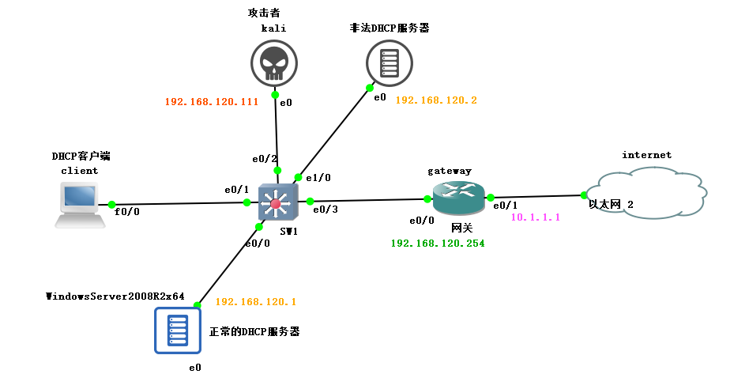
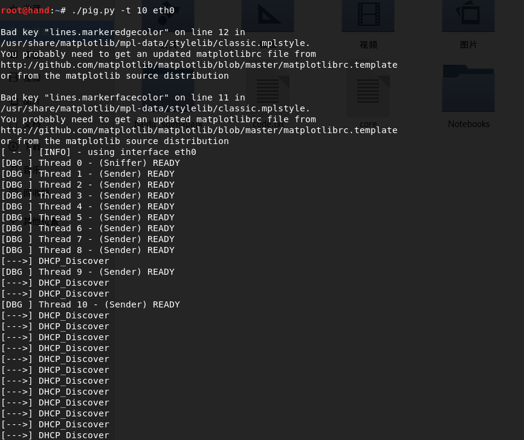
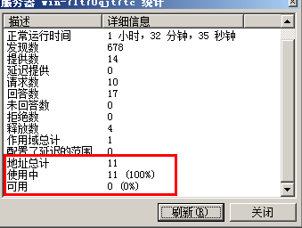
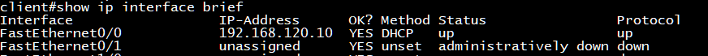
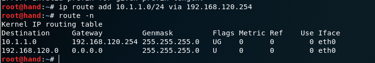
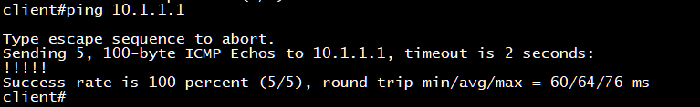
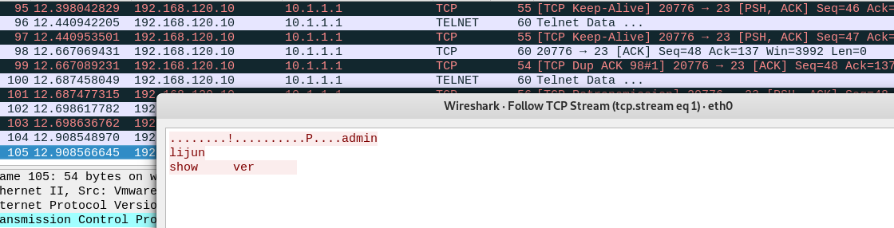

关于DHCP的各种攻击介绍可参考之前的一篇文章[DHCP snooping总结](https://darkless.cn/2018/06/18/DHCP-snooping-summary/),本文重点以实验的方式来演示DHCP的攻击与防御😊。


## 实验拓扑





实验模拟器使用的是GNS3，路由器及交换机为思科设备，DHCP服务器为winserver2008,攻击系统为kali linux。


## 实验思路

1. 先使用kali linux攻击正常的DHCP服务器使其地址耗尽
2. 使用非法DHCP服务器为客户端分配地址，并将网关指向kali
3. 在kali上配置路由使得客户端可以正常上网（防止客户端不能正常上网引起怀疑）
4. 在kali上抓包即可看到客户端的所有数据包（最终目的）

## 使用dhcpig攻击正常的DHCP服务器


DHCPig可以发起一个高级的DHCP耗尽攻击。它将消耗局域网内的所有IP地址以及阻止新客户端获取IP，同时它也防止旧客户端释放IP地址。另外，它会发送无效的ARP去把所有的windows主机震下线。关于DHCPig的使用方法请参考：[https://blog.csdn.net/qq_29277155/article/details/51712059](https://blog.csdn.net/qq_29277155/article/details/51712059)


先查看下当前DHCP服务器的地址池情况：


地址池中有10个地址。


发起攻击：





攻击完成后再次查看DHCP服务器统计情况，发现已经无地址可用。





## 启用非法DHCP服务器为客户端分配地址


可看到client已经获取到地址：





并且网关为kali linux的地址：


也就是说client上网的话必须经过kali linux


## 在kali上配置路由


在kali上配置路由使得client能够访问internet也就是10.1.1.0网段





> _注意在为kali配置路由前需要先开启kali的路由转发功能：  
> echo 1 > /proc/sys/net/ipv4/ipforward_


此时client即可访问10.1.1.0网段了：





## 在kali上抓包


DHCP攻击的最终目的是能够在kali上抓到client访问internet的数据包.


在kali上抓包：





可完整的查看到client访问的数据包，至此DHCP的攻击就算完成了。接下来说说怎么防御DHCP攻击


## DHCP攻击的防御


DHCP攻击的防御在交换机上的实现很简单，只需要开启DHCP snooping功能即可，下面以思科交换机为例进行配置：


```shell
ip dhcp snooping
ip dhcp snooping database disk0
interface e0/0
    ip dhcp snooping trust
interface e0/1
    ip dhcp snooping limit rate 2
ip dhcp snooping vlan 1

```


配置上述命令后即可防御DHCP的攻击，一旦发生DHCP DOS攻击，对应的接口会直接shutdown,需要手工up。

