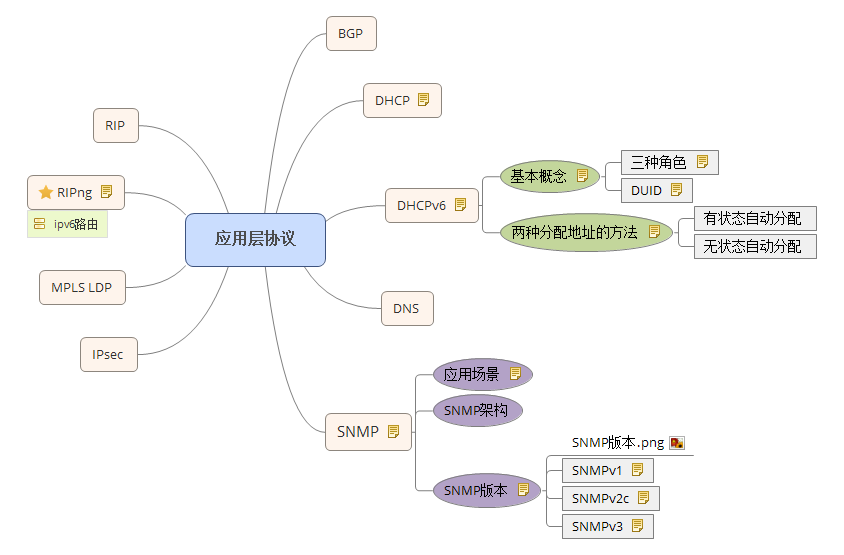

应用层是OSI七层模型的最高层（附OSI七层模型：）

- Layer 7：应用层（Application Layer）
- Layer 6：表示层（Presentation Layer）
- Layer 5：会话层（Session Layer）
- Layer 4：传输层（Transport Layer）
- Layer 3：网络层（Network Layer）
- Layer 2：数据链路层（Data Link Layer）
- Layer 1：物理层（Physical Layer）

> 应用层和应用接口结合为用户提供常见的应用服务，我认为的应用层就是为各种应用提供接口和协议，来供各种应用接入网络。然后通过数据的封装形式，一层一层向下传递直到物理层，然后转换为比特流在传输介质上进行传输。

常见应用层协议图解：

