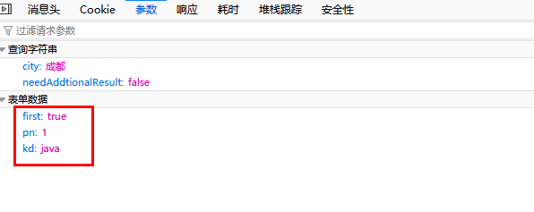
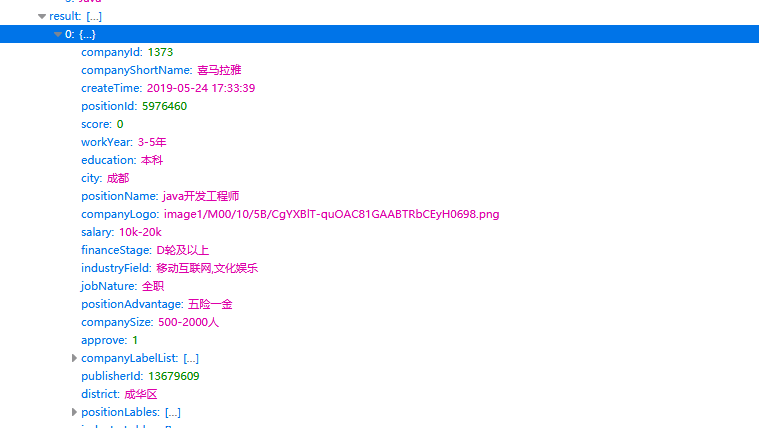
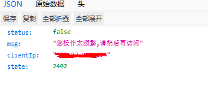
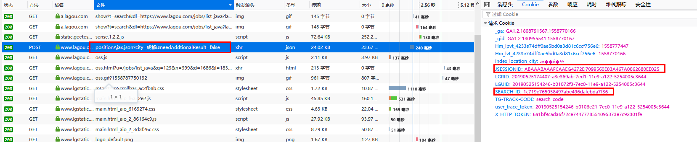
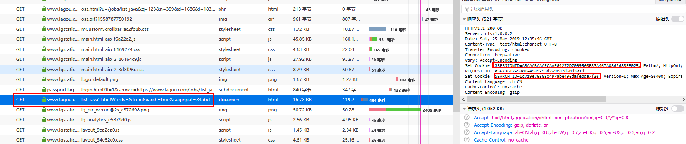

这两天看了一篇文章是写爬取拉勾网职位信息的，看了以后想自己也尝试下。可能是拉钩网加了反爬，网上的大部分方法已经不能用了，我自己研究了下它的反爬措施，找出应对的方法即可完成爬取。


拉开拉钩随便搜索一个职位信息，F12查看请求与响应。


可在一个Ajax请求中找到有关职位的所有信息：


链接为：[https://www.lagou.com/jobs/positionAjax.json?city=成都&needAddtionalResult=false](https://www.lagou.com/jobs/positionAjax.json?city=%E6%88%90%E9%83%BD&needAddtionalResult=false)


`city`后面是城市名，还有三个参数一起被提交：





`first`表示是否为第一页，`pn`表示当前页数，`kd`表示职位名称


只要将这三个参数和上面的链接一起以post请求发送给拉钩，就可以获取一个json文件，里面有详细的职位信息。





网上的爬虫也大部分是以这种方法去爬取的，但是现在打开这个链接后会有以下提示：





对于这种，第一种方法：不去解析这个Ajax请求，直接提取html信息来完成抓取，但要注意请求次数和时间，不然会被禁ip。第二种方法就是我接下来要写的。


反复查看请求与响应，发现每次POST请求Ajax之前，都会先发送一个Get请求来获取用户的Session（Cookie）信息。


随后发送的Ajax请求会将此信息携带到cookie中，这样才会请求到正真的数据。








知道这个规律后就可以直接上代码了,关键代码如下：


```python
import requests

headers = {
'Accept': 'text/html,application/xhtml+xml,application/xml;q=0.9,image/webp,/;q=0.8',
'Accept-Encoding': 'gzip, deflate, sdch',
'Accept-Language': 'zh-CN,zh;q=0.8',
'Upgrade-Insecure-Requests': '1',
'Referer':'https://www.lagou.com/jobs/listjava?labelWords=&fromSearch=true&suginput=&labelWords=hot',
'User-Agent': 'Mozilla/5.0 (iPhone; CPU iPhone OS 80 like Mac OS X) AppleWebKit/600.1.3 (KHTML, like Gecko) Version/8.0 Mobile/12A4345d Safari/600.1.4'
}

# 网上找到的免费代理，可能会失效
proxies={
    "http":"219.157.145.68:8118",
    "http":"120.83.110.86:9999",
    "http":"125.105.109.62:3128",
    "http":"171.221.35.32:8118",
    "http":"122.193.245.108:9999",
}

#设置一个会话
session = requests.session()

# 发送Get请求更新cookie
session.get('https://www.lagou.com/jobs/listjava?labelWords=&fromSearch=true&suginput=&labelWords=hot',headers=headers,proxies=proxies)

data = {
'first':'true',
'pn':1,
'kd':'java'
}

#使用更新后的hsession请求Ajax json
rep = session.post('https://www.lagou.com/jobs/positionAjax.json?city=%E5%8C%97%E4%BA%AC&needAddtionalResult=false',headers=headers,proxies=proxies,data=data)

# 请求成功，接下来就是提取想要的信息。
print(rep.json())
```


参考链接：

- [https://blog.csdn.net/williamgavin/article/details/81390014](https://blog.csdn.net/williamgavin/article/details/81390014)
