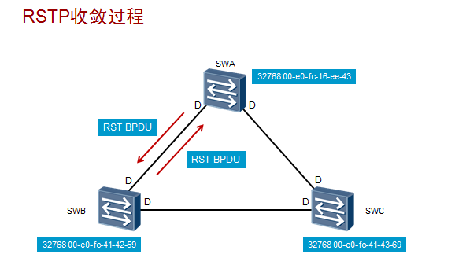

生成要30到50秒的时间，很大的影响了流量的传输和用户体验。

针对STP的不足，提出了快速生成树协议RSTP（802.1w）。RSTP通过特殊了P/A机制实现了快速收敛。网络拓扑变更后，大约需要3个hello time时间，即6秒。

P/A机制

1.每一台交换机启动RSTP后，都认为自己是“根桥”，并且发送RST BPDU。所有端口都为指定端口，处于Discarding状态。
2.每个交换机收到对方发送的BPDU后会选举其中最优的，此时发送次优BPDU的交换机将停止发送BPDU。并开始执行同步。
（同步过程指的是：当收到Proposal置位并且优先级高的BPDU报文时，接收交换机必须设置所有下游指定端口为Discarding状态。如果下游端口是Alternate端口或者边缘端口，则端口状态保持不变。）
3.同步执行完成后，下游交换机向上游发送Agreement 置位的`RST BPDU`，此时次交换机的端口已经确定为根端口。上游交换机收到后，立即将指定端口变为转发状态。因此`RST BPDU`报文Flags字段里面设置了Agreement标记位和根端口角色。
4.下游网段开始使用同样的P/A进程协商端口角色。直到所有网段协商完毕。

