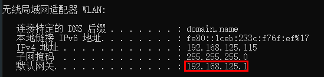
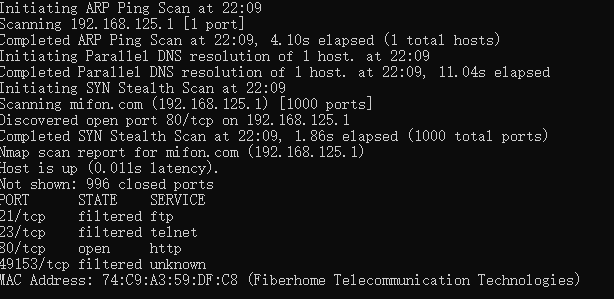
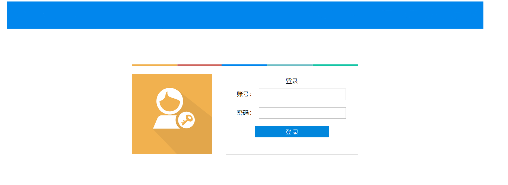
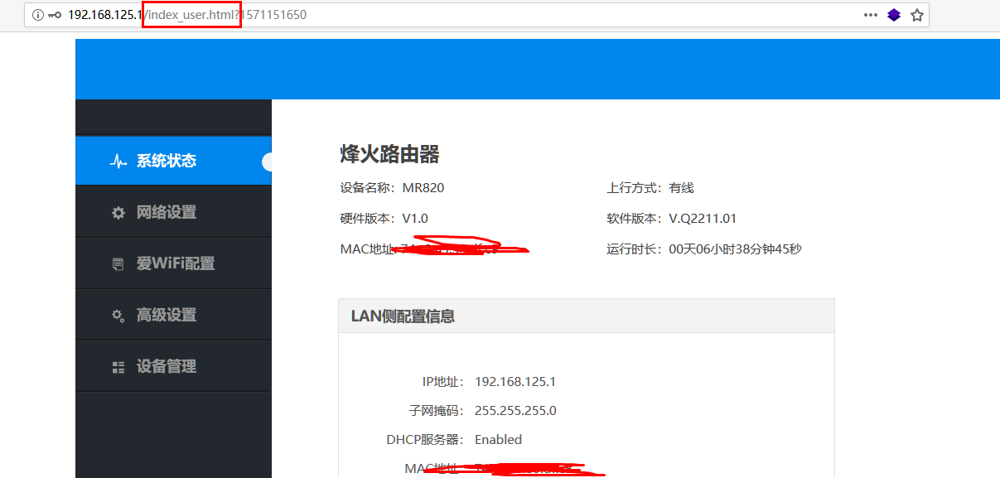
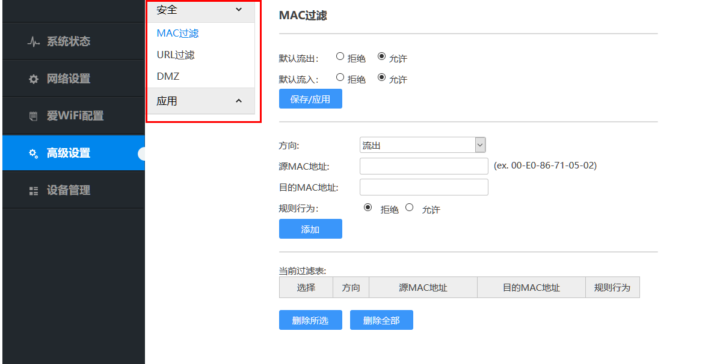
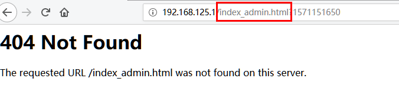
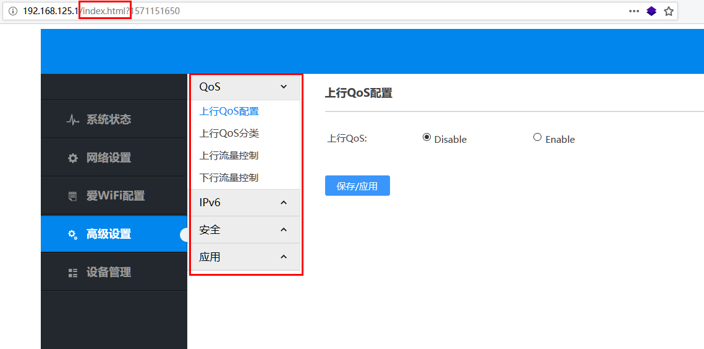

## 无聊引发的渗透

在外出差，为了打发无聊时间只能拿路由器开刀了，连上WIFI后查看地址，然后nmap扫一波。

只开放了80端口

然后web登录，是下面这个页面

使用admin用户登录密码错误后会提示密码错误，使用其它用户登录会提示不存在此用户，可以确定存在admin用户

无奈测试多次后也无法猜对admin的密码。

## 一处越权

然后去路由器上看了下，背面贴着user用户的账号和密码····

然后就使用user用户登录，发现url是这样的：

user用户的权限较低：

尝试把url中的user换成admin，出现404.

尝试把url中的user去掉，发现此时已越权至admin用户，有较大权限。

