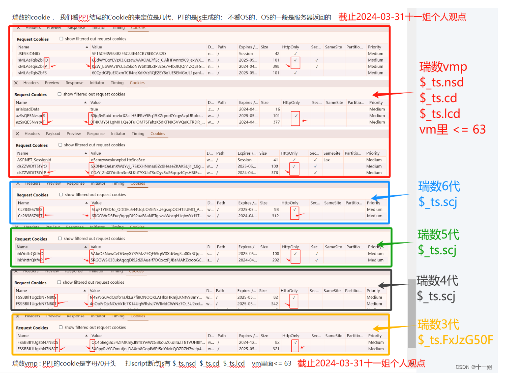

在某项目渗透过程中遇到了瑞数vmp防护，具体表现为不能重放数据包，重放时会报400或者412错误。

关于如何识别瑞数vmp和其版本，可以看这里：[https://blog.csdn.net/weixin_43411585/article/details/138332923](https://blog.csdn.net/weixin_43411585/article/details/138332923)

找了几个绕过的方法，大多数是利用js补环境来模拟真实请求从而获取到可以绕过的cookie。但我尝试了一些项目都失败了，原因未知，例如这个项目：

[link_preview](https://github.com/pysunday/sdenv)

那是不是可以利用类似playwright的框架启动无头浏览器访问目标网站呢，这样就和真实访问目标网站没什么区别，于是我有了如下思路：

有了这个思路后我借助cursor完成了整个项目，结果证明是可行的。项目地址：

[link_preview](https://github.com/handbye/RSVmpBypass)

里面保存了利用cursor编写过程中的详细文档。其实过程是很曲折的，主要表现为如何让AI正确理解我的需求，我的经验是可以先利用chatgpt进行头脑风暴，让他完全理解你的需求并写出需求文档，然后在发送给cursor编写。

