## 简介

网络钓鱼攻击指的是攻击者尝试通过电子邮件、网站、短信或其他形式的电子通信窃取敏感信息，控制目标主机的行为。钓鱼攻击在被害者看起来像来自合法公司或个人的正式通信，往往被害者短期内无法知道自己已被攻击。

根据Verizon Enterprise的2020年数据泄露调查报告，网络钓鱼是安全事件中第二大威胁类型，也是数据泄露中最大的威胁类型。网络钓鱼攻击继续在数字威胁格局中占据主导地位。

邮件是大多数组织的主要通信媒介。因此通过邮件也是攻击者较为常用的恶意软件投递载体。根据反信息滥用工作组的调查，事实上超过 85% 的传入邮件中包含垃圾邮件或“滥用邮件”，如何从这些邮件中识别哪些是钓鱼邮件也变得较为困难。

本文将从攻击者视角来完整还原一次钓鱼过程，注意：本文的目的是为了让大多数人了解钓鱼过程和其危害性，从而能够预防这种攻击。本文中提到的技术和工具仅为了学习研究和技术交流，严禁以此来从事各种违法活动。

## 侦察

在任何攻击开始之前，都必须进行侦察，钓鱼也不例外。侦察或者信息收集是保障钓鱼成果的前提条件，后续的所有工作都建立在这一步所获取的信息的基础之上。

这一步我们需要尽可能多的收集目标单位的信息。

- 单位邮箱域名（邮件地址规律）
- 单位性质（单位性质不同，邮件内容也需进行定制化）
- 单位所在地（以该地的热点信息为诱饵投递邮件）
- 单位组织架构（用上下级关系为由投递邮件增加点击率）
- 近期单位的重要活动（用重要活动为诱饵制作钓鱼邮件增加点击率）
- 重点部门（运维部门，财务部门等）
- 某些员工的活跃度（例如是否在招聘网站上较为活跃，可通过工作为由投递邮件）
- 社工库（能否通过社工库先拿下某个员工的邮箱，这样更有利于了解企业内部信息或通过此邮箱投递邮件增加可信度）
- ·········

以上仅是一部分信息，其它的请大家开放脑洞，尽可能多的收集。

## 平台搭建

### 钓鱼平台搭建

侦察完毕后就开始了正式的钓鱼攻击，预先善其事，必先利其器。纯手动的钓鱼邮件投递效率太低，另外我们需要在邮件中实现鱼竿感知功能，即当目标打开邮件或点击邮件中的链接时，我们可以看到。这些功能钓鱼平台已经都集成好了，没必要自己再去实现。这里我推荐一个开源的平台[gohish](https://github.com/gophish/gophish),这是一个跨平台并且有着良好webUI界面的钓鱼平台。

goPhish搭建很简单，下载官方提供的二进制文件运行即可。

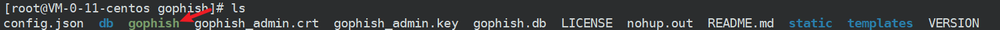

_gophish默认管理端web端口为3333，phishserver端口为80，可在_`config.json`文件中修改。

初次运行是，系统会分配一个随机密码，登陆后必须进行修改。

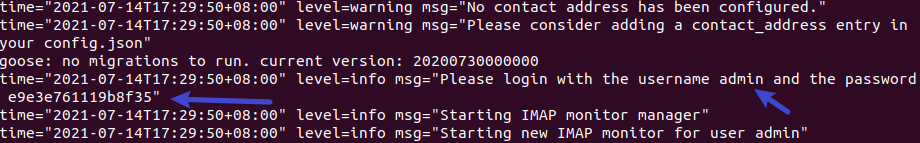

然后使用浏览器打开：`https://ip:3333` 即可登录

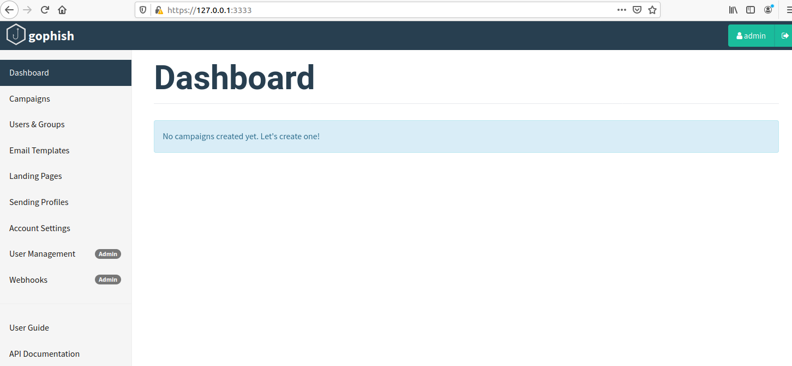

简单介绍下gophish的几个模块：

- Dashboard: 仪表盘，用来显示钓鱼项目的整体情况。效果如下：

	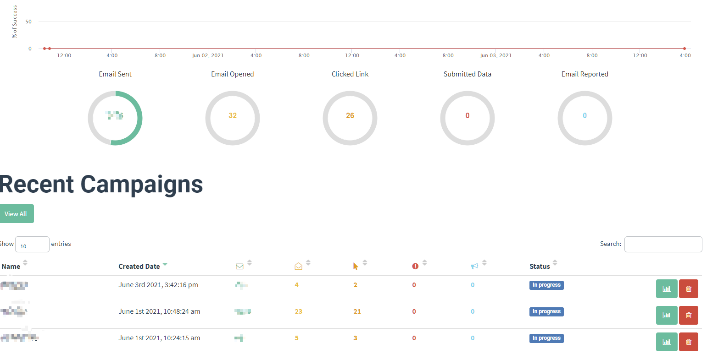

- Campaigns: 每个钓鱼项目的列表展示和详细信息，用来创建钓鱼项目，创建后钓鱼邮件就会自动发出：

	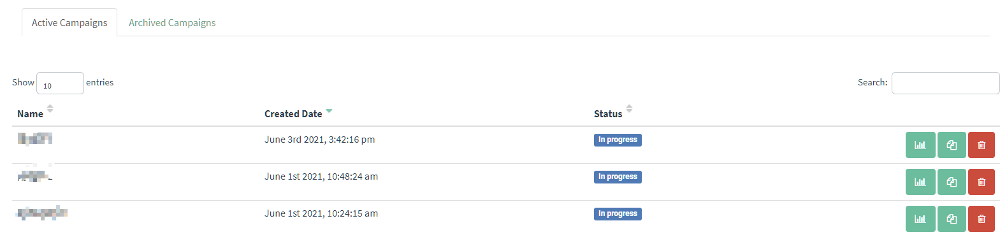

	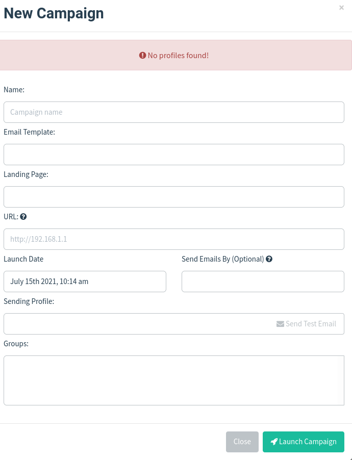

- User & Group: 可为每个项目添加组和目标单位的邮箱地址：

	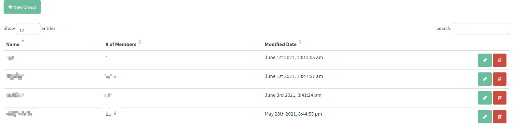

- Email Templates：创建钓鱼邮件的模板，支持从html导入：

	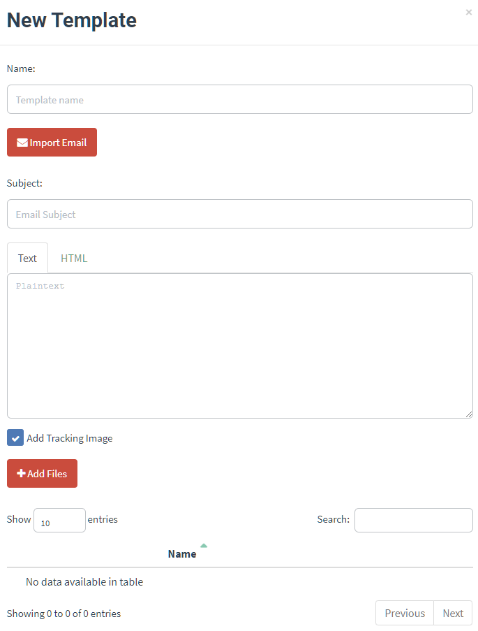

- Landing Pages：水坑页面，可以把他理解为钓鱼邮件里面内嵌URl点击后跳转页面，支持从某个站点直接导入：

	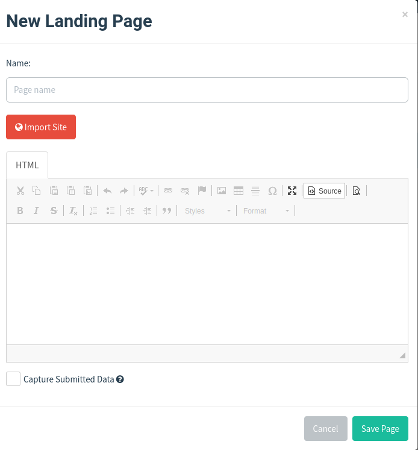

- Sending Profiles：钓鱼邮件发送配置，需填写发送邮件服务器的地址，用户名和密码等。

	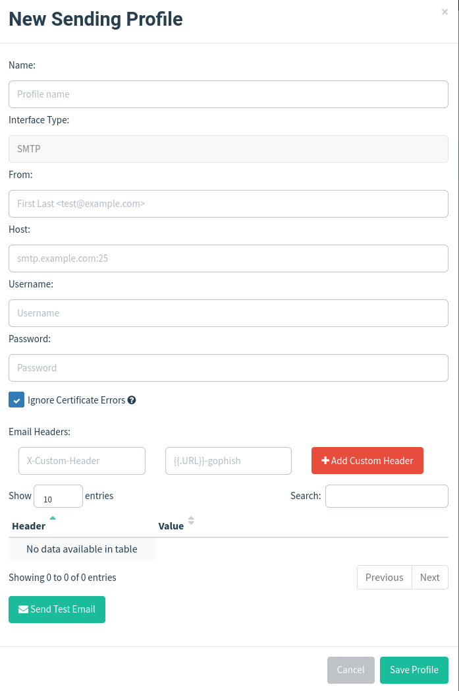

gophish的详细使用教程请参考：[Gophish钓鱼工具使用教程](https://xeye.io/post/gophish%E9%92%93%E9%B1%BC%E5%B7%A5%E5%85%B7%E4%BD%BF%E7%94%A8%E6%95%99%E7%A8%8B/)

### 邮件服务搭建

邮件服务器的搭建一般有两种思路，自己搭建或使用已有的商业化邮件平台。两者各有优劣：自己搭建的邮件服务器需要提供VPS,而且易被识别为垃圾邮件，但是灵活性较强。使用商业化邮件平台，例如作者使用的ZOHO，其免费版每天最多可发50封邮件，且对附件大小等都有限制，但是搭建简单，不容易被识别为垃圾邮件。

对于这两种方法，可根据现实情况自行选择。我这里使用了使用ZOHO进行搭建的方法，如果你需要自行搭建邮件服务器，作者建议使用这个开源的邮件服务器软件[EwoMail](http://www.ewomail.com/).其搭建教程可参考官方文档：[EwoMail 邮件服务器（开源版文档）](http://doc.ewomail.com/docs/ewomail/jianjie)。

> 注意在搭建之前需选购一个域名作为邮件地址，域名的选购最好具有迷惑性，选购和目标单位相似的域名，例如目标单位的域名为ohmygod.com，我们则可以选购一个0hmygod.com的域名，这样成功的概率就会提升很多。

ZOHO是一个比较不错的商业邮件托管平台，如果你需要寻找其它平台可参考这篇文章[最好的电子邮件托管服务推荐](https://www.10besty.com/best-email-hosting-providers/)

ZOHO邮件的搭建可参考这篇文章:[Zoho Mail免费架设域名/企业邮局 - Zoho域名邮箱申请和设置详解](https://zhuanlan.zhihu.com/p/32679780)

搭建完毕后即可登录后台添加邮箱地址：

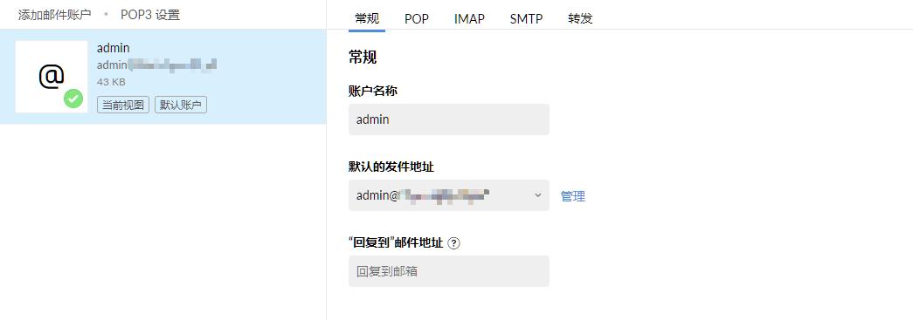

添加完毕后，记录SMTP添加到goPhish平台即可。

## 鱼饵制作

邮件服务器搭建完毕后，就可以开始制作“鱼饵”了，这一步尤为重要。鱼饵的制作分为两步，钓鱼邮件模板的制作和投递物的选择及免杀。

钓鱼邮件模板可根据目标单位的具体情况来制作，比如可以写内部安全检查，补丁升级，某某事件的通知通告等。

投递物可选择word文档加载恶意的宏文件，恶意的exe文件，link快捷方式，解压缩自加载等。

在本次钓鱼中，我以邮箱插件升级为由制作了一个恶意exe文件进行投递。

邮件模板如下：

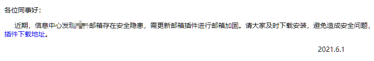

恶意exe如下：

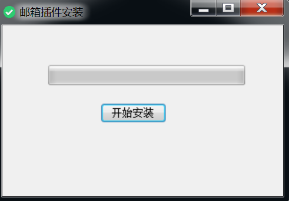

使用效果看起来还可以，这样避免引起目标人员的怀疑：

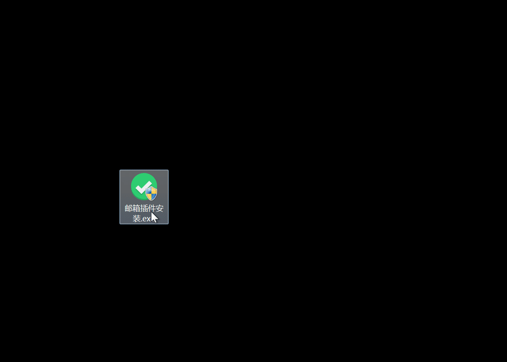

> 这里要重点要提的是在投递恶意样本时，一定要提前做好免杀，这是能够成功的前提条件。至于免杀，则有很多方法，这里建议学习下Tide安全团队的文章：https://github.com/TideSec/BypassAntiVirus

## 收杆

钓鱼邮件投递完毕后，就等待鱼儿上钩了。goPhish这个平台会有鱼竿的感知，被害者打开邮件或点击URl时都可以看到：

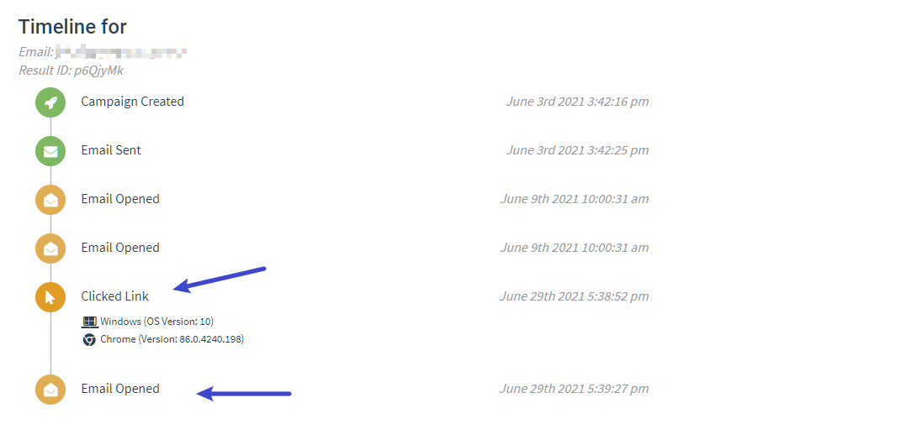

然后就是CS上线了：

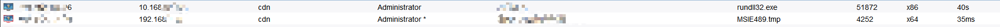

由于我投递的样本进行了UAC申请，这样在上线时就是一个system权限。

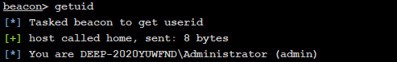

那么以上就是一个完整的网络钓鱼过程了，所有信息仅供参考。

## 参考

- [有针对性的网络钓鱼](https://www.cisco.com/c/dam/global/zh_cn/products/security/email-security-appliance/ironport__targetedphishing.pdf)_
- [6种常见网络钓鱼攻击的防范](https://www.secrss.com/articles/27115)
- [如何抵御网络钓鱼攻击](https://docs.microsoft.com/zh-cn/windows/security/threat-protection/intelligence/phishing)
