## 重要说明


本文中涉及到的所有操作均得到了客户单位的授权，并且在漏洞修复后得以公开。请勿在未授权状态下进行任何形式的渗透测试！！！！


## 漫长的探索


某天，接到一个任务，要求对某医院的信息系统做一次安全检测，看能否发现问题。经过初步的信息收集后，发现该医院并无官网，只有一个微信公众号提供了预约挂号，缴费等功能，看来只能把突破点放在这个公众号上了。


下图是微信公众号的一些功能：


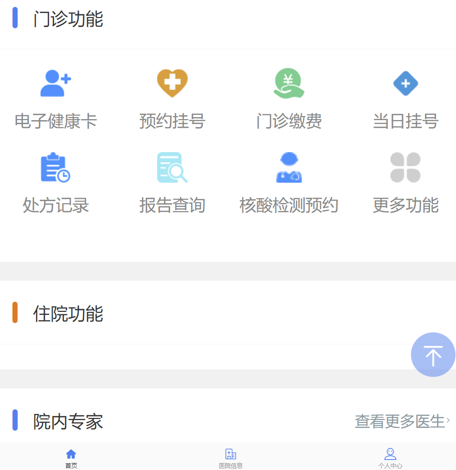


当点击这些功能并抓包的时候，令我看到奇怪的是所有的请求都指向了`a.test.com`这个域名，如下图，原谅我的厚码...


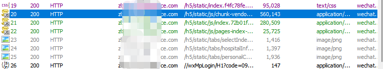


`test.com`这个域名经过查找后发现是一家提供医疗信息系统的本地公司,但不解的是为什么医院的系统会放到供应商公司去呢？他们是如何进行数据同步的呢？带着这些问题我开始了对`a.test.com`这个域名的测试。


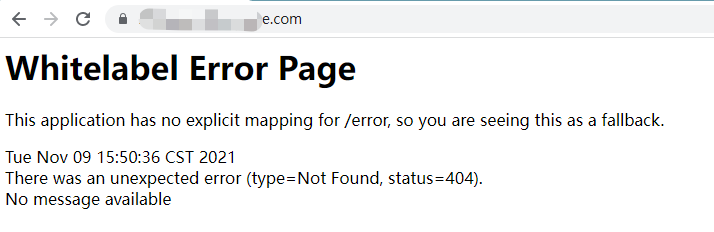


看到这个熟悉的页面，确定了此系统大概是由sping boot开发的，经过一系列常规操作后，只发现了一个swagger-ui页面。


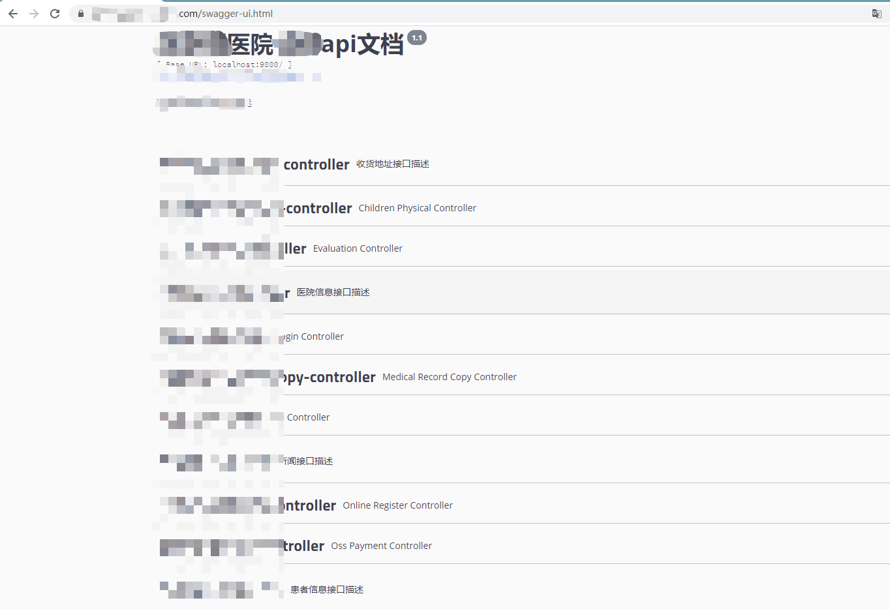


由于我们的目标是拿权限，所以重点对此页面的接口进行了sql注入和越权等测试，无果，也没有任何的文件上传接口,开始卡到这里了。


回过来想，`a.test.com`这个域名是`test.com`的子域名，是否能够通过`test.com`进行突破呢？


访问`test.com`,打开的是供应商公司的官网。


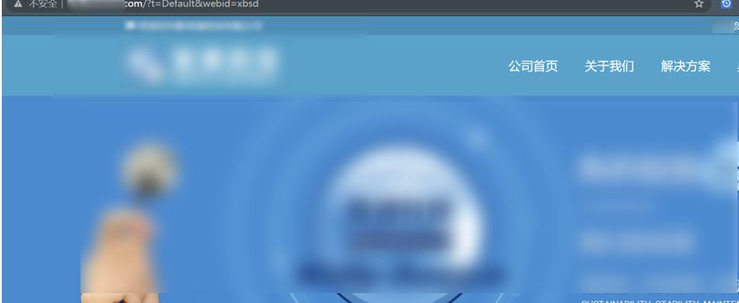


对`test.com`的域名做信息收集后发现了几个子域均解析致某云服务器，但是ip不同。


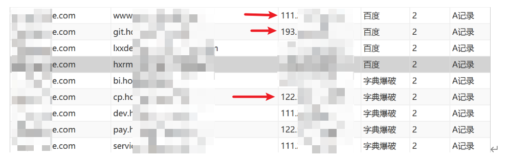


首先`git.test.com`这个域名引起了我的注意，打开后是一个gitlab服务。


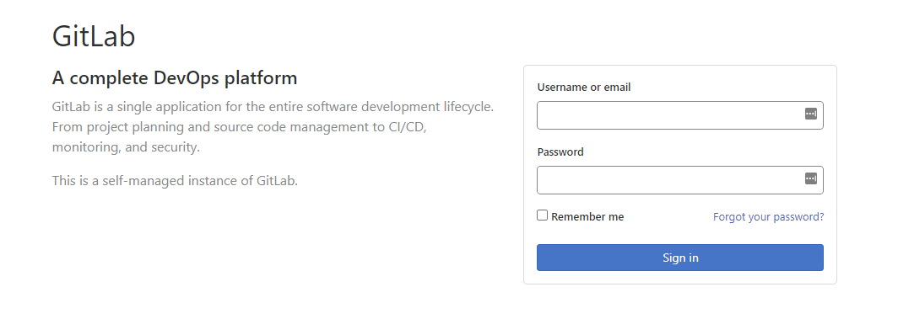


gitlab历史上是由几个漏洞的：


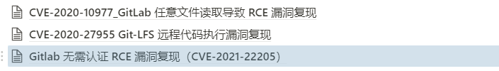


但不幸的是此系统版本较高，漏洞均以修复。


那会不会由弱口令呢？使用几个常用的用户名和top密码进行爆破，无果，我又想办法加到了此公司的一个qq群中，尝试在群文件中获取一些有效信息。


果不然，群文件中有一份表格，记录了员工的详细信息


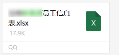


有了这些信息，我开始使用姓名和工号等组合成gitlab的用户名，使用常用弱口令定向爆破，期望能有一两个结果，但是还是无果，看来此gitlab对密码强度有要求，弱口令是走不通了。


## 柳岸花明又一村


当使用google hack 语法搜索此gitlab时发现了几处无需认证即可访问的公开仓库。


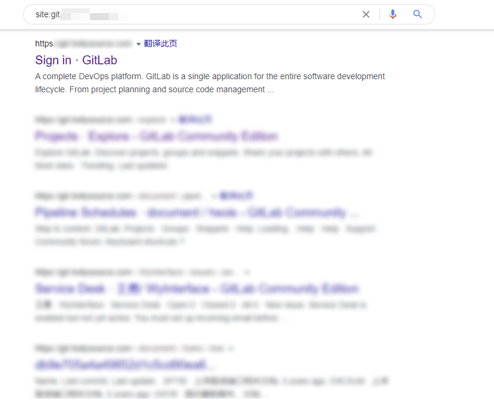


我开始把希望寄托在了这些可公开访问的仓库上，仔细翻看这些仓库，大多数都是一些接口文档，对本次渗透没有啥用。


终于在rabbitmq安装介绍文档中发现了一个oracle数据库的连接用户名和密码：


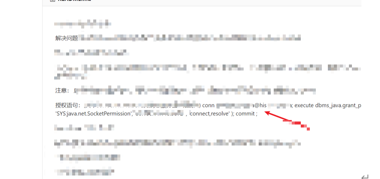


在前面的信息收集过程中，已经发现了`x.test.com`这个子域名对应的ip地址开放了oracle数据库端口，我迅速连接了此数据库发现用户名密码正确，可以连接。


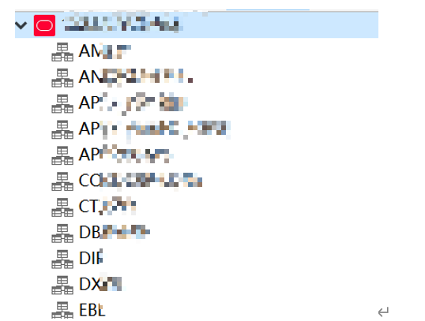


由于此数据库版本较低，并且时sysdba权限，我可以直接以system权限执行命令。


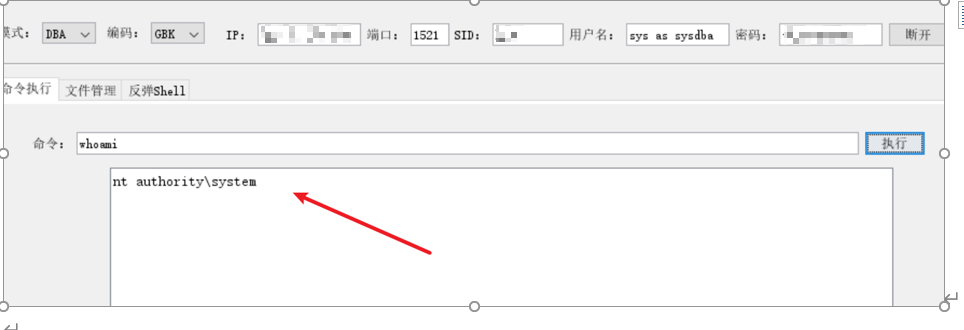


然后就是添加用户登录拿下了这台oracle数据库的服务器。


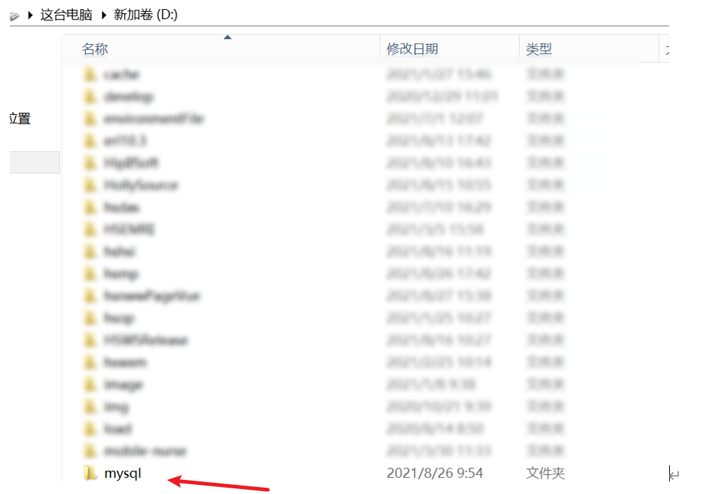


并且在这个mysql文件夹中发现了mysql的配置文件。


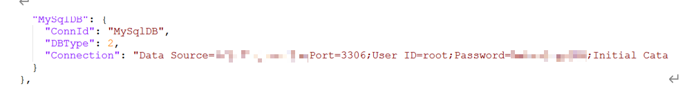


由于`test.com`这台服务器是开放了mysql数据库的，利用此信息，我又成功登录了mysql数据库。


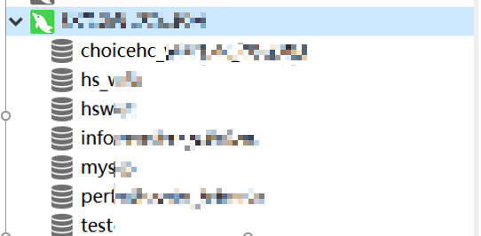


在mysql数据库中成功获取了供应商官网`test.com`后台的用户名和密码。


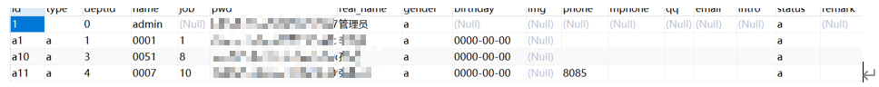


当我满怀欣喜的去登录时，发现确实可以登录，但登陆后的后台功能都已废弃，只有一个大大的thinkphp错误。


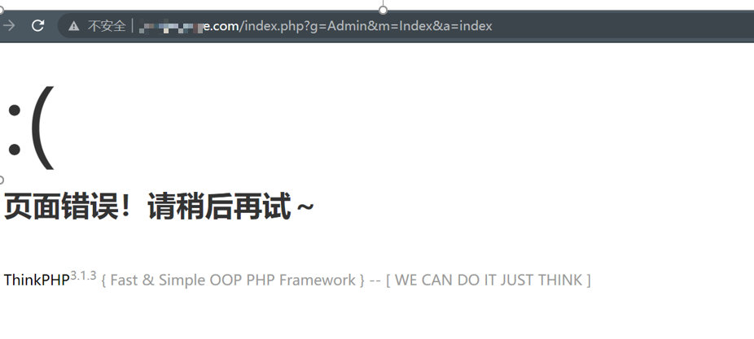


怎么办，原想的通过后台getshell的想法也落空了。（也尝试过使用Thinkphp3的漏洞利用，但也全部失败了）


## 绝处逢生


到这里，我认为只能把希望放在这个mysql数据库上了，由于是windows系统，udf提权大概率成功不了，那就只能尝试写webshell了。写webshell的话需要知道绝对路径，我尝试使用各种办法让`test.com`报错，看报错信息中有没有包含绝对路径，一系列操作过后无果，只有404页面。


没办法了，只有盲猜一波，我突然想到了mysql数据库表的表名是否就是网站的目录名呢？


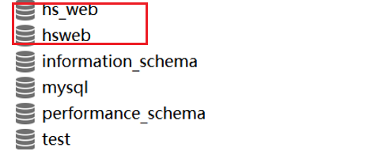


使用这两个表名构造了以下绝对路径


```text
_c:\\hsweb
c:\\hsweb
d:\\hsweb
d:\\hsweb_

```


当尝试到_`c:\\hsweb`_时，webshell提示已经写入成功了。


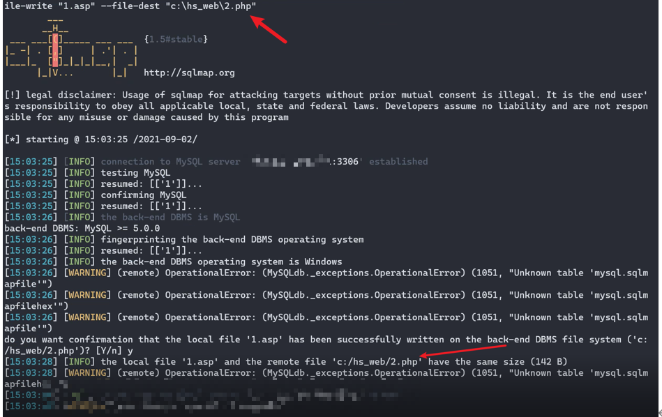


使用蚁剑连接成功：


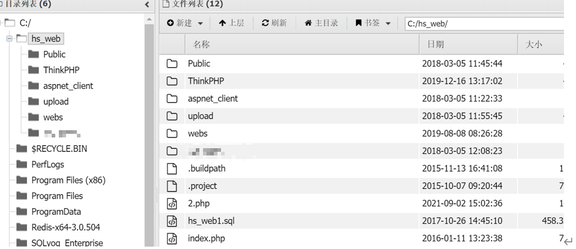


由于当前用户权限较小，使用potato成功提权：


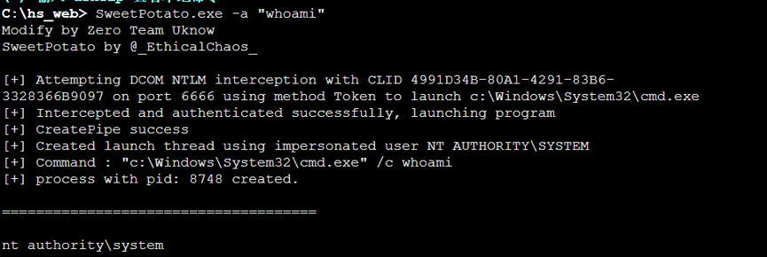


添加用户成功登录远程桌面：


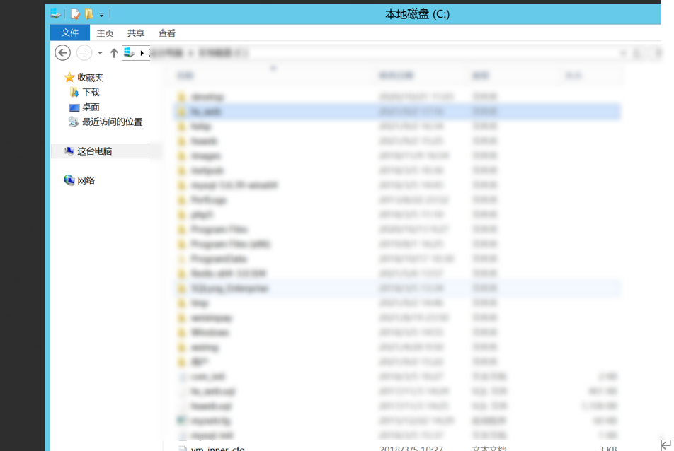


在服务端的nginx配置文件中发现了代理规则，涉及到几十家医院：


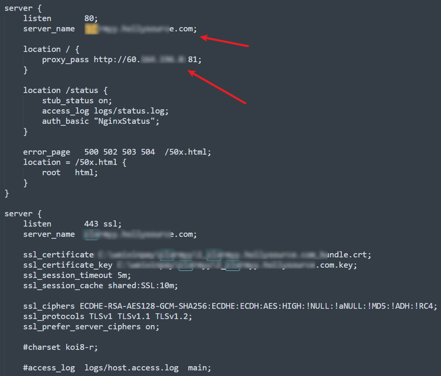


原来这些医院的微信公众号业务都是先访问`test.com`这台服务器，然后再由这台服务器上的nginx转到到各个医院的真实服务器上。那这样也太不安全了吧，一旦供应商的这台服务器宕机、他们的业务也得跟着丢。


然后在这台服务器上发现了微信公众号后台源码，丢给同伴审计了一波，发现了后台登录绕过漏洞，可以直接登录后台。


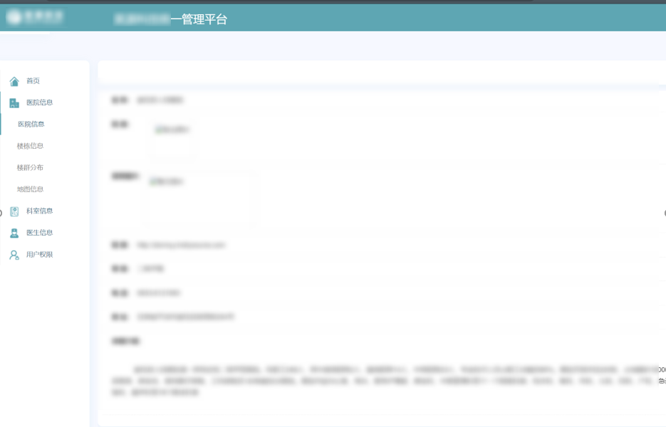


然后就是随意改信息啦。


至此本次渗透就结束了，其实拿到医院的真实ip后也可以更深入的进行测试。

