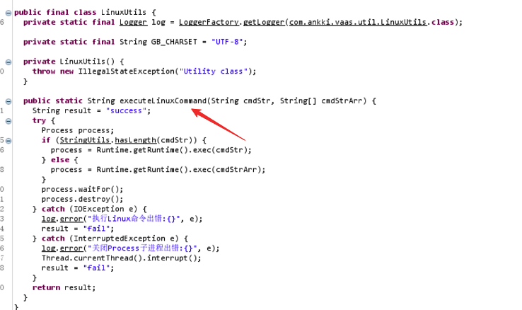

在某次的HW行动中，遇到某目标单位的数据库审计系统开放到了公网上，在尝试了默认口令口发现可以进入到后台。但是只是进入后台不足以完成任务，于是就开始了此次对此数据库审计系统的RCE挖掘之旅。

## 后台任意文件下载

后台中有个功能是抓包工具的下载，抓包修改其文件名即可下载任意文件。

## 寻找源码位置下载源码

只存在一个任意文件下载漏洞还不够，要是能利用此漏洞下载到系统源码，然后进行代码审计就有可能发现更多漏洞了。在后台翻功能时发现存在一个升级日志文件可进行查看，在此日志文件中发现了源代码的存放位置。

利用上述的任意文件下载漏洞成功下载到了源码

## 审计后台RCE

审计代码发现存在如下问题，executeLinuxCommand 函数会执行系统命令

调用位置如下：

本来想的看升级包文件名是否可控，进行命令拼接RCE,但是文件名必须符合如下正则，无法绕过。

所以就直接构造升级包，将反弹shell的命令写到updateAll.sh文件中即可执行。

源码中也贴心的给出了模板文件：

那我们就按照他的升级逻辑来制作一个升级包：

将这个三个文件打包成xxx-1.1.1-12345678.tar，这个名字要符合上面那个正则

updateAll.sh是关键，其内容如下:

上传升级包就可以执行命令进行反弹shell了.

本来有个RCE动图的，这里就不放了，等厂家修复后再更新。

## 进一步挖掘前台RCE

光是后台RCE还不够，利用难度有点大，我想要把它变为前台RCE，所以开始进一步的代码审计。经过审计还真发现了一处处理用户登陆时的逻辑漏洞，可以在前台获取管理员密码，配合上面的后台RCE即可无条件的进行命令执行。

先展示利用过程：

该系统存在三个默账号admin/auditadmin/ruleadmin，这三个账号是内置的，不可修改的。

使用上述默认的三个存在账号进行登录，保存登录包的cookie。

然后使用该cookie发送修改密码的包，即可该用户获取加密后的密码，加密后的密码在代码中给出了解密逻辑，可轻易进行解密。

然后就是利用解密逻辑进行解密了，解密脚本这里就先不放了。

解密出来后就可以成功登陆后台了。

此漏洞分析过程如下：

此系统采用springBoot框架开发，权限过滤器中，updatePassword.action无需权限校验。

Login过程中，由于我们输入的是错误的密码，所以在进行第一次finduser查询时，返回的logininfo对象会是null，从而会进入 null == logininfo 的分支中进行第二次finduser查询；第二次finduser查询由于传入的password参数为null，因此在进入sql查询语句的时候并不会在where条件中拼接password字段的条件，从而成功查询出了数据，也就让logininfo中保存了登录用户对象的信息；随后程序将logininfo放入了session中。

紧接着在执行updatepassword时，程序会从session中获取logininfo，然后根据logininfo中的username去查询对应的用户信息。

因此该用户的信息保存在了this.user对象中，从而导致密码信息被泄露，而密码的加解密逻辑都可以在代码中找到，从而可以解密后登录系统。

